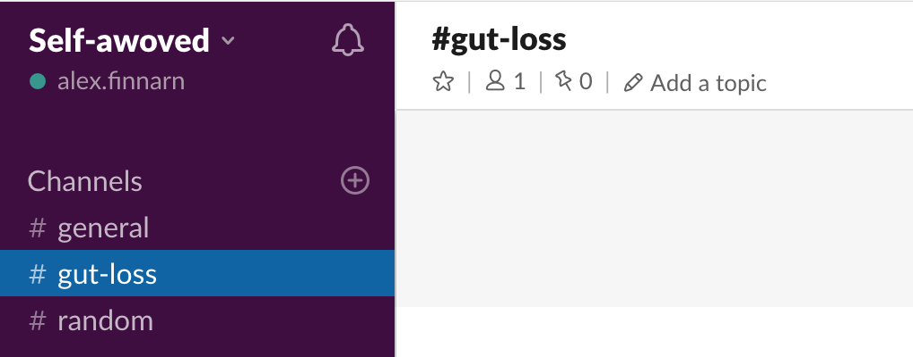
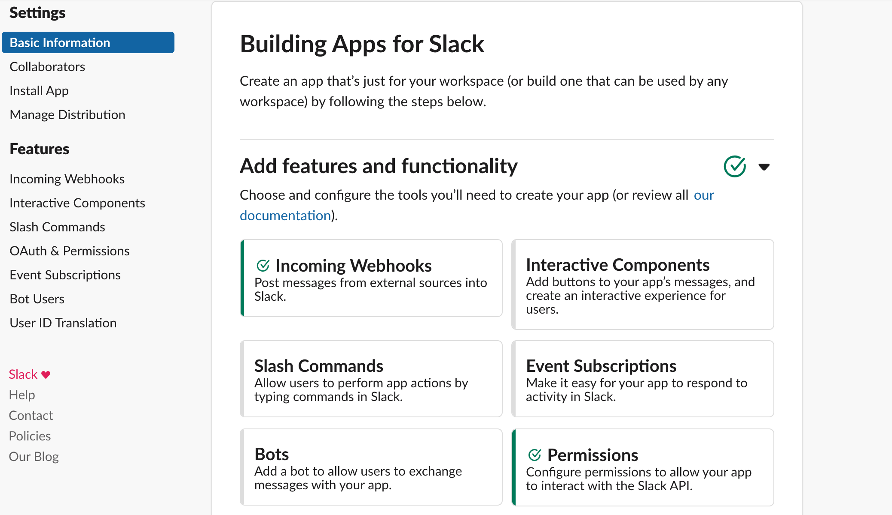
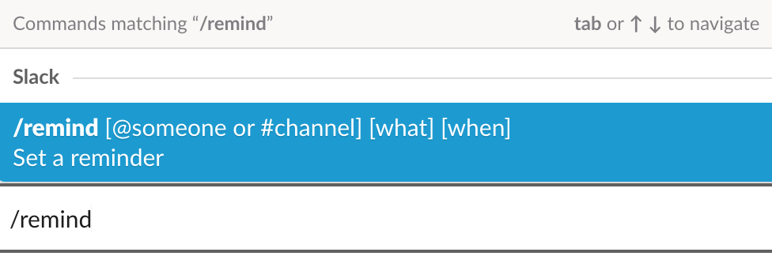
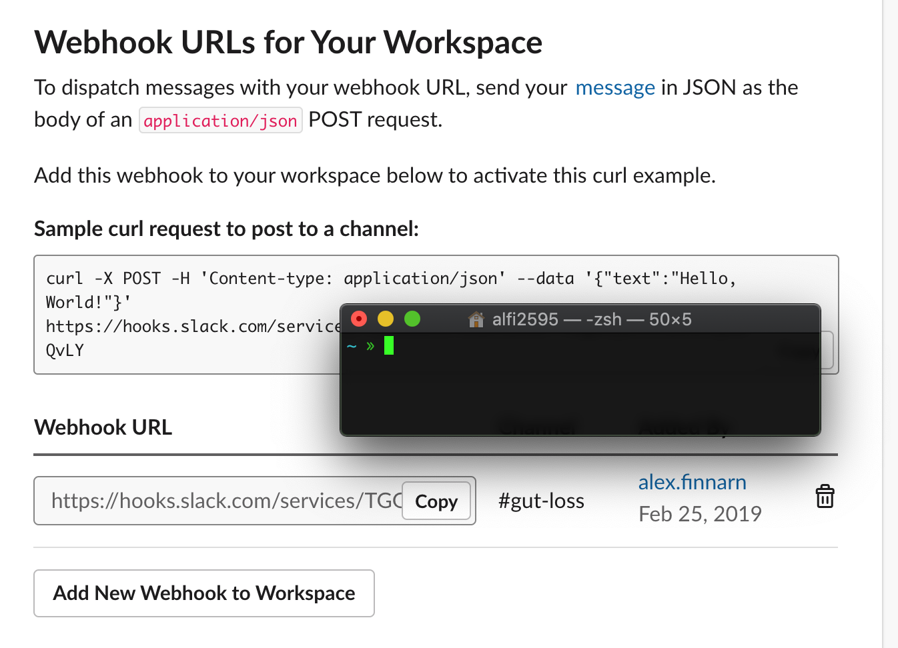
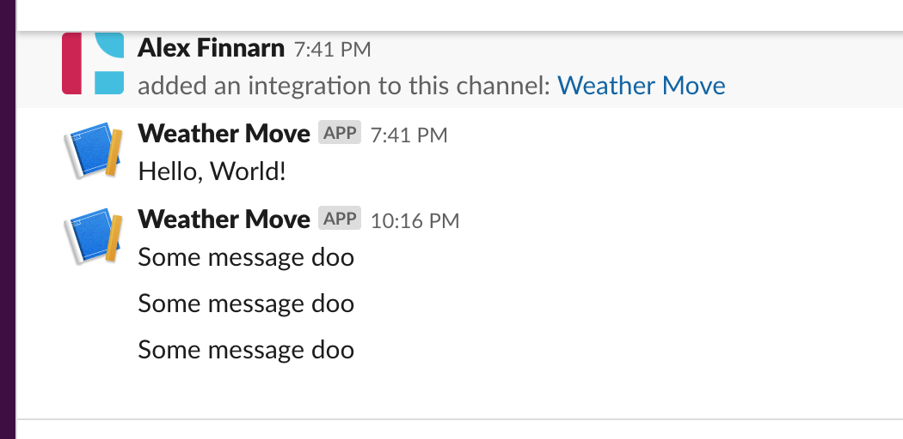
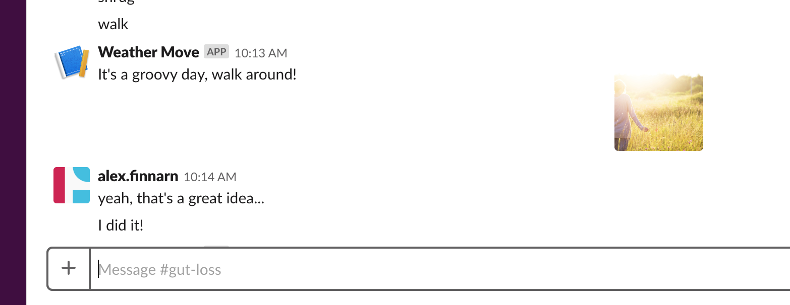
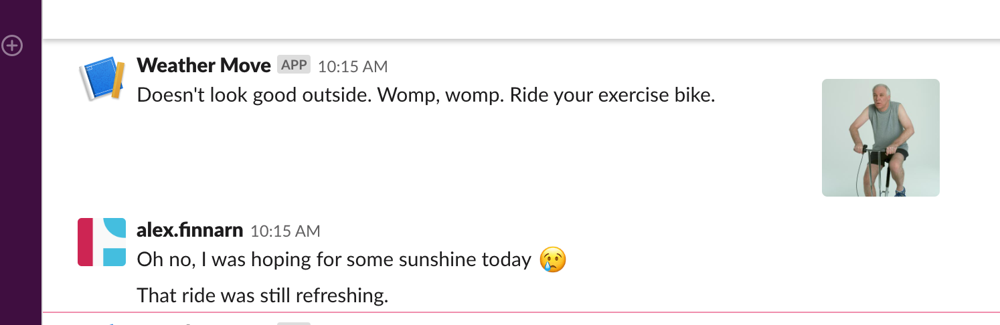
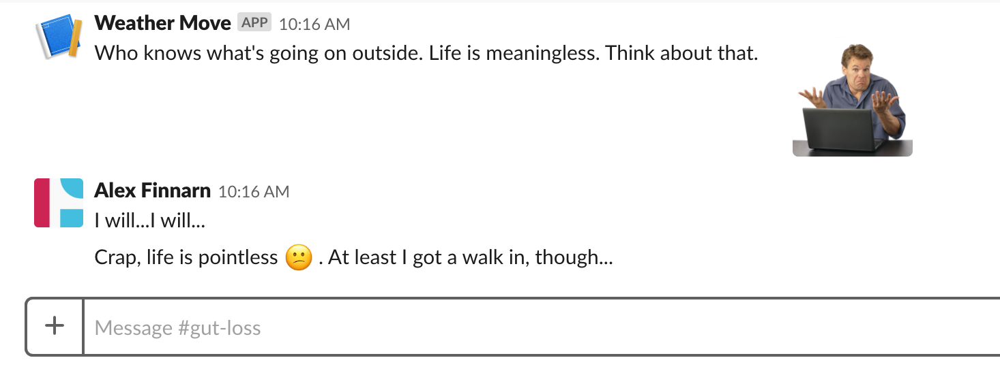

On a kind of dreary and rainy day last week, I noticed the Columbus JavaScript Usergroup was presenting a talk on “Writing simple Slack bots with Node.js”. Meetups, pizza, and beer usually lift my spirits on such days as these so I figured I might as well build a Slack bot to notify everyone of this great remedy to the rainy day blues.

### The Columbus JavaScript Usergroup

The [Columbus Javascript Usergroup](http://columbusjs.org/) has been around since…well, their Twitter says they joined in May 2011, so that’s pretty old in terms of internet years. I’ve personally only attended two meetups since being back in the Columbus area for about a month, but both meetups have been packed and the group felt pretty vibrant to me.

The topics for meetups are akin to what you’d expect from a JS meetup. Last month, the presenter gave a high-level talk of the ins and outs of using “serverless” services to replace custom backend functionality. Before that talk, I saw mentions of NoSQL, WebAssembly, and “[Robots Powered By React Native](http://columbusjs.org/05-16-2018/scott-preston-how-to-mix-react-native-and-robots.html)”. All are topics that spark my interest, and I expect high-quality, interesting topics to be presented on in the future.

[Guy Royse](http://guyroyse.com/) is the self-proclaimed “czar of the group” who helps to line up speakers for the meetup. Guy jestfully called himself the czar and graciously thanked the speaker [and the host, Pillar,](https://pillartechnology.com/) for providing the pizza, beer, and fancy-schmancy draft cold brew for attendees to gobble down. Each meetup starts with designated time for grabbing some pizza and drinks while networking so you’ll never have to build your Slack bots on an empty stomach.

If you read this before attending one of their meetups, then I’ll let you know one important detail that always has a few people jetting out of the venue to correct. You’ll need to park in the back of the complex and not out front unless you want your car to get towed. In general, it’s always best to verify the parking details of any meetup you go to that involves private parking, and in this case, there is always more than enough room out back to park for free without fear of towing…just make sure you move your car to the back. You’ve been warned 🕵

Just like any meetup, they are on the lookout for speakers at future events and [you should contact the czar](mailto:guy@guyroyse.com) to find out more.

### The Presenter: Curtis Autery

The session was kicked off by [Curtis Autery](https://autery.net/) who works at Beam Dental. He is a self-avowed mumbler, just like me, but you’ll be happy to know that the JS group has a pretty good AV system complete with a mumbler-approved microphone.

Curtis has many years of experience developing and one area where this became apparent was his great use of presentational resources to allow attendees to follow along and peruse later. You can view the sample scripts and slides that Curtis used that night below.

-   [Example App Scripts](https://gitlab.com/autery/node-slackbot-demos)
-   [Presentation Link](https://autery.net/talk/)

Another area where Curtis’ experience showed was in his use of `telnet` to navigate the Slack API responses in the terminal. I didn’t have the telnet utility installed on my machine so it was a joy for me to look at how telnet is able to “provide a bidirectional interactive text-oriented communication facility” and [read more about it via the Wikipedia article](https://en.wikipedia.org/wiki/Telnet).

### Setting up A Workspace

We started out the interactive presentation by setting up a Slack Workspace. I’ve only interacted with Slack bots at my work via integrations with services like Travis CI or as a way to impart timely GIFs into conversations, but I’ve always wondered how I could utilize a Slack bot in other meaningful ways.

You’ll want to set up a separate workspace to experiment in so that you don’t have to request access in any of your current, professional Slack workspaces. Even if you think you already have access or your work is cool with it, there’s no telling that things will remain cool once you want elevated permissions or to integrate with a third-party service that doesn’t look too trustworthy…or you give out an API key or something publically accessible code…

Slack [makes it so easy to create a workspace](https://slack.com/create#email), that you don’t need to worry about sneaking around an existing Slack workspace. You’ll find yourself starting workspaces full of typos with questionable channels in no time.

### Types Of Bots

Now that you have a workspace to play around with, you might wonder what types of bots you can create to take full advantage of Slack. I personally have several Slacks open at all times during the day so I have plenty of opportunities to think of ways I can use Slack to avoid incessantly checking other apps during the day. I’m in Slack all day anyway so I might as well keep my distractions in there as well.

Curtis presented on ways you can use Slack bots including showing “basic queries for server info (users, channels), using the real-time messaging API with websockets, and receiving interactive events over Slack-to-server callbacks.” He tied that all together at the end with a live demo of a “choose your own adventure” app [utilizing all the examples he described to us](https://gitlab.com/autery/node-slackbot-demos).

### My Bot

I was so caught up following along with the presentation and trying things out that I don’t have any good photos, videos, or logs of the examples Curtis showed, so all I can do is post a link to the example code he mentioned for that stuff.

After the meetup, I was inspired enough to create a simple Slack bot of my own. I decided that my bot would nag me every hour to move around and tell me specifically how to move around based on the current weather. I tend to check the weather as the day goes along and before I head outside to take a walk so it made sense to create a bot that periodically did that for me.

I’m still going to use the Slack workspace I created above, but I wasn’t sure what method I should use to interact with posting to the Slack channel.

### Types of Slack Features

We start by creating a webhook from the prompts under the general “Create New App” workflow on slack.com. My screenshot above probably looks different than what you’ll see since I went back to take it after adding my webhook, but as you can see, there are several other forms of interacting with Slack that you can choose to pick from.

I’m sure everyone has used a “Slash Command” or two while using Slack, especially the `/gifme this is fine` type of funny GIF conjurer I see in most every Slack I’ve joined so far. If you haven’t done so, I would quickly type `/` into your “Slackbot” channel just to see what Slash Commands are available to you right now. There is a `/remind` command that basically does what I want to do here but without the dynamic lookup for weather, which is a much hipper way to try and get yourself to move around. I could just say `/remind me to take a walk in 10 mins` or something like that if I wanted to quickly get myself moving.

Curtis developed a “choose your own adventure” type of script that showcased the Interactive Components API, but I’ve never used any Slack bot where I could choose from a list of options for a given interaction. I mainly just send GIFs or get notices of failed test results.

### Creating An Inbound Webhook

So at this point, I guess I should mention I didn’t actually make a bot in Slack’s own terminology. They deem a bot as “a type of Slack App designed to interact with users via conversation.” Since I’m just updating a channel with a message, my script isn’t a bot…even though I do talk to myself a decent amount after I see a message posted, that sadly doesn’t count 😞.

You can add a webhook to a specific channel in about two clicks, which is pretty awesome. Afterward, you can test your integration by sending a cURL request in a terminal.

For whatever reason, I got a lot of satisfaction from seeing how quick it was to create a webhook and test the integration. If I didn’t have to interact with an API to dynamically alter my message, I could have created a simple script with an interval for posting to the Slack channel, and I would be done with the whole thing in a few minutes.

I’m sure you’ve started to explore a topic that interested you before only to quickly get lost in the documentation, hit a stumbling block, and then leave your example project in limbo as your interest moves elsewhere. Based on my great initial first impression, I’ll probably look into other ways I can utilize Slack since I do have it open at all times when I’m working throughout the day.

### Interacting With The Weather API

[I’ll post a link to my example project](https://github.com/alexfinnarn/slack_weather_mover) that has a detailed readme of what I did to complete my example project, but I’m only going to go over the general details in this post. Feel free to use my code in your own explorations!

In a quick Google search of “hourly weather API”, I ended up seeing [https://openweathermap.org/](https://openweathermap.org/) pop up in the top search results. I always like to see the word “open” and that tempted me enough to go to their website, sign up for an API key, and get started coding. It is entirely possible you can find a much better resource to use for weather data, but I found OpenWeatherMap to be reliable and easy to use in my tests.

The JSON response you get back from OpenWeatherMap for any given city contains a description of the weather that could be something like “clear skies”. My goal was to provide a list of phrases with good vibes and phrases indicating bad times and decide what message to send based on whether the weather description was giving off good or bad vibes.

Instead of just sending a JSON payload with the message in it like the “Hello World” example, I wanted to add a nice image in conjunction with my message. [Slack block elements](https://api.slack.com/reference/messaging/block-elements) come into play here by allowing you to make sections for your notifications, add media assets like images and videos, and add interactive elements like select lists and buttons.

For example, if a weather description includes the word “sun” which would cover “sunny skies” as well as “plenty of sun” or other similar phrases, then my script posts a nice image and message telling me to go take a walk outside.

If a weather description includes a bad word like “rain”, then my script posts a message to tell me to ride my exercise bike indoors. Side note: Purchasing an exercise bike was one of the smartest things I’ve done recently as I can watch a TV show while getting some exercise in.

Finally, if the weather description doesn’t fit into a bad or good category, then I post a message to induce an existential crisis…and that’s gotta burn some amount of calories, right?

With the script running, every hour I get a nagging message to get up and move around in some fashion or question life entirely. Of course, my script as it now gets annoying when I keep seeing the same message pop up during the day. To improve my script, I would start by including the time of the day as a variable in calculating the message to send. Maybe I always want to ride my bike between 10 AM and 11 AM each day. Or maybe on Mondays, I like to walk a certain path around my neighborhood. Stuff like that would keep the messages fresh and more meaningful. Another obvious integration would be with a step counting app. Keep missing your step count; keep adding suggested time for taking a walk break.

Thanks to the Columbus JavaScript Usergroup, I made the leap to finally try my hand at building a Slack bot, or at least what I’d call a Slack bot. [Stay tuned for future meetups](http://columbusjs.org/) and remember that [you can always contact Guy](mailto:guy@guyroyse.com) if you’d like to present on something.

Demo project link: [https://github.com/alexfinnarn/slack\_weather\_mover](https://github.com/alexfinnarn/slack_weather_mover)
