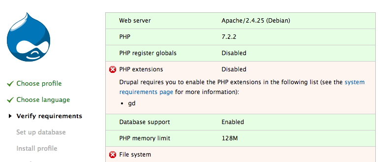

overview of last post…

detail of repo setup with Drupal and other code…

sample config going in…will modify later.

note about cleaning up Docker…I had many images and containers that conflicted with names. List several Docker command line commands.

“Interactive Shell” note that led back to Apache image.

tricky `-a` option to show containers not running

`docker --rm` for automatically removing container.

Ports option needed. 

Install extra PHP extensions for Drupal and note that memory is low…notes about how Docker allocates resources.

7.2-apache includes Debian as an OS. Look at the Dockerfile in PHP library to find out.

Installing GD library involved looking up a lot of packages that I did by “docker exec -it container-name bash” and looking up via “apt-cache search”

Ran into mounted volumes issue that isn’t the same as “COPY” in Dockerfile. So, switch to Docker Compose.

\[show Docker Compose YAML file\]

But wait Docker Compose is slow so I go back to Dockerfile and docker run mounting the volumes via the command line.

But wait now my container is slower than before. I did something wrong or a hanging process. Show how to reset Docker completely. We will not use Docker Compose now to debug and to know how to use Docker better.

Mounting a volume instead of copying was what slowed down the requests to the web container. Once I switched back to copying in the Dockerfile speed increased dramatically. Installing a site went from me giving up and killing the process to less than a minute install.

Issues installing my site via drush, and then file uploads didn’t work…

Anger and flames…back to just using a local setup.
