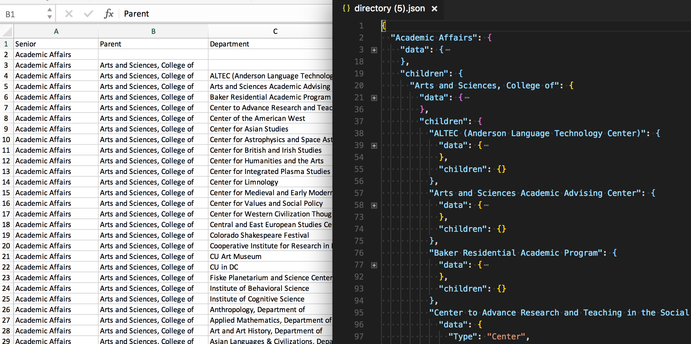

In a project that I’m working on, we needed to create a JSON object that contained a hierarchical structure of organizations and data associated with each organization. I’ll draw an example to explain the concept better.

```
- org_level_one
-x address
-x email
-x children
-- org_level_two
--x email
--x address
-- org_level_two
--x email
--x address
--x children
--- org_level_three
---x email
...
```

Hopefully, you get the idea. There could be any number of organizations and any number of levels of parent/child relationships. Each organization only needs to have one set of data about things like emails, addresses, URLs, etc. and each organization can only have one parent. However, each organization can have any number of children and they can be renamed and moved into another level of the hierarchy.

### Why Use CSV File?

A very good question to ask. CSVs generally aren’t used to store information that exists in a tree-like structure. I was originally given a CSV file with a list of organizations and the data associated to each one. The parent/child relationships were the first four or so columns and the remaining columns were data. After trying some things out, I thought why use a CSV file in lieu of building a UI in JS that would create the appropriate JSON object and be sent to a server for storage and retrieval?

In that workflow, a CSV file could be used to initially populate the data needed for the JSON object, and then the UI would take over for future edits. With this scenario, moving around organizations in the hierarchy would be simple and could be done with a drag n’ drop interface to move all child organizations along with the parent. I thought that approach would be a much nicer UX.

However, we still have a CSV file being edited as the consumer of the data is being developed along with the editing workflow. So, we need to develop some initial conversion step anyways. If I already need to develop that part of the workflow, then why not try and keep the workflow limited to the CSV file for the user. After all, if they were more comfortable using JSON, they would have just given me that format off-the-bat, right?

One failure of development projects that I’ve seen countless times within my career as a web developer is “over-engineering”. I can’t say this enough…but when you take the user out of their comfort zone for little to no reason other than you wanted to make a beautifully architected app while learning some new tricks, you’ve probably failed your managers and the users who will be forced to use whatever you develop after release it. Sometimes…ahem, most times, the simplest solution might work and a PoC might give you insights on how to approach the problem differently. Whatever you end up developing, it’ll probably need quite a few iterations before it is polished enough for a final solution.

### If You Build The JS, They Will Come

Another reason I wanted to go from CSV to JSON the client apps would consume is that it’s typical to need a build process for any JS app you develop these days. The `npm run dev` and `npm run build` commands, or similar, is what I’m used to when perusing other people’s projects. You can hot reload, transpile, use fancy syntax, and use node modules in the browser via that workflow and associated tools.

However, you’re introducing a decent amount of complexity with all of that stuff. I remember learning Vue.js while building out an app that started in standalone HTML files. Each page/route loaded a different HTML file. Then, I switched to the Vue Webpack starter kit with single-file components, testing, and linting all automagically working for me with little to no manual configuration. The developer experience was better for me, but end-users and other developers actually liked the initial, crappier version of the app (which is still stinky).

One reason for this related to the routing. Initially, I wasn’t using `vue-router` since each route was included in an HTML file. This did cause duplication of code, which I tried to mitigate via HTML Imports (Safari didn’t like that “feature”). Since each page contained a global variable of the Vue instance, you could reach into that variable, or do something else…you probably shouldn’t be doing.

But the fact remained that it was far easier to explain to other devs where the code lived and what it did. I didn’t have to say “well it starts out as just a blank <div id=”app”> tag nested within a template with another file that defines the instance…and webpack…ES6 definitely…etc…etc…”. Hell, I still don’t know how the Vue Wepack starter kit works exactly, I just know how to connect routes to components and take it from there.

If you’re trying to work collaboratively in a team where other devs know some jQuery but not ES6 et. al. and you are introducing new dev tools and language syntax on top of a new JS framework to them, don’t be surprised if they make a run for the exit. They might even resent you afterwards…after all, you’re kind of being selfish trying to learn on the job and leave them under the bus if you leave the job at some point with documenting anything.

For these reasons, I decided to start out with what I was given, a CSV file of data. I knew the end-users were more comfortable using CSV files and they couldn’t enter data into something I am developing but isn’t finished yet. I also knew that having a workflow as simple as possible and hopefully easy to understand would help another dev to work on it in the future. Finally, I’ve seen projects lose funding mid-development before deployment when a quicker solution might have been deployed, used, and maintained if a simpler, potentially messier approach was entertained in the first place.

### The file…

The original file I was given consists of an organizational hierarchy in the first columns and data associated with the organizations in the remaining columns.

The first thing I noticed was that each row only contained one organization’s data but also the parent/child relationship in its entirety. Originally, I saw four levels that an organization could fit into; however, the number of levels could change as time goes on. If the levels do vary across time, then the data for each organization would get pushed further out in terms of columns in the spreadsheet.

You could separate the data for the organization from its place in the hierarchy by creating two spreadsheets. You then have a foreign key to match them up and can have people editing only the data or the hierarchy.

But how do you see the full hierarchy while working from that spreadsheet? You’d have to have a UI to assemble that data into the correct order. Therefore, having the data as it was allowed the user to just copy and paste the rows they wanted when moving organizations around. It might be more of a pain to scroll over to the data in the right-most column of the spreadsheet, but at least the visual nature of the relationships are preserved.

To make an initial structure work, we can have the user enter the number of levels of hierarchy, probably with their column header labels, and assume all the remaining headers are data for the organization in that row.

Since we chose to make the UUID of the organization a combination of the hierarchy names, we need to think about how the user can change those relationships and then how the consumers of the data will update to reflect the changes.

Luckily for us, since the data is gathered over HTTP via Apache, a potential solution redirecting the user to the new data if they happen to have loaded a cached version of the organization’s view before it was updated. We can keep the redirects in a separate file that gets generated on a build process everytime the data changes. We can also create JSON files for each route needed to display the data and have a flat-file API without needing a database to assemble data sent back to the client.

### A Simple Form; A Simple HTML File

For the UI, all I’m going to do is create a simple form. It’s been so long since I’ve done this in HTML, that I had no idea what to type in my IDE after it completed `for` to `<form action=""></form>`. I’m used to using some sort of framework to make the form, gather the input data, add CSRF protection, and POST to the right endpoint for persistence.

One of the nice parts about reducing the complexity of your code is that you go back to basic web development concepts that were essential knowledge used to build websites 20 years ago but that a lot of developers have forgotten or never even learned how to do. I started web development using the Drupal CMS and its Form API as well as the front controller and routing/menu systems. It wasn’t until years later that I learned what a front controller was and more about routing and the request/response lifecycle. However, I still don’t recall off the top of my head how to make a proper form just in HTML…so I still have a long way to go in the department of basic web concepts.

To keep this small app as simple as possible, I wanted to make it a stand-alone HTML file someone could load and process into a JSON file on form “submission”. For that reason, the submit button is using `onclick=”submitData()”` to process the CSV file in the background. The reason I quoted “submission” is the “action” attribute typically used to send data back to a server for processing which we are faking to keep it client-side.

I’m not going to add the form HTML code since it is pretty standard, but I was pleased to find out that uploading a file is pretty easy to do in a form input by setting a type and what extensions are included.

```
<input type="file"
       id="csv_upload"
       class="form-control"
       name="csv_upload"
       accept=".csv">
```

### Handling File Inputs

I had no idea how to work with file uploads in a browser before trying to complete this task. Whenever I don’t know something about the web, I turn to the great MDN website, and luckily for me, they had [a good article on how to use the file input type](https://developer.mozilla.org/en-US/docs/Web/HTML/Element/input/file) complete with examples.

```
const uploadFile = document.querySelector('#csv_upload');
uploadFile.addEventListener('change', () => { currentFiles = uploadFile.files});
```

The MDN article explains how you can use an event listener to save the selected file in a variable and do whatever you want with it. It might be a good idea to [read up on the File Web API](https://developer.mozilla.org/en-US/docs/Web/API/File), but the input field will give you a list of file objects that you can later use in your code. I thought I would need to do more work to upload a file and grab the data but…good job Team Web!

### Parsing The File

I only searched the internet briefly to see what CSV parsing libraries were out there, and I quickly found [Papa Parse](https://www.papaparse.com/docs). It had enough GitHub stars and activity for me to give the 👍.

```
// After the user submits the form...
// Parsing handled separately in a callback.
Papa.parse(currentFiles[0], parseConfig);
```

All I needed to do was pass in the file object I grabbed on form submission and supply a callback in the config object the `parse` function takes as a parameter. I know that Papa Parse has a lot of functionality I didn’t explore, but I’m glad it was really easy to use and gave me the headers and row data I needed in an easily accessible format.

### Creating The JSON…and eval()?

The meat and veg (meat and taters in the states) of my app is how the CSV file is parsed into JSON. I visualized it in a tree structure that I drew at the beginning of this post because, in that format, you can move organizations around and carry their children with them. You’d want to carry your children with you if you moved too, right? I think you legally have to anyway. 😝…killing it.

But more seriously, if the organizations have this relationship, it didn't make sense to me to list the parents in a field making the JSON file look just the same as the CSV file. It also didn’t make sense to avoid making a more convoluted format once I tried to create the original tree structure from a single CSV file and failed…and kept failing. I got pissed at my infantile development skills.

You might want to sit down first before I show you the following code. It uses the evil `eval()` function. SHAME, SHAME! How could you, the internet barked. The internet actually doesn’t bark and seemed to say that `eval()` isn’t so evil to use provided you do so in times of low self-esteem and woe. StackOverflow told me so.

> I also consulted the infamous and talented Honey Badger, and she told me, “Honey Badger don’t care! Honey Badget uses eval() all the time!”

Legit.

My use of eval came from not being able to figure out how to assign a value down the chain of an object when I didn’t know what the parent elements would be exactly at the time of assignment. To me, variable assignments happen in one line of code and recursion is still an implementation I struggle using. I thought…wrote out code…wrote out sentences…made scratchings on a whiteboard…thought some more…looked out the window. Then I thought, screw it, I’ll use variable variables to accomplish my task.

I’m far more familiar with PHP, which allows variable variables by using the `$` variable token twice `$$varString` but in JS, eval seemed like the only solution for that, although I might have seen another way to do this on StackOverflow. I don’t use variable variables in PHP, but my solution was to use eval and variable variables to create the assignment variable and then set the final value within the nested object with one eval call…well, several as you’ll see.

<Embed src="https://gist.github.com/alexfinnarn/f10a9c7ca50cd9ce0af99cf6c89bfcfa.js" aspectRatio={0.357} caption="" />

In that beautiful, beautiful piece of code, each organization level header value is checked to see if it is blank. The CSV file rows always declare the parents with at least one blank `orgLevelHeaders` value so that value was all I needed to check to figure out where to place the final data for a particular organization. When the final evaluation happens, `varString` contains the organization level hierarchy needed to assign the data within.

I’m sure I could have done this in a better way, but while making a PoC I don't tend to spend too much time cleaning up code until I know that the direction I’m taking is the right one. Having said that, let me know how much my code has failed you in the comments section.

### Downloading The File

In case you don’t know how to download a file from clicking a button in the browser, I’ll include some of that code too. I would have spent some time researching how to do this, but I already copy and pasted…ahem, figured it out…in another project.

<Embed src="https://gist.github.com/alexfinnarn/30cbfbfa6a3cb42eef6beba8d35b62a1.js" aspectRatio={0.357} caption="" />

…I can’t explain the code all that well, but once again MDN can fill you in on some of it [like the Blob](https://developer.mozilla.org/en-US/docs/Web/API/Blob). Essentially, you create a blob of data that gets turned into a downloadable file, make a temporary link on the page, simulate a click on the link to the file URL, and then remove the link. Apparently the `download` attribute for links is an HTML5 feature. Alls I know is that this works in Chrome 🤷‍♂

You can find the complete code for the app here: [https://github.com/alexfinnarn/directory\_parser](https://github.com/alexfinnarn/directory_parser). The project has a great readme that will tell you how everything works 😬.
