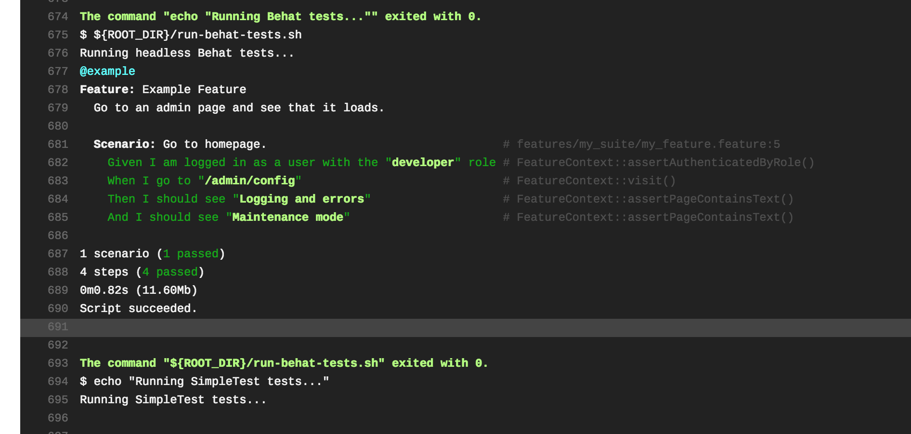

I’ve been writing a few blog posts on the Backdrop CMS as I work on migrating a Drupal 7 (D7) codebase to Backdrop. Here are some of those posts for background information:

-   [Code Syntax Highlighting Module](https://medium.com/@alexfinnarn/adding-a-code-syntax-highlighting-ckeditor-plugin-to-backdrop-cms-8ca718568374)
-   [Introduction to CKEditor and Text Formats](https://medium.com/@alexfinnarn/an-introduction-to-the-ckeditor-and-text-formats-in-backdrop-cms-21f9460651ac)

One nice thing about porting modules from D7 to Backdrop is that a lot of them already have SimpleTests included in them and the way to run SimpleTests hasn’t really changed much from D7 to Backdrop. However, while drupal.org used to nicely run tests on a patch when it was uploaded, Backdrop hosts its contributed modules on GitHub and so there is no automagical test runner support…yet.

There are [several issues floating around in the Backdrop contrib team idea queue](https://github.com/backdrop-ops/contrib/issues?q=is%3Aopen+is%3Aissue+label%3AIdea) about how to improve the contributor on-boarding process which includes discussions around automatically creating a repo structure for your contributed module. The bot that creates the new repos could easily add a testing template for you to start out with, and telling you the story of creating such a template will be the focus of this blog post.

### The Express Project’s Test Suite Setup

Let me preface what I’m about to show you with…I’m not entirely proud of what I helped setup for a Drupal 7 installation profile I work on. There are good parts of the testing setup to share but also bad parts and bad practices. It’s not worth going though all of the testing suite setup, just the parts that I had to work with and change as I got the same setup working for a Backdrop contrib module. If you want to peruse the code, [it lives here](https://github.com/CuBoulder/express/tree/dev/tests) and is kicked off by [a .travis.yml file here](https://github.com/CuBoulder/express/blob/dev/.travis.yml).

To get my Backdrop testing template to work, I started with Behat tests. IMHO, writing Behat tests fits more in line with the target market of Backdrop users than writing SimpleTests does. They are easier to read and write, and you get a lot of cool step definitions out-of-the-box for navigating a website, posting to forms, and making assertions based on your interactions.

Then, I’ll move onto running SimpleTests, which is something I never got fully working in the Express project. I got close, but we didn’t write many SimpleTests ourselves and running them against Drupal core and the hundreds of contrib modules we use maxed out the Travis test run time limit. Running them only on one contrib module, like is done on drupal.org, takes much less time to complete, and so it seemed like a good idea to also include running SimpleTests in the starter template.

### Setting Up Behat Tests

The first part of running any Behat test suite is to install the Behat dependencies so you can type something like `./bin/behat` into your terminal to run the tests. It is easiest to install the dependencies via Composer, which isn’t used anywhere else in Backdrop-land. In the Drupal community, a lot of developers love using Composer to manage dependencies and include non-Drupal PHP packages, but then again other developers get confused using it and hate the fact that it’s pretty necessary to use in D8 for a happy DX.

Nevertheless, we will use Composer to install dependencies for our Behat testing setup. At this point, I will mention the excellent [Drupal Behat extension](https://www.drupal.org/project/drupalextension) that provides a lot of custom steps for working with Drupal in the context of a Behat test; things like logging in with a certain role, finding things in a region, running Drush commands, etc.

I chose to drop that extension from the Express testing setup since it involves locking you into more dependency versions and packages than you might like. For example, if the main Behat project is moving along at a faster pace than the Drupal extension can keep up with, you might get stuck using an older version of Behat than you’d like. Or if the Drupal extension needs to patch the main Behat project and Mink extension, then you might have to modify that patch…stuff like that. Plus, I didn’t use most of the custom step definitions they provided…I also have other reasons, but let’s move on shall we.

Dropping that extension is a huge help in converting the Express testing setup to Backdrop since I would have had to maintain a whole new Backdrop extension to handle the differences between Drupal 7 and Backdrop. Couple that with the fact that the Drupal extension is focused more now on D8 work than D7 so it is unlikely that a lot of new step definitions will be added for me to work with.

<Embed src="https://gist.github.com/alexfinnarn/b09ac46e84301f4d1527f6a9f36c53e2.js" aspectRatio={0.357} caption="" />

The `composer.json` file only has three packages listed for it: the Mink Extension, the headless Goutte driver, and the always painful-to-setup Selenium driver that allows you to emulate actual browser interactions. The Behat binary is placed in the `bin` directory and that is how you end up running the tests, like `./bin/behat --config behat.yml`.

<Embed src="https://gist.github.com/alexfinnarn/1b5374b67a6b63c70585b89cbb2b961f.js" aspectRatio={0.357} caption="" />

Now comes the aforementioned config file. I didn’t have to change any configuration in that file, which was awesome. We’ll get to the `sauce_labs` part of things later or in another post, but it allows you to set things like browser and OS version among many other features I haven’t used. Another caveat worth mentioning is the Guzzle parameter which relates to accessing a site over HTTPS that has a self-signed cert. Might trip you up sometime and good info to know, but the config syntax might have changed since we added that so you should look it up again if you have any issues related to HTTPS requests failing.

With that config file, if I run

`_./bin/behat --_stop-on-failure --strict --config behat.travis.yml --verbose --tags ~@broken`

then I will run any Behat tests that don’t include the `@broken` tag. This command will also print out the output in as verbose a manner as possible, which helps to debug failing tests, as well as stop the test run when the first failure is encountered. I think the failure option is important to add since all I have to do is click on the “scroll to end of log” in Travis to see what failed rather than scroll through hundreds of tests looking for the one in the middle of the stack that failed.

Finally, for some reason I had to add `--strict` to get a failed test run to exit with a code of `1`. The exit code is important in the Travis test run since it looks for an exit code of `0` for success and `1` for failure. If the Behat script fails but all the steps of the `.travis.yml` file complete, then you still see a green checkmark on your PR in the GitHub UI where the Backdrop contrib modules are hosted.

Now, I can run any Behat test I please without issue, just the same as I did in D7. Sweet!

### Adding Local Users

After dropping the Drupal extension, we started creating users for each role we had on the Express service within a custom module. Since the permissions for the roles were already in the codebase, only a default user per role was needed to run the test suite.

Creating the user in D7 was much easier since all I had to do was loop through a list of user roles, create a new user, and assign one of the roles to them. In Backdrop core, we don’t have all the user roles we have in Express as well as the way we have been managing permissions using [a module called Secure Permissions](https://www.drupal.org/project/secure_permissions).

So, I had to dig deeper into the Backdrop code to see how the user roles were created and assigned permissions. I found where the roles were gathered and noticed a useful function I will probably use elsewhere.

<Embed src="https://gist.github.com/alexfinnarn/a666dcb49358b27347e59ce5170d8b8d.js" aspectRatio={0.357} caption="" />

`config_get_names_with_prefix()` allows you to search through config files with…you guessed it, the prefix you pass in. Using this function, we can essentially recreate the Secure Permissions module by grouping permissions per role in the module’s they should be associated with, looking for `secure_permissions.roles.` prefix and aggregating all of those into one config file per role.

Once I saw that line in the `user_roles()` function, I knew that all I had to do was declare config files using that prefix with the permissions I needed and then when I installed my `backdrop_test_users` module, the users were added with the correct roles and permissions. A little different code-wise, but now we can move the same permissions arrays we have in Express into those test user roles and run the same Behat tests we currently have as we refactor the codebase.

### I Got 99 Problems And Drush Is One

So far, so good…and then there was Drush. We use Drush to run the webserver for our D7 profile’s tests, install the site, enable modules, and run database updates to simulate deploying to existing live sites. Backdrop does have a project that hijacks Drush commands, lets some pass through to the regular Drush code, and also directs other Drush commands to Backdrop versions of the same D7 Drush command.

The problem is that several of the commands we use everyday weren’t ready to run on Backdrop when I started trying to make this testing template. I did [make a PR](https://github.com/backdrop-contrib/drush/pull/147) to add `drush runserver` to the list of commands Drush in Backdrop can run, and [I also tried out a PR](https://github.com/backdrop-contrib/drush/pull/98) to make `drush en my_module` work as well. With those two PRs, I could install a site, boot up the webserver, and enable the needed testing modules. Those PRs need some work, but they are good enough for me to continue on with figuring out a testing starter template for Backdrop contrib modules.

<Embed src="https://gist.github.com/alexfinnarn/f7e4b7023caedb2a571b5af0b14cb123.js" aspectRatio={0.357} caption="" />

### Onto SimpleTests

And that is really it for the Behat part of it. Much more is in the code sample link I added at the beginning of this blog post, and I’ll link to the finished repo at the end of this post. But not much had to change with the scripts I was using before; altering the Drush commands took the longest time to develop.

I had a sample shell script that ran SimpleTests in the Express project; however, I was trying to `grep` the output of the SimpleTest test run in order to determine success or failure. In the process of re-vamping the Behat part of our test suite, I added a helper function to determine if the last shell command executed correctly.

<Embed src="https://gist.github.com/alexfinnarn/480d46aa9367f4e231ea9aa0fc68e142.js" aspectRatio={0.357} caption="" />

That helper function allowed me to capture the exit code of the SimpleTest run and propogate that up to the main execution of the `.travis.yml` file so that a pass or fail result could be communicated properly.

<Embed src="https://gist.github.com/alexfinnarn/c380be6f8afb2a69e0124a3121398508.js" aspectRatio={0.357} caption="" />

And that simple shell script allows me to run any SimpleTests with the classes listed in the `${SIMPLETEST_CLASSES}` variable that is defined at the top of `.travis.yml`.

### Putting It All Together

<Embed src="https://gist.github.com/alexfinnarn/760944c035e95435f9698605486e275e.js" aspectRatio={0.357} caption="" />

As you can see, I tried to keep the `.travis.yml` file as simple as possible so that each contrib maintainer just has to change the names of the modules they want to install, the Behat tags they want to include or exclude, and the SimpleTest classes they wish to run.

<Embed src="https://gist.github.com/alexfinnarn/41364d0edb05eeb8831ff13ff4f8948b.js" aspectRatio={0.357} caption="" />

All of the other code needed to run the tests, Backdrop core and the other necessary contrib modules, are cloned down from the respective dev branches, partially due to fact that `drush dl` has an issue with downloading contrib modules and partially because I thought developing off of the dev branches of the projects would be more insightful than using their last release. Granted, some contrib modules won’t update before you make your next release, but Backdrop core definitely will update on the quarterly release schedule so keeping up with the `HEAD` of the dev branch makes sense.

### Final Example

I just got a clone of the XML Sitemap module working using the starter template, but [some of the Sitemap module tests need updating](https://travis-ci.com/alexfinnarn/xmlsitemap/builds/82986620#L719). I ended up having to pull the scripts used for the test run out into their own repo. The idea being that the scripts can be updated and modified without having to have each contrib project update its testing files and structure each time a script needs to be updated.

One repo, the “[testing starter template](https://github.com/alexfinnarn/testing-starter-template)” holds an example `.travis.yml` file, the local users module, a sample Behat and SimpleTest, and instructions on how to install the template. The other “[testing starter scripts”](https://github.com/alexfinnarn/testing-starter-scripts) repo holds the scripts needed to build the codebase, install a site and modules, and then run the Behat and SimpleTests. I tried to separate the scripts into reasonable chunks for better maintainability, but I’d like some feedback on the project before trying to stamp it on more Backdrop contrib modules.
