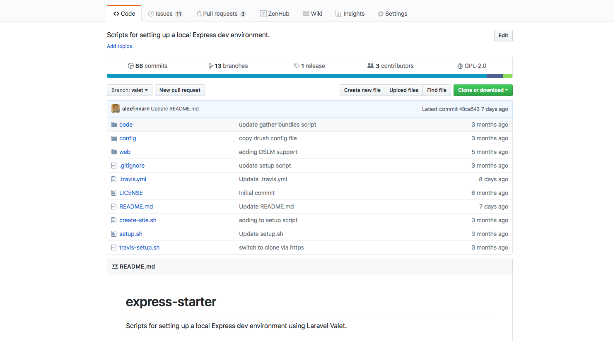
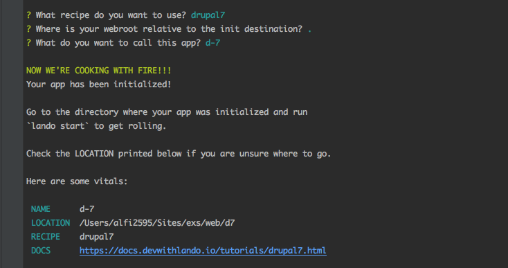
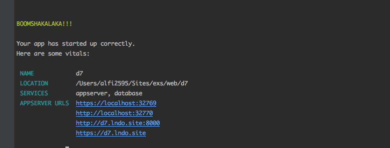
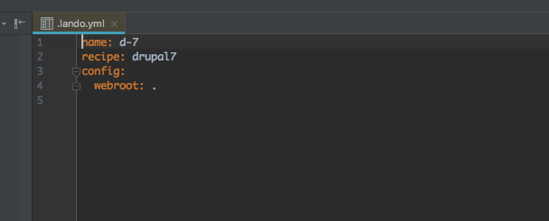
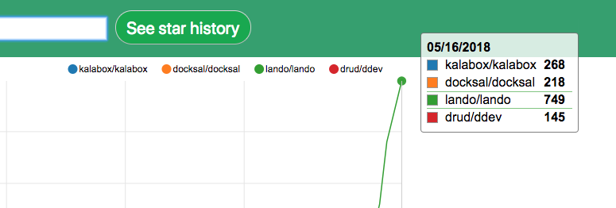
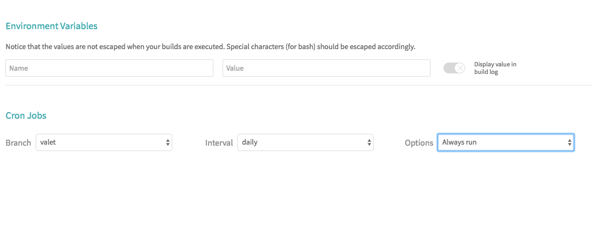

[In a previous post](https://medium.com/@alexfinnarn/drupal-development-environments-off-the-island-400cea9cc90a), I went through discussions about how hard it is to install Drupal vs. some starter kits for other PHP frameworks, like Laravel and Symfony. I vented a little, laughed some, and cried a lot. But now it’s time to see what all that crying was actually about.

This post is about the different setups I attempted while creating a standardized development environment within my current team. In total, there were no less than four different configurations I tested out and tried to finish.

### Lando

Of all of the “off-the-shelf” Drupal development environment solutions I’ve seen, Lando is my favorite. If you ever see [a member of the Tandem team](https://thinktandem.io/about/), buy them a beer for all of their great community contributions. Good job, great show!

Lando is based on Docker, Docker Compose, and custom configurations you can add to your `.lando.yml` file. With other Docker-based solutions, I’ve had to setup a fair amount of configuration in the required “dotfile” for the solution to begin working. Lando has an interesting concept of “recipes” for common frameworks, like Drupal 7 and 8, that make setting up an initial project dead simple.

Recipes are tied to other Docker images needed to generate containers for services, like Apache and PHP. Then, Docker Compose groups the containers and handles the setup container orchestration tasks. You can override the recipes in your YAML file using specific keys [that are pretty extensively documented](https://docs.devwithlando.io/).

To me Lando is unique in the Drupal development environment showdowns, because in addition to the Drupal recipes, you can also use other recipes for frameworks like Laravel and the MEAN stack. All you need to do once you install Lando is run two commands `lando init` to choose your recipe.



And then…you probably should read the linked documentation, but screw it…let’s proceed with `lando start`.



Boomshakalaka!! That’s what I like to hear! I love me some NBA Jam…Tournament Edition, of course. In the terminal output, you can see all the URLs you can access your site from, in my case a Drupal 7 site. They provide secure and unsecure URLs as well as “pretty URLs” via an on-the-fly Dnsmasq feature.

I love how it only takes two commands to start your project and the process is easy to follow, which is great for team members who can struggle with DevOps related tasks. Just tell them to run two commands and they are good to go. If they get a little confused, tell them to read the recipe documentation. Think the config file is confusing?



Think again. That is basically as simple as you can get. Granted, once you start using the recipes you are locked into Lando’s golden handcuffs (just like Drupal contrib modules), but if you’re just needing a development environment to get some work done, who cares? And if you need more customization, you can override a lot of things.

<Embed src="https://gist.github.com/alexfinnarn/f9f10af91f56b195a786ffe6e50a6421.js" aspectRatio={0.357} caption="" />

You can see what I tried to customize above, what didn’t quite work (commented out things…), and the “extras” part that allows you to be a sudo user on your main application container, “appserver”. The tooling section is pretty fun since you can create commands like `lando create-site` and have that run a script on the appserver.

I’m not that familiar with a lot of other Drupal development environment tools, but I think you ought to give Lando a try, if only to have a backup plan for when nothing else is working. Recently, a team member received a new laptop and was able to use Lando to get a working Drupal 7 site after failing to install the non-containerized solution I made up…we’ll talk about that “solution” later.

Lando usage numbers are also great. The [growth in GitHub stars is off the charts](http://www.timqian.com/star-history/#lando/lando&drud/ddev&kalabox/kalabox&docksal/docksal), and they’ve went from 0 to 4500 active users in less than a year.



### Drush Runserver

While Lando was great, trying to setup Behat tests that use Selenium Server via container communication was not. Headless Behat tests ran fine, but interacting with the Selenium Server was always a huge PITA. Since I wanted my teammates to write Behat tests and move towards BDD, I needed to figure out how to run the whole test suite locally including the Selenium tests.

`drush runserver 127.0.0.1:8079` provided me with a running Drupal 7 site once I installed MySQL locally. However, MySQL is now the non-standard part of running a Drupal site in this setup, which isn’t great. I didn’t really care much, though, because I was able to set up a Selenium Server locally outside of Docker and run the whole test suite. Hooray! Done.

But then we ran into an issue where the port used by Drush was a problem when trying to communicate via two local sites. When the port was stripped off of the request via a PHP function, some of our features didn’t work. I think we needed a custom “pretty” domain name, and so it was time to move on…plus, using native Drush and MySQL isn’t a standardized solution.

### Docker Compose

Oh Docker, I wish I knew you better. I briefly tried creating a super-charged, super-fast Docker Compose setup using PHP’s built-in web server and SQLite. In that setup, only one container is needed, core PHP with additional extensions. You’d think it wouldn’t take me all that much effort to set that up, right?

I quickly got fed-up with SQLite partially because I’ve never really tried to use that extension before let alone on these scary Docker container things. I got a Drupal site to install via the UI but via Drush the site install kept hanging for some reason. MySQL was next in line to try for the database layer. I don’t remember exactly how far I got with adding a database layer, but all the sudden, my sites got real, real slow. Not knowing much about Docker, I didn’t know initially what was going on.

Until the internet came to the rescue…well, sort of. I was able to find a lot of information on how [Docker on MacOS can be slow when mounting files](https://spin.atomicobject.com/2017/06/20/docker-mac-overcoming-slow-volumes/) instead of copying them. Mounting files allows you to edit them locally and have the changes show up on your containers instantaneously. If you only tell Docker to copy the files, your local edits won’t get synced back to the Docker container.

When you are developing a new feature, mounting the files you are editing is pretty essential. You can create jacked up file watchers that copy over certain files when they are saved to get around this limitation, but it is really frustrating that mounting files is an issue on MacOS but not Linux…and my team uses MacOS exclusively to develop on. Oy Vey! Moving on…

I also remembered slowness while using Lando and adding more mounted files to the appserver. A team member wanted to use a symlinking setup where many sites could be created that shared the same code files. I think Docker treats symlinks like files, and so the slow down occurs as more sites are added.

### Valet

Somehow one day, I saw a link to the development tool that Laravel developers use when they don’t want to create a virtual machine environment. Laravel’s Valet project is built using PHP, NGINX, and Dnsmasq. It is a super lightweight setup that was markedly faster than any Docker or Vagrant/VirtualBox setup I’ve tried, but it did use NGINX instead of Apache. So, right off-the-bat we were differing from our production environment’s use of the Apache web server. It wasn't even a version issue, it was a whole application layer change: a big no-no in terms of local development environments.

The Valet setup is pretty easy to follow, but depending on the state of your machine, the instructions I wrote in addition to the Valet setup were hard to follow. A few team members had issues with the setup scripts, and truth be told, I had all the dependencies installed on my machine while I was writing the instruction set.

I did set up [a build on Travis CI using their MacOS image](https://github.com/CuBoulder/express-starter/blob/valet/.travis.yml) to test how a new machine would install the whole development environment. I thought that would be good enough for team members to look at who didn’t have the required dependencies installed. And that build worked until development on the instructions stopped and the build on Travis CI wasn’t run for months.

In the meantime, Homebrew decided to move the PHP formulae into their core and Valet looks to [still have not solved that issue](https://github.com/laravel/valet/issues/544). So, when I went back to look at the Travis build due to a team member having install issues, I saw that it was broken due to the Homebrew formula location change.

At this point, I decided it would be a good idea to use Travis’ cron job functionality to run the build every day and use their status check image to display the build state to team members before they tried to install anything.



While more work needs to be done on our Valet setup, most team members report it being the fastest development environment they’ve used within our team. Some nice features are “pretty URLs” via Dnsmasq (same as Lando), the ability to share your local site via a public URL (can also do in Lando), and secure URLs (in Lando too).

Valet also has many drivers detailing how the web application should be served, one of which is Drupal, in addition to the Laravel driver. Many more drivers for serving your application are included than with Lando, but Valet is a PHP-only solution. Having a flexible driver system is helpful when you run into issues and the way it’s set up is very easy to understand and modify. Well, definitely not as scary as containers or VM configuration changes.

I think you should try Valet out if your other solutions are getting slow or complicated. Just be warned that your team will end up with unique setups and it can be a PITA to help each team member deal with their specific issues. Also, I haven’t figured out how to tunnel via Sauce Connect Proxy (our hosted Selenium service) to run Selenium tests locally. It is probably a Dnsmasq issue.

### A Light At The End Of The Tunnel?

While I was evaluating those four solutions mentioned above, I took it for granted that every way you tried to install Drupal was a PITA and far worse than the three commands other frameworks required for a quickly setting up a running application.

And then I saw the [Contenta CMS “quick install” instructions.](https://www.drupal.org/project/contentacms) I had been following that Drupal project since it is the most reasonable thing to play with relating to API-first Drupal initiatives.

```
php -r "readfile('https://raw.githubusercontent.com/contentacms/contenta_jsonapi/8.x-1.x/installer.sh');" > contentacms.sh 
chmod a+x contentacms.sh
./contentacms.sh
```

That seems simple enough, if it works. But regardless, install instructions like that are what most developers want to see when evaluating a full-stack framework.

In conclusion, Lando has been the most stable development environment we’ve used. My setup can sometimes get jacked up, but when that happens I just download the latest Lando release and rebuild everything. I think it is a bad idea to keep stuff you “need” on a local development environment, so while not ideal, I don’t mind blowing away my containers when something seems off or broken.

Valet has been great…for me…but other team members have had problems setting it up and have went back to using Lando. I think Valet is really fast and it was easy to make XDebug work, which has been a PITA to setup on other local development environments. Lando is also easy to setup XDebug with a simple `xdebug: true` in your `.lando.yml` file.

But in the end, I think you are better off using Docker Compose or Vagrant to build a highly customized solution for you team, if you are building out a service or product. If you are an agency, then a tool like Lando might be great for your team to switch frameworks and not have to waste time with each particular setup.

It is a lot of fun to test new solutions out, and if your job allows it, testing those solutions out will pay off in the future. Saving 5 seconds per request or being able to install a site in 2 minutes instead of 10 can really boost a developer’s productivity. Sharing your local site with stakeholders can also be huge.

For me though, I’ll continue using my eccentric, bad practice way of Frankenstein-ing different solutions together when they work cause that’s how I roll. Let me know what you’ve tried out, what worked, and what you learned from your (potential) failures.
