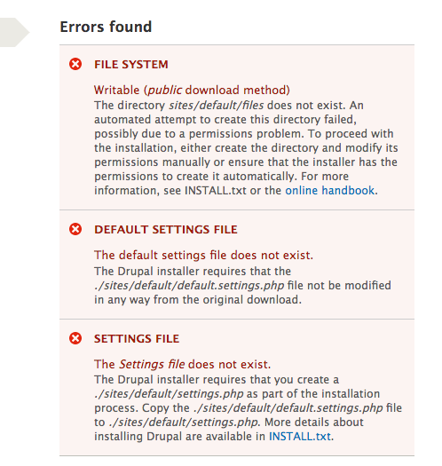
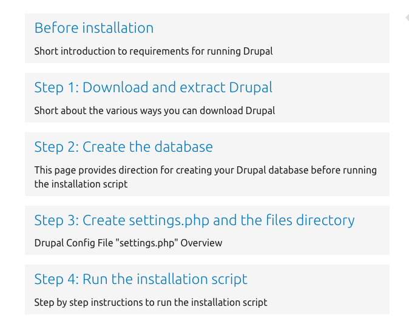

Back in the days of early Drupal 8 development, we were told to “get off of the island” and use “proudly invented elsewhere” tools instead of continuing to do things the “Drupal way.” That sentiment sounded awful nice to me since I knew Drupal had a lot of “Drupalisms” and was terrified of the learning curve graphic for popular CMSes.

I’ve made it past the Drupal bulldozer boss by now, I guess, but I still wanted to know more about the PHP community in general than I was seeing daily while working on Drupal 7 tasks. To really see and try out what other PHP developers were doing and using, I needed to look at development environments that not only included Drupal, but could also run other popular PHP projects like Symfony and Laravel. Since most PHP frameworks allow you to use the AMP stack, I thought there might be one defacto solution to rule them all.

### Drupal’s Development Environment Mess

Other communities seem to have coalesced on defacto development starter solutions, but in Drupal’s spirit of “you can’t tell me what to use/do”, there are many different options a newbie has for choosing a suitable development environment. Several articles have been written about how many options there are for local setups and [how many steps it takes to install and investigate Drupal](http://matthewgrasmick.com/compare-php-frameworks), but I wanted to share my two cents.

I actually took [a survey about local development environments](https://docs.google.com/forms/d/e/1FAIpQLSeyqjE76yabU20nxLZ2DPEU7weuqbMl1-14kC0r-bP7tCp-9w/viewform) recently and noticed that there were many options listed to select from for your tool of choice. I’ll be curious to see what the breakdown is from those survey results. I ended up choosing multiple answers on several questions, which I’ll detail below.

Please take the survey (if it is still open when you read this) before reading my answers so as to not skew any of your answers.

#### Project Types?

When answering that question, I said “Some Drupal 8/Mostly Drupal 7”. Oddly, that answer was the only one where “mostly” came after “some.” Maybe it is some psychological trick to get me to use D8? I don’t know…

My answer comes from working on a team that develops a Drupal 7 profile with hundreds of modules (a lot of contrib) and can’t really take the time to rewrite the whole codebase to fit D8. It is ridiculous to think we can hit an “Update” button and be done. If you’re rewriting your whole codebase in 2018 anyway, why choose Drupal 8 for building you “ambitious digital experience”? 🤷‍♂ I need a tabla rasa with a basic routing and an event messaging system; not a blog on install. Much cleaner…but I digress.

#### IDEs?

I use PHPStorm, VS Code, and Vim in that order. IDEs utilized across teams is a HUGE deal. I’ve seen so many times when a developer turns in ill-formatted code that could have been automagically formatted on file save via an IDE plugin. Why don’t people enable theses plugins? Who knows? It’s so easy to do and you can generally pass around a shared config file.

I hear a little bit about monetary complaints when I suggest an IDE like PHPStorm to people, but I like Jetbrains and what they do for the PHP community so I’m not upset to give them $99 a year for a license. They also have some free licenses for certain open source contributors, but many developers won’t fit that criteria. VS Code is free so you shouldn’t have any complaints from teammates about having to pay for an IDE personally or violate licensing terms.

Vim is just fun to play around with, and it can be a great learning tool for your team to standardize on for remote server work. I only dipped my toes into extending Vim, but with a few plugins my DX on remote servers is infitinetly better.

I can’t beleive I forgot to mention XDebug up to this point, but standardizing on a team IDE can allow for easier and more efficient debugging. No more `dpm()` or `print_r();die();` or anything like that. Just set a breakpoint and don’t fatal error the codebase when Devel isn’t enabled, mayne.

#### OSes?

I use Ubuntu and MacOS personally but development environment setups can change drastically depending on OS. Luckily, everyone on my team has a MacBook Pro so we don’t have to worry about Linux…or even the dreaded Windows platform. I feel sorry for you if you have to use Windows 😢.

Well, it was “luckily” until we ran into the file mounting Docker issues on any OS that isn’t Linux. I’ll get into that later, but we aren’t switching OSes at work so…moving on.

#### Technologies Used For Local Development?

Here is where we start getting into the meat and potatoes of the survey. I’ve tried all of the listed options and am now on a native setup that uses NGINX, PHP, and MySQL. Before that we tried Docker and Docker Composer; before that Drupal community tools; before that Vagrant; before that MAMP.

Over the days and years of developing, though, each developer on my team had an outdated version of the configurations mentioned above and so none of us were actually using a “standardized development environment.” Even after trying to use best practices to standardize across our team, we probably were more likely to be at parity with each other back in the old MAMP days.

I’ll get into why we are sticking with a “native” solution in a little bit, but let’s move on to the next survey question.

#### Tools Used For Local Development?

Best flame war question of the whole survey, IMHO. I had tried to use roughly half of the listed solutions, but I was sad to not see our most recent choice of Laravel Valet listed.

This is the point when you should look at how other PHP frameworks tell curious developers how to begin creating their wonderful app. Just like [Matthew Grasmick](https://www.drupal.org/u/grasmash) was confused when pretending to be a noob looking at Drupal documentation, I am confused on how I should even begin investigating the Drupal framework on my local machine.

[Dries mentioned a funnel](https://dri.es/three-ways-we-can-improve-drupal-evaluator-experience) in a blog post that started with “Discovery” and then “Download” before getting to “Documentation.” But how the hell am I supposed to download Drupal if the docs are fragmented and list multiple ways to do so?

**Side Note:** A local Drupal meetup had a talk recently on the “various ways to install Drupal”, and that presentation title made me laugh and laugh and laugh 😆. There should be only ONE way of installing your framework that you recommend to an interested developer. Don’t overwhelm them before they even get started. They aren’t used to that in other frameworks with starter kits. Be nice.

#### Google “install drupal”

Try that out for yourself, and tell me what you see…I see “[https://www.drupal.org/docs/8/install](https://www.drupal.org/docs/8/install)” as the first link. Off to a good start. Show the developer the most recent version of Drupal with a reasonable page title. Nice.

However, then…six steps?…wait 8 steps?…why can’t I `composer create-project drupal/drupal`? That was my assumption. Welp, I’ll click on the first link “[https://www.drupal.org/docs/8/install/before-a-drupal-8-installation](https://www.drupal.org/docs/8/install/before-a-drupal-8-installation)” and see what happens.

…A Preamble?…to installing your framework?…screw that, we’ll go to “[https://www.drupal.org/docs/8/install/step-1-get-the-code](https://www.drupal.org/docs/8/install/step-1-get-the-code)”. More confusion with multiple conditionals for ways to install Drupal. I probably would quit at this point and try googling other PHP frameworks I’ve heard about.

#### Google “install symfony”

First result of “[https://symfony.com/doc/current/setup.html](https://symfony.com/doc/current/setup.html)” goes to a page with a reasonable title with detailed instructions. There aren’t eight steps, there’s just one page to read.

Install Composer? Not me, I already have that installed. I am a knowledgable PHP developer in working in 2018. Most PHP devs will skip that step. Oh there is a `composer create-project` command? I know that guy already. I’ve used it many times. It seems like a standard way to install a project. Three commands (four if you install the reccomended server) and you’re done.

#### Google “install laravel”

The first result takes me to “[https://laravel.com/docs/5.6/installation](https://laravel.com/docs/5.6/installation)”. I see requirements I need and then get into the commands used. They have a CLI tool they recommend, but you don’t have to use that.

Once again, I skip the Composer step and opt for… `composer create-project`. Hey there that guy is again. Boy he sure seems to show up everywhere that isn’t Drupal…hmmm. Three commands (including the `cd new-site`) and you’re done again.

### Chronological Dev Environment Timeline

Now that we’ve somehow figured out how to get code and where to place it in a Drupal 8 project we need to install a site using whatever development environment we’ve chosen to use. Don’t forget that your Symfony and Laravel sites are being served after install in those few steps mentioned above. No database needed, if you don’t want or need one.

Since Drupal requires a database no matter what, we can’t just use the built-in PHP webserver and go hog wild developing modules. I know scaffolding tools can help with setting up the “pre-install” steps, but creating the files folder and the `settings.php` file was always a pain to me and something I would automate with a shell script. Trouble is, when you are just investigating, you aren’t going to have those shell scripts or maybe even know about Drush or Drupal Console.

…sigh. I was looking for these steps in the Drupal 8 guide, but I only saw “The next step in the installer will verify that your system meets the minimum requirements. If it does not, you’ll be presented with an outline of what needs to be corrected in order to proceed.” on [https://www.drupal.org/docs/user\_guide/en/install-run.html](https://www.drupal.org/docs/user_guide/en/install-run.html).

I cheated a bit to lock down permissions on the `sites/default` folder before trying to install Drupal 8 and ran into my familiar red X homies. It seems like you don’t need to manually do any of those steps by default, so props for that core team, but the “[online handbook](https://www.drupal.org/server-permissions)” link still confuses me.

It leads to a “Webhosting Issues” troubleshooting page, but those three steps aren’t hosting related: they are needed steps for installation. I don’t even have to put my thoughts into words since [a commentator already did so](https://www.drupal.org/server-permissions#comment-5475010) 6 years ago:

> Naturally, when you click that link you expect something like “Here´s how you do grant permissions to files and folders…” But instead, the link points you to a page with webhosting issues, and the first thing it tells you is that you can use specific drupal hostings…So for newbies, the first thing that you think “is there a problem with my webhost”? Well, no. The only thing is that you should change the chmod configuration. Why the page won´t tell you this? I´ve read the whole thing and it won´t clearly tell you how to configure the chmod.

But if I switch back to Drupal 7 docs, I see a nice page about the `settings.php` file and [all I could ever want to know about it.](https://www.drupal.org/docs/7/install/step-3-create-settingsphp-and-the-files-directory) You also get a nice ordered list of install instructions that are better formed than in the Drupal 8 guide, IMHO.

### Get On With The Show, Man

But enough of my rambling ranting without providing any solutions. Documenting a large open source project is hard, and I only intend to point out my journey just as others have done so recently while evaluating Drupal vs. Framework X.

Once you have your AMP stack set up and those tricky files permissioned right, you can actually start trying out dev environments. I’ve rambled too much in this post to add what I wanted to write about in the first place, so we’ll just discuss that in our next post.
