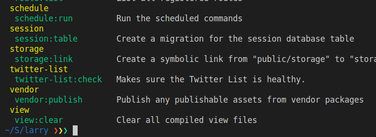

When you first get curious about a development community it isn’t uncommon to follow a “starter kit” project or use some CLItool to help you scaffold the project. In node, you can simply run `npm install && npm run dev` to have a working development environment and PHP has adopted Composer for a similar `composer install` dependency setup. However, PHP hasn’t standardized on using `php -S` to run the development server. 

This is where the Laravel command line “Artisan” executable comes into play. Just like Symfony’s Console, where you start up a server with `.bin/console server:run`, with Laravel and Artisan you can run `php artisan serve` to accomplish the same thing. I would highly reccomend aliasing those two CLI tools to save you some keystrokes, e.g. `alias pa='php artisan'`.

You’ll like do something like `composer install && pa migrate && pa serve` when you start a new Laravel project, and sometimes you’ll see `composer create-project --prefer-dist laravel/laravel blog` in order to not have to clone down a repository first. Laravel goes one step further, like a lot of projects, and even has their own CLI tool where you can switch out the command above for `laravel new blog`, which is much simpler to write. I caved and chose to install the `laravel` tool ’cause of peer pressure, but you don’t have to.

### What Is Artisan?

Now that you have a site up and running, you’re done right? Of course not. Now your actual journey of building a web app begins with a tabla rasa; a blank slate. Well, not really, but not really in a good way. Laravel leaves several stubs in certain places to help you get started. A commented out method here, auto-loading of a blank directory where certain classes will probably go. Things I love to see when I’m just getting started trying to figure out a framework. 

The Artisan command line tool will make your life so much easier by helping to fill in the gaps. With it’s help, you’ll be creating models, `pa make:model`, running migrations, `pa migrate:refresh`, running tests, `pa dusk`, and even getting inspiring quotes, `pa inspire`, when your day just isn’t going that well 🙎

After looking through all of the commands available on project creation, you might start thinking, “how can I create my own commands for my project?” Lucky for you, Laravel makes it super easy to write your own commands making user prompts a breeze, unlike in Bash scripting. In this post, we will go through creating a few commands for a project I’m working on, and we will compare that code with similar code you’d need to write for an equivalent bash shell script.

### My Use Case

I have a project where I want to perform a series of “health checks” for instances of models I imported to an application on creation. The instances are prominent Twitter users in the PHP development community. When I created the app, I manually went through gathering a list of influential tweeters to create a database seed I could use during development. 

Once the site is up and running, however, I want the application to automatically update that list on a schedule so that it always contains the most influential PHP Twitter users according to my health check algorithm. Scheduling that task to run something like once a day seemed like a great candidate for a cron job. When I looked at [Laravel’s scheduling documentation](https://laravel.com/docs/5.6/scheduling), it had “Scheduling Artisan Commands” at the top of the list, so I put two-and-two together as what I needed to complete my task: run a series of Artisan commands during a cron run to prune, modifiy, and sort the list of Twitter users.

### Creating A Command

I will first create a dummy command just to demonstrate that I understand what I’m trying to do here. I highly recommend using this practice in contrast to planning out the exact code you’ll write from the get-go and risk “over-engineering” your new feature. Immediate feedback is your friend here, and with the way commands are executed, getting that feedback is really easy.

Documentation is always at the top of my list as far as things Laravel does well, and they don’t disappoint with [their “Artisan Console” documentation](https://laravel.com/docs/5.6/artisan). You should pause here to read that documentation in order to get a good context for the rest of this post. 

\[Does it use Symfony Console to look at docs too?\]

```
pa make:command TwitterHealthCheck
```

With that Artisan command, we now have a new Command class stub created in `app/console/Commands`. We’ll go over the parts of the command class shortly, but you now can actually see your command show up in the list of Artisan commands already.

```
/**
 * Register the commands for the application.
 *
 * @return void
 */ 
protected function commands()
{
  $this->load(__DIR__.'/Commands');
  require base_path('routes/console.php');
}
```

Laravel conveinently loads any Command class it finds placed in the `/Commands`subdirectory. Run `pa` now to see the newly created command.


