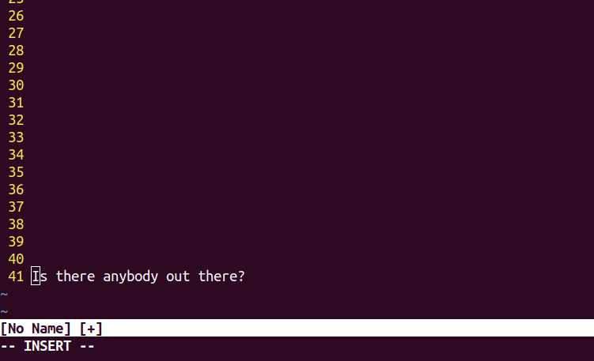

I think that every developer worth their salt has at least heard of the ancient and esoteric text editor known as Vim, and I also think that every developer who lives a normal life has tried and failed at groking Vim, oftentimes while staring into a deep dark modal abyss.

I first learned of its legend back when I was new to the terminal and REALLY needed to edit a file on a remote server without using SFTP. Not that I couldn’t have used SFTP, but rather I wanted to outgrow my little kid GUI pants and do what the big boys did. So, I opened up a terminal window, prayed a little, and entered Vim.

And then…and then…and then… and then I guess I somehow hit the letter “i” or another combination to get into insert mode, but for longer than I’d like to admit I felt like the monkeys in “2001: A Space Odyssey” banging away on my keyboard. Whew, I was relieved. That wasn’t so bad. Finally, I could edit text as I would in any other text editor. Once I had happily made my changes, I instinctively tried the ole’ “ctl+s” for the win.

Except there was no win…or even some wind with a blowing tumbleweed of bits and bytes dusting the screen. Just a lot of nothing and repeated key mashings. Don’t laugh, pounding random keys over and over again has worked for me in the past, I swear. I did notice some pesky \`— INSERT — \` text cryptically staring back at me. Insert what, man?

Sadly, like many before me, I had to Google how to exit Vim: 3.5 million results on Google so far with a third-place finish in auto-completion choices for the stem “how do I exit…”. I think Vim is the only program I’ve opened that I couldn’t figure out how to close. It’s no wonder so many people fail at ever exploring Vim when so many people fail at exiting it. How sad does that make you feel as a “professional developer”? Excuse me sir, can you help me with my computer? Sure, as soon as I can figure out to exit this program over here. I’m real smart and totally work with computers all day long, trust me.

So if you’re reading this and stand on the side of the light, go forth and spread that light to all the junior devs and the meek and the mild. Show them how to exit Vim and how great your dotfiles are. Like snotty-nosed teenagers, they will sneer at your snobbery but thank you ten years later when they’ve become so productive they’re already retired.

This series of posts isn’t an attempt to show you that light or help you on your way towards retirement. It’s not an attempt evangelize for a text editor that has caused much gnawing and gnashing of teeth, either. What I am attempting to do is show you the benefits of trying to use Vim like a pro, even if you don’t fully switch to it as your only text editor. There just isn’t enough time in the day to configure all of the plugins you’d need to match what other programs already do for free. I certainly don’t use Vim all the time, but I have benefited greatly from my foray into Vim and modal bliss.

Future posts will be broken down (and linked once done) into the following categories:

-   Vim and NeoVim: History of the two and installation
-   .vimrc: Where the magic happens
-   Key-bindings: Screw the mouse
-   Plugin managers: Vundle, Pathogen, Vim-plug
-   File Management: Fuzzy search and file explorer
-   Debugging: Set breakpoints, inspect stuff
-   Code Completion: Tab complete to your heart’s extent
