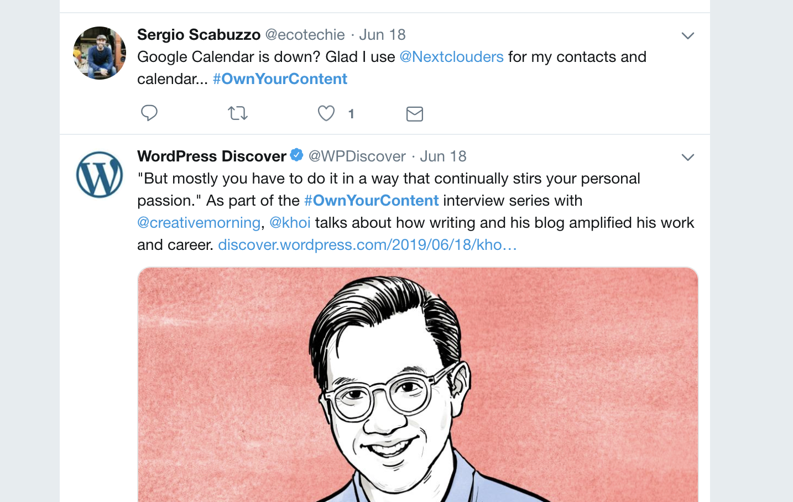
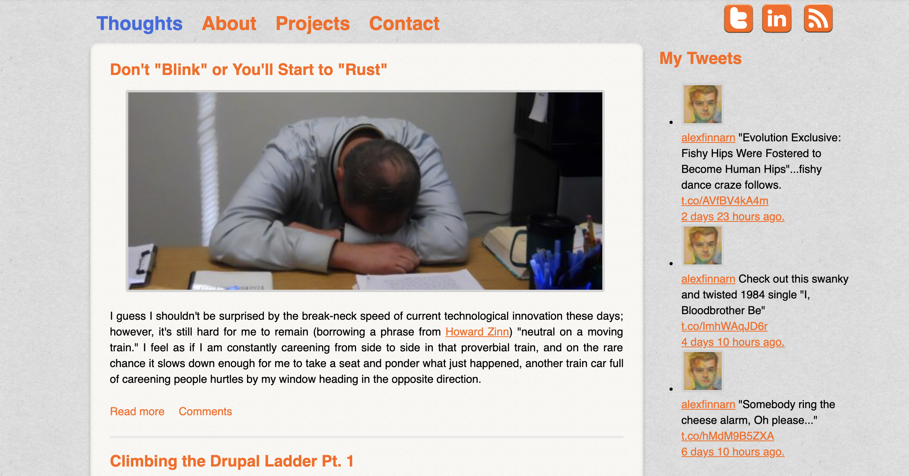
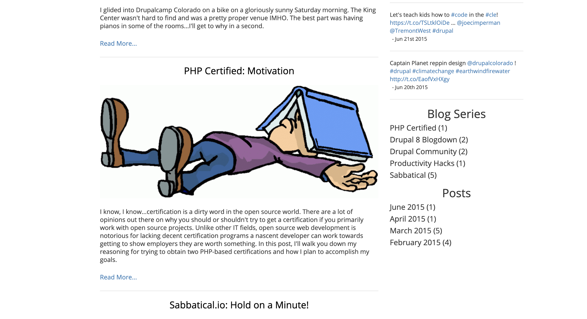
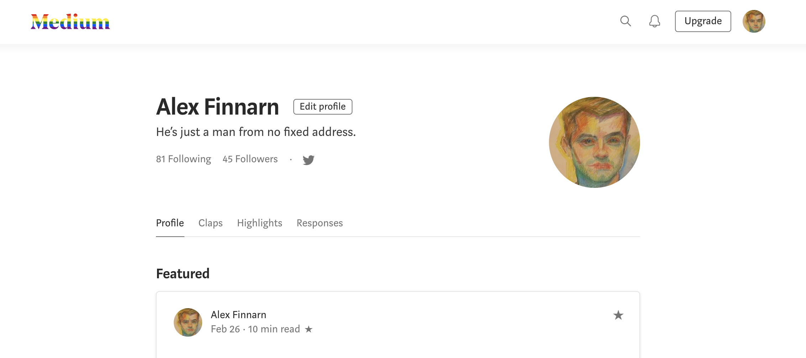
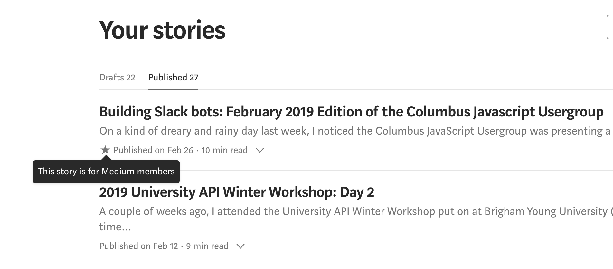
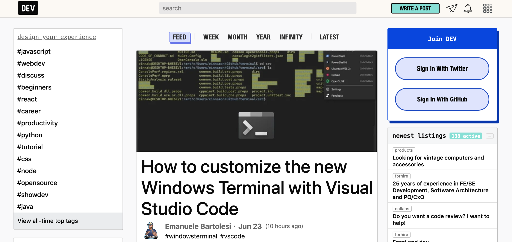
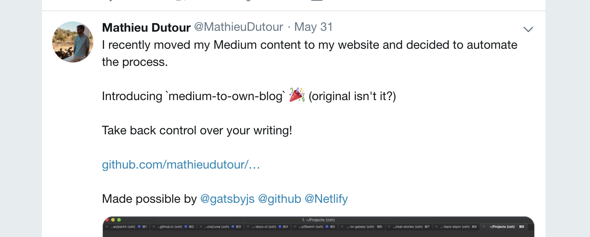
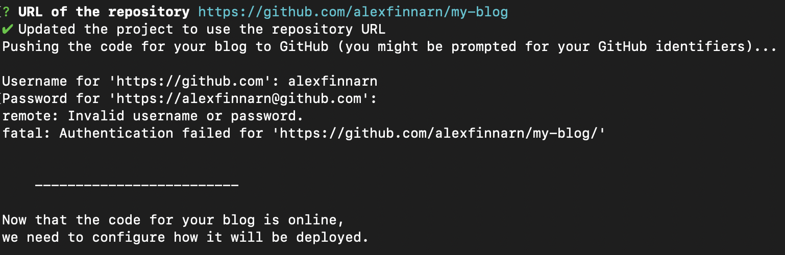
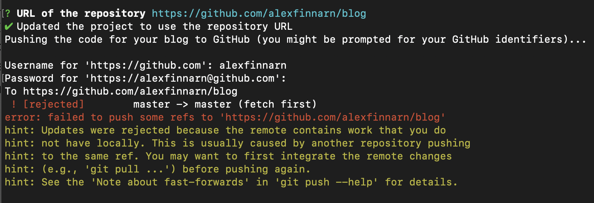

I forget when I first saw the [hashtag #OwnYourContent on Twitter](https://twitter.com/search?f=tweets&vertical=default&q=%23ownyourcontent&src=typd), but I'll always associate it with the blogging platform, Medium.com. The general idea of the hashtag is to warn content creators of what can happen to their content when they publish it on a platform they have no control over.

As I sit here and type, I have no control over how often my drafts are saved, what types of content I can upload, how many external services I can integrate, what analytics are taken into account when someone views an article, and most importantly how companies like Medium make money so I can use their platform "for free." Yes, even this blog post was written on Medium. I thought I would document my process as I went, and I also thought it would be cool, ironic, and way badass to start it on Medium and finish it on my very own personal blog.

Don't get me wrong, I still tend to like Medium a lot for the writing experience. Coming to a site that just shows you a white canvas on page load was/is still refreshing. No clunky boxes to move around and arrange. No WYSIWYG buttons…like who actually wants to mess with justification when you're writing. Float the image over here, now get the pixel size right…whoops, now figure out how `&nbsp; &nbsp;&nbsp;&nbsp;<strong>H&nbsp;</strong><a href="#">ello</a> World<i>!</i>` happened. 🤷‍♂

But then there are the bad things: paywalls, no choice over feature changes or the buttons you get to use…man do I want to center justify this paragraph right now…and the fact that you don't own what you create. I suppose it helps to start this story back when I did own my blog content.

### Alex Gets A Website

I used to own every piece of my digital personality back when I had a website. I guess I had Facebook and Twitter too, but all long-form content, all my actual ideas, all of that stuff was owned by me. The site design, fonts, sidebar widgets…more sidebar widgets. You get the picture. They were all MINE!

And all built on top of the fabulous and glorious Drupal 7 CMS platform. I was interested in becoming a web developer at the time but hadn't obtained my first web job just quite yet. I did insert myself into any conversation where the other party cried out for website assistance, and so I thought creating a blog in my spare time made total sense. This way, I'd have some practice in order to come to the rescue when my job needed a web expert the most.

It's some of the small things that I remember most fondly about my first personal blog site. I remember spending way too much time rounding the edges of the container around my header and content areas. Some repeating background gave me site a papery feel outside of the content container, but it was the gradient and transition to the content area that I remember being satisfied with the most. Oh yeah, and the orange. Orange is my favorite color, and it was pretty awesome to add one of my favorite things to one of my favorite websites…at the time. The only time I see any orange on Medium is when they do something cute with their logo in the navbar of an article layout.

### Sidebars

Not to sidebar this post…but other than the CSS and theme of my personal blogs, the other joy that Medium robs you of is the sidebar, a.k.a the best thing on the web since (sliced) headings and paragraphs. HTML inherently has hyperlinks built into the spec, and once you have some text and a way to link to some other text, you need tools to break up the text and links into visually pleasing chunks. Headings and paragraphs allow you to break up your ideas into the same format someone reading a newspaper would experience.

Just like a newspaper, your website screams out for sidebars that compliment your main content of the page. I certainly want to read about the sensational four-alarm fire on the front page, but I'll also checkout section A4 for that less scintillating but just as important community story. On my old blogs, I could put similar content in the sidebar that might catch someone's eyes. As you would think, these adjacent links helped to move traffic around my site from article to article. People didn't have to search Google to find all my articles, they could find one via Google and then read four more via links placed around my website.

While Medium's starkness provides for a nice, clutter-free reading experience, you probably aren't going to direct many people's attention to related articles they might enjoy if they can only see them after spending the mental energy to needed to read your whole post. I sure as hell never click or even read the titles of the other related articles at the end of a Medium post. I'm too mentally exhausted to do so, and I've already patted myself on the back for learning something new.

Contrast that with the YouTube UI where alternative viewing options are presented eye-level in a sidebar the whole time. After two minutes, maybe I think another video might have better content more along the lines of what I'm searching for. However, if those same videos options show up 50 minutes into an hour long video, I'm not very likely to try and see what alternative view they might have to offer. I don't have the time or mental energy to compare anymore.

Sidebar widgets are not only useful because they encourage traffic to stay on your site, but they are also a useful way to dynamically display different links based on different contexts to different types of users. A/B tests, market segmentation, random fun…or no fun if you only blog on Medium. As a writer, Medium's blank canvas is inviting. As a web developer, it pains me a little every time I look at it.

### My Medium Blog

But look at it I must…at least in the year 2018. A whole year ago. Times move fast, I guess, but in January of 2018, I was reading so much content off of Medium it was a no brainer for me to start an account. I began 2018 with a minimalistic goal of consolidating my digital presence to reside solely on Medium, LinkedIn, Twitter, and GitHub Pages. All for free. No Drupal security updates, SSL renewals, or shared hosting SNAFUs. I was going to keep it simple.

And it worked. I was able to jump into writing a blog post within seconds. No sidebars were there to distract me. I couldn't think of a cool new feature to add to my site that derailed my writing. I had just enough tools to write a decent blog post and no more. The Medium did a great job of offering that experience.

I was also able to judge my word counts, how many people looked at a post, how many people actually read the whole post, and an estimate of how long it took the average reader to finish a post. After a few "good" posts relating to the Vue.js framework, I even got one post curated by Medium staff that helped to boost my readership. Sadly, I didn't have enough time and energy to continue writing posts around that topic, but before Medium, I had no insight into stats around my blog post.

### The Developers Grab Their Pitchforks

I wasn't the one who started chanting for people to #OwnYourContent, but I eventually heard them loud and clear. It seems that most people thought highly of Medium in the beginning when the service was courting users, but at some point, the public's opinion soured for various reasons.
 
Developers holding their pitchforks and torches would shout such things as:
- Medium is trying to aggregate your content behind a subscription service. Write because you have something to say with personality, not for page views.
- Centralizing the internet is bad in its own right. Don't you remember when the internet had personality due to its inherent decentralization? Blink tags. Image maps. [Space Jam website](https://www.spacejam.com). Need I say more?
- You have no control over stats, layouts, integrated services, etc.
- Medium removes the "face of the content". A lot of my views on Medium come from external sources so I might as well brand myself if the Medium community and curators aren't helping spread my gospel.

The worst part for me was quickly agreeing to some prompts one day thinking I struck it rich in fame and fortune only to see I had joined the paywall, I guess. I personally didn't notice any changes from my experience writing articles, but if you tried to read my new articles, your experience was definitely different.

Crap. My zeal for easy and free hosting had tarnished my higher goal of always freely publishing my content. Crap. Time for a plan.

### My Closest Medium Competitor: dev.to

[dev.to](https://dev.to) came into fruition around 2016 as a platform "where programmers share ideas and help each other grow." How nice 😍! I started seeing posts on it more and more late in 2018 and liked the idea. I can certainly get behind a platform dedicated to sharing programming knowledge as that is the focus of almost all my blog posts. Coincidentally, 2016 was the year Medium introduced paywalled content so maybe dev.to was in part a reaction to that move. Maybe they have a pledge that they won't turn into Medium or something like that.

Even if that were the case, I didn't want to switch to another platform that had the potential of a user uprising, and then eventually find an even niche-ier platform to move to after that. If I was going to exit the ease and comfort of an all-in-one freely-hosted blogging platform, I might as well go all-in.

### #OwnYourContent TLDR;

Luckily for us, it's 2019 and it's hella easy to get out of Medium…like really hella easy. The process will literally take you about 5–10 minutes depending on how many Medium posts you've written over the years. It took me about 40 minutes, but that's because I ran into a few issues I reported and will try and help fix.

Here's a list of them in case you see something similar.

I ran into [an issue with two-factor authentication on GitHub](https://github.com/mathieudutour/medium-to-own-blog/issues/54). I kept copying over my username and password, but the prompts never correctly completed for me. It finally dawned on me that I should try to log out and log back in via my browser to see if I had any issues.

It was then that I remembered enabling two-factor authentication (2FA) security on my GitHub account. Every time I use HTTPS, I have to also okay the login via 2FA. If you copy the ssh URL like you normally would when you `git clone` a repo, I don't think you'll encounter my authentication issue, but the current instructions point you to use the HTTPS URL at the prompt.

You can also just use your personal access token when prompted…but that assumes you remember that's a thing.

The second issue I ran into relates to the screen you see at https://github.com/new. I like to add a readme, .gitignore file, and recently, the Renovate Bot plugin on new repos, but if you do that, then the remote has work that the local repository doesn't. I think cloning down the GitHub repo instead of creating it locally within the node script will [fix the issue, but we'll see about that](https://github.com/mathieudutour/medium-to-own-blog/issues/55).

[My final issue was an errant ` ` tag within a bulleted list](https://github.com/mathieudutour/medium-to-own-blog/issues/56). I kind of found it hilarious that the break tag caused all hell to "break" loose, but once I wrapped that in single tick code marks, it seemed to work fine.

Behold, I give you my own Medium thanks to [@MathieuDutour](https://twitter.com/MathieuDutour): https://read.finnsweb.io Huzzah! 🔥

### Next Up: Editing and Creating Posts

Nww that I have...