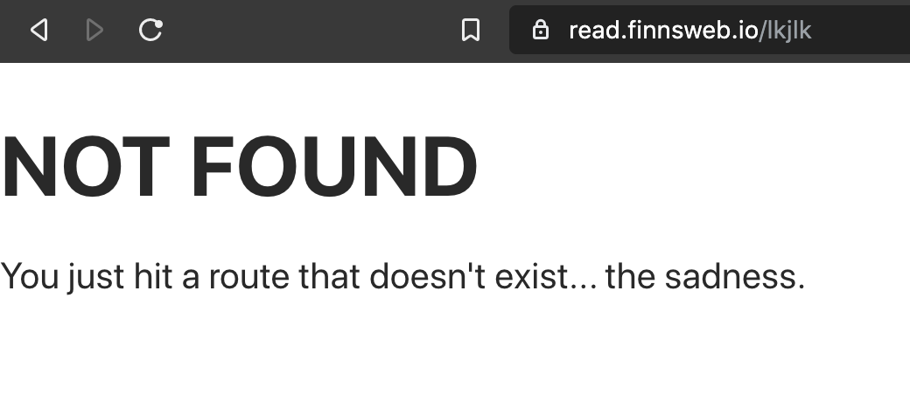
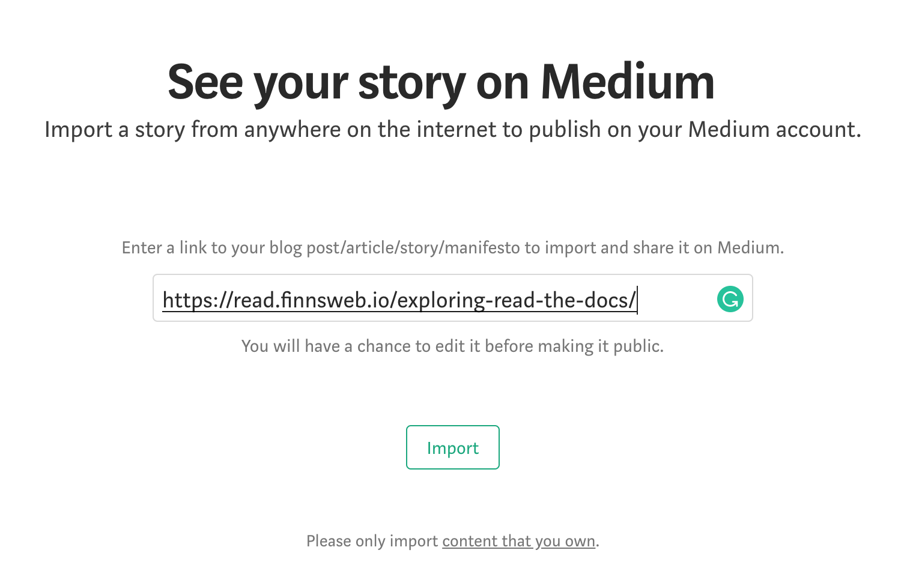

<!-- import Helmet from 'react-helmet'

<Helmet>
  <meta property="og:type" content="article" />
</Helmet> -->

In [my last post in the #OwnYourContent series](...), I went over how to manage DNS for your new blog since Medium isn't doing that for you anymore. While going through that exercise, you may have noticed that all my domain aliases point to the same content at this point. I'd like to see `www.finnsweb.io` redirect to `read.finnsweb.io` for now until I can come up with something more general for `www.finnsweb.io`.

I also want to have a good strategy for posting content back to Medium or a similar syndication tool like dev.to in order to not lose the good SEO traffic I've already built up. My Medium account, https://www.mediumcom/@alexfinnarn, is the second link in Google search for "Alex Finnarn". I definitely don't want to ignore that link since the highest result is from a previous employer's website, and I can't control where they redirect anything. If my online presence amounts to a 404 and then a blog that hasn't updated in months, people might not see me as much of a competent, expert web developer.

### Managing Redirects Through Netlify

The first order of business is making sure that we're getting all users to the right URLs that we want to boost on organic search platforms like Google. Going back to my previous example, if we split traffic three ways between `finnsweb.io/article-1`, `www.finnsweb.io/article-1`, and `read.finnsweb.io/article-1`, then the URL I want people to share, `read.finnsweb.io/article-1`, might only get a third of the traffic. Coupled with penalties for duplicate content, that reality would be really bad SEO.

[The Netlify documentation regarding redirects](https://www.netlify.com/docs/redirects/) points to two places where you can place redirect rules: a `_redirects` file and in `netlify.toml`. So, which file should you put your redirect rules in, you ask? Well, it all depends.

I started by placing them in `netlify.toml`, because my version of that file was very slim and I didn't want to create another file until there was a good reason for me to do so.

```yaml
[[redirects]]
  from = "https://finnsweb.io/*"
  to = "https://read.finnsweb.io/:splat"
  status = 301
  force = true
  # query = {path = ":path"} # COMMENT: apply this rule for /old-path?path=example
  # conditions = {Language = ["en"], Country = ["US"], Role = ["admin"]}
  # headers = {X-From = "Netlify"}
  # signed = "API_SIGNATURE_TOKEN"
```

As you can see, creating the redirect rule takes a few key-value pairs including where you want the user redirected and the status code of the HTTP response amongst other options you can play around with. I only used the basics here, but the GeoIP and role-based redirect options seemed pretty interesting. You can [check those out in the Netlify documentation](https://www.netlify.com/docs/redirects/#geoip-and-language-based-redirects), if that tickles your fancy.

My redirect rules living inside `netlify.toml` was short-lived, however, as I simply needed to add the same rule a few times for the different domain aliases I created. The important Netlify-specific thing to look at here is the `:splat` variable. If you've ever made any redirect rules via Apache, which is where I've always placed redirects at the web server level, you can think of `:splat === $1`.

### \_redirects File

I prefer the simplicity of looking at a one-liner for my redirects rather than four lines each time so I opted to create the `_redirects` file mentioned in Netlify's docs. I wanted to see if I could redirect all of my traffic from `https://*.finnsweb.io` to the specific subdomain that hosts this blog at `https://read.finnsweb.io`, if that was possible.

```
https://:sub.finnsweb.io/* https://read.finnsweb.io/:splat 301!
```

To test out my idea based on what I could glean from the docs, I wrote that line above into a `_redirects` file and built the site. To my dismay, things didn't work as I had hoped...not sure I expected to have all my domain wants met for free from Netlify, but I had to try.

The `sub:` placeholder was supposed to allow the splat operator to still pass over the slug of the posts while representing any subdomain someone might try to access my site at. However, the request can't even get to your redirect rules if you don't already have a domain alias set up in the Netlify DNS dashboard. Unfortunately, you can't add a wildcard entry on the free plan. I saw mention of being able to do this on the Pro plan, but I can't confirm anything.

```
https://finnsweb.io/* https://read.finnsweb.io/:splat 301!
https://www.finnsweb.io/* https://read.finnsweb.io/:splat 301!
https://foo.finnsweb.io/* https://read.finnsweb.io/:splat 301!
```

So instead of leaving the previous rule in, I decided to name specific sub-domains to redirect to. To my confusion, this didn't seem to work while the `netlify.toml` redirect did...hmm. I even added a dummy `foo.finnsweb.io` redirect rule, and that worked in my `netlify.toml` file but didn't seem to in the `_redirects` file. Oh well.

Even though my redirect rules aren't all that complicated, I'm beginning to feel like I'll outgrow Netlify's free tier pretty quickly. And since this blog series is about owning your content, I think I will probably move my app to be hosted on Digital Ocean or Linode in a future blog post. On top of having way more freedom, I'll get to learn more about GitHub apps and webhooks, which are two topics I've been wanting to learn more about anyway.

### Pretty URLs

There is some caveat on trailing slashes and the CDN where you can create an infinite redirect by adding a rule like: `/blog/remove-my-slashes/ /blog/remove-my-slashes 301!`. The reason is that those URLs are basically the same. I don't really care about this caveat or trailing slashes, but I do like to make things pretty if it is easy to do.

> You cannot use a redirect rule to add or remove a trailing slash. However, you can enable Netlify’s Pretty URL feature, from your site dashboard at Settings > Build & deploy > Post processing > Asset optimization.

You might have some reasons to not turn this feature on, but you might as well start with it enabled.

### Better 404 Page



The project I used to convert my Medium blog to a React and Gatsby-based blog had the forethought to include a 404 page, but as you can see from the screenshot, the content of that page is quite lacking. Instead of leaving users hanging, I thought it would be great to redirect them to the blog listing page with a little message about why they were redirected.

It took me a little while to figure out how the default 404 page works on my blog, but it comes from default Gatsby behavior. When you create a component file under `src/pages/404.js`, Gatsby converts that to `https://www.example.com/404.html`, and whenever Gatsby can't find a component to match the current route, the user gets sent to that 404 page.


And if you don't include a 404 page at all, you'll see some message like that above.

```jsx
const NotFoundPage = () => {
  useEffect(() => {
    setTimeout(() => {
      navigate('/')
    }, 5000)
  }, [])

  return (
    <Layout>
      <Section centered>
        <SEO title="404: Not found" />
        <h1>NOT FOUND</h1>
        <p>
          You just hit a page that doesn't exist and will be redirected back to
          the home page in five seconds.
        </p>
        <p>
          If you are not redirected,
          <Link to="/">click here</Link>.
        </p>
      </Section>
    </Layout>
  )
}
```

The code used here is pretty juvenile, but it works for me for now. I'm using a React Hook at the top that will only run when the component mounts. The empty array passed in as a dependency ensures the effect will not be tied to any state changes and thus will never run again. Once five seconds has passed, the `navigate()` helper function programmatically redirects the user back to the homepage.

Now since this a static site that by default doesn't need JS to work, I also included the link just in case a user has JS turned off. The `<Link>` component comes from the gatsby project, but it is really just a wrapper around `@reach/router`. So, if you know Reach Router then you shouldn't have a hard time following along here.

### Import Your Stories On Medium

Now that I have at least done something with redirects, I can move onto re-posting my content on Medium. My blog content on that platform is getting pretty still since I haven't posted back any content since I began moving my blog over to Netlify.



If you navigate to "https://medium.com/p/import" and put in a URL of a blog post, then Medium will attempt to pull all your content in through an import process. I found the first pass of one of my articles quite lacking. I was a bit dismayed that even though I was using very similar syntax to what I felt like I was using while writing a Medium article, a lot of the formatting didn't come through.

When I looked at the source code that Gatsby generated, it didn't look awful, but I can see why Medium had a bit of trouble converting the code blocks. None of my images were converted, however, and this made less sense to me. Other things like quote blocks were off, and when I put all of the issues together, I thought I might as well table reposting my content until I could improve the process.

At the end of the day, I would just copy your Markdown into a new Medium post to make sure that the conversion process doesn't miss anything. If I were serious about my content and syndication, then I'd probably do this, but for now, I'll be lazy and skip it.

### Summary

And there you have it. A way to redirect users from Netlify's side of things, a way you can programmatically redirect users from a 404 page, and a way to redirect people from your Medium blog to where you post content now. In my next post, I'll continue on with adding analytics and some other SEO-related topics.
