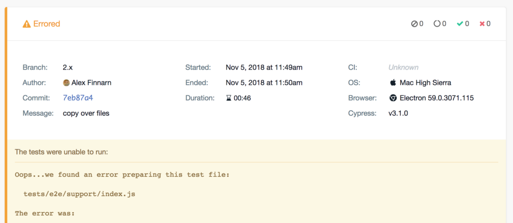

This is the third part of a series where I update a Vue application built from static HTML files to using the Webpack boilerplate template to finally using vue-cli 3. 

Previous posts:  
\-   
\- 

I originally just wanted to fix my testing setup to run reliably on Travis but chose to update everything, because I ended up having 43 outdated dependencies I didn’t want to look into updating them. The original tests used Nightwatch.js, Karma, and `json-server` to run E2E tests, but in the newer version of my app, I will be using Cypress, Jest, and some sort of VCR-type tool to record API interactions. 

### Previous Testing Issues

The previous testing issues I’ve had testing my app all relate to the stability of the testing environment. Since my app is a front-end that interacts with an API, I needed to simulate the requests and responses that normally happen when a user sends POST, PATCH, and GET requests. I also need to try and simulate the most popular browser used, Chrome, and potentially other browsers if possible. 

To simulate the responses from the API, I simply ended up GETting responses to the listing endpoints for each resource/record type. With that data, I could then POST and PATCH the records using a sample derived from an actual record. I didn’t get any validation with this method, although I could have stored those responses just the same as I had the listing of all records. 

When I ran the tests, I had some issues selecting certain records via CSS selectors, but I don’t think that was a limitation of Nightwatch.js \[link\]. The selectors had the record IDs in them, but I probably could have handled that with some visible text a user would see relating to one of the record’s fields. 

I do think the Selenium integration to Nightwatch was an issue I couldn’t really do much about. The Selenium tests ran fine locally, but rather than setup Selenium Server on Travis CI, I had been using Sauce Labs for other projects. Those projects had pretty reliable results, but for this app, the E2E tests usually failed at random points due to a component not loading or some JS issue. The other projects I mentioned don’t use a lot of client-side JS so that might be one reason they have more reliable test run results. 

### Cypress Test Runner

> “Fast, easy and reliable testing for anything that runs in a browser.”

Cypress bills itself as [an evolved version of E2E testing](https://www.cypress.io/). It doesn’t use Selenium and packages everything together for you claiming to make writing, running, and viewing results for tests a breeze. One reason to consider Cypress is for simplicity’s sake.

](./asset-1.png)

I always hated looking at all parts of the testing framework side of things , having to pick and choose solutions, and then having to configure settings to make all of this stuff work. I might eat my words, but the generated configuration for Cypress from vue-cli 3 is only 24 lines vs. 96 in my old setup. 

Not that lines of code should matter all that much in the end, but when you’re new to something, less boilerplate makes it easy to follow what the code is doing. My Nightwatch setup might have had a lot more going on and functionality I never used, but I enjoyed seeing less configuration upon initial inspection.

```
// cypress.json
{
  "pluginsFile": "tests/e2e/plugins/index.js",
  "projectId": "8ys7r3"
}

// tests/e2e/plugins/index.js

// https://docs.cypress.io/guides/guides/plugins-guide.html
/* eslint-disable import/no-extraneous-dependencies, global-require */
const webpack = require('@cypress/webpack-preprocessor')

module.exports = (on, config) => {
  on('file:preprocessor', webpack({
    webpackOptions: require('@vue/cli-service/webpack.config'),
    watchOptions: {}
  }))

  return Object.assign({}, config, {
    fixturesFolder: 'tests/e2e/fixtures',
    integrationFolder: 'tests/e2e/specs',
    screenshotsFolder: 'tests/e2e/screenshots',
    videosFolder: 'tests/e2e/videos',
    supportFile: 'tests/e2e/support/index.js'
  })
}
```

That is all the configuration I have at the moment and it was easy to see where to put the tests, where images and videos of test runs would go, and how to extend Cypress if I need to do so. 

The “projectId”: “8ys7r3” line actually connects my codebase to a Cypress test runner service where I can view reports of test runs complete with videos, screenshots, and even stack traces when a test fails. I’ll go over the “Dashboard Service” \[link\] a bit later, but I started with the seed plan that is free and good enough for me to explore. 

### TypeScript Errors

I was excited to see how the testing service performed since reliability was the reason I wanted to switch testing frameworks. I usually had to spend a decent amount of time setting up configuration on Travis CI, but maybe I won’t this time. I set up a simple test that passed locally and tried running that through the Cypress testing service. Uh oh, I had syntax and other errors to check out.



I started writing about all my errors and how I fixed them, but I had so many issues to fix that I wrote up another post \[link\] solely on changes I made after adding TypeScript support. The Dashboard Service did allow me to inspect the errors in a more friendly, and public way so Cypress helped me in that way.
