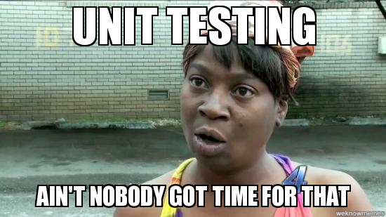

I try to write tests, I really do. I utter that phrase every time I enter the confessional booth and it usually doesn’t incur too many hail mary penalties since the priest has heard that phrase uttered many times before. He doesn’t write tests either.

I feel ashamed to say that I’ve never written a proper unit test, but I have written many functional tests. One can debate the merits of which type of test to focus on while developing your feature, but I say that if your team isn’t large, you aren’t working within a service-oriented architecture, and you always deploy a monolithic application accessed via HTTP, functional tests are far more helpful than unit tests.

Here’s why: using information visible to the user and simulating how they interact with your app can catch bugs that unit tests simply can’t. After all, the end-users are the ones who you are serving and their experience matters most in regards to keeping your job. With all the focus on abstractions like mocks, stubs, spys, and the like, why not just use your app like a real user would for testing \[try to find a link to presentation\]?



I’m not trying to dissuade you from writing unit tests, but more so trying to give you a possibly more pragmatic and expedient approach to smoke testing your application.

### My Past Experiences: Mainly Behat

When I started my current job, we were using Behat \[link\] to run some functional tests against our codebase. We weren’t close to 100% test coverage, and with functional tests, it’s hard to measure that metric accurately anyway. We did catch bugs with the test runs on PRs and merges into our dev branch so the Behat tests were providing some value.

I ended up taking over the job of writing some tests and making sure they ran on Travis and could be run locally while developing features. We mainly used the headless Goutte driver for feature scenarios that didn’t have to interact with a UI too much and Selenium for tests that did. Oh Selenium, how much I loathe thee. 

The Selenium tests were usually super slow, especially when using a hosted solution for standing up the Selenium server, and I tried to discourage writing `@javascript` tests so devs could get more immediate feedback from Travis test runs.

On another app I was developing, it came with Nightwatch.js \[link\] via a starter kit, and the default for emulating a browser was Selenium again. I almost got to the point of having the tests run locally and on Travis successfully, but the test runs on Travis kept failing because Selenium was inconsistent on loading and interacting with the JS via a hosted Sauce Labs setup. Sauce Labs is great; my particular setup just wasn’t great.

### Enter Puppeteer

Just like a lot of devs, I look at several Slack channels during the course of my day. Most of the time, the banter/discussions aren’t all that useful for me, but in rare cases, I’ll see someone post a link to some resource that I can immediately use in my day-to-day work. In one Slack, someone posted [a link to Puppeteer](https://github.com/GoogleChrome/puppeteer), and it looked promising enough for me to try out.

Puppeteer is developed by the Chrome DevTools team for the main purpose of providing a “canonical library that highlights the capabilities of the [DevTools Protocol](https://chromedevtools.github.io/devtools-protocol/)” among other goals. My favorite listed goal and the focus of the blog post is: “Learn more about the pain points of automated browser testing and help fill those gaps.” I was going to add more quotes as I read the FAQ section, but you should probably just read it yourself. 

The FAQs do discuss Selenium and how that project compares to Puppeteer. The main difference amounts to Selenium trying to be a cross-browser automation solution while Puppeteer only focuses on Chromium. Since I was testing on Chrome and used the `chrome-headless-driver` at points when Selenium server crapped out on me, this isn’t a big deal for me. 

They also had a couple lines that jumped out at me, and I will quote them. “Puppeteer requires zero setup and comes bundled with the Chromium version it works best with…” OMG, yass! Setting up Selenium with the right versions of the driver was always a nightmare for me. “There’s no need for evil “sleep(1000)” calls in puppeteer scripts.” OMG, double yass!! I moved onto “wait until element appears” in my tests, but using that method, you have to rely on the specific structure CSS for an application, which is a very brittle solution.

My next question was how I would run Puppeteer on Travis CI, the CI service I’ve always used for testing apps. A quick Google search provided some GitHub issues about testing not working on Travis CI (bad) that led to [example projects with code I could use](https://github.com/bennyn/example-puppeteer-travis-ci) in an initial setup (good). 

### Dissecting The Examples

Since [Puppeteer comes with examples](https://github.com/GoogleChromeLabs/puppeteer-examples), you should not miss that piece and probably start there. I had some trouble running Puppeteer with some other example projects, but this repo installed as expected. 

Since I was interested in crawling a website for a project, I first ran `node crawlsite.js`. I wanted to capture the output of the page after it was fully rendered and store the DOM somewhere for future analysis. I was happy to see they had developed a `collectAllSameOriginAnchorsDeep()` function that I could dissect and adapt for my use case. That function “_Finds all anchors on the page, inclusive of those within shadow roots.”_ I’m not sure I get the shadow root part at this point, but I do want to find all the anchor links on the page.

I quickly noticed while looking through crawlsite.js that I don’t know modern JavaScript much at all. I started learning some ES6 as I developed a project using Vue.js, but I’ve never used `await` or new data types like `Set` before. Sure, I’ve heard about them and read some blog posts, but until I use something in a codebase, all that knowledge goes in one ear and out the other. I do like it when an example or some code dependency I’m using introduces me to code I can work with to learn those new features/concepts, though.

The next script I looked at was `pacman.js`. In that script, you can see how to launch Puppeteer in a non-headless mode.

```
const browser = await puppeteer.launch({
  headless: false,
  args: ['--window-size=800,500']
});
```

By setting `headless` to false and the window size, you get a Chrome window to pop up where you can play Pacman using the arrow keys on your keyboard. Watch out though, you might get sucked in and lose some productivity time if you aren’t careful. 

### Page API

Other than launching the browser, creating a page instance, and closing the browser, the `Page` class is used to control navigation in the Pacman example. My next stop was the Page section of the API documentation.
