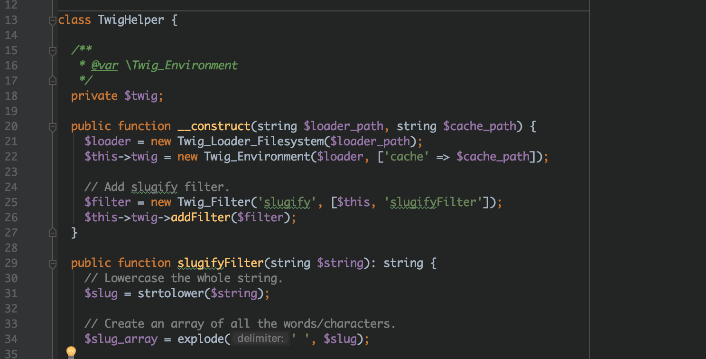

In this new year of 2019, I’d like to say that all my Drupal work happens on the Drupal 8 (D8) platform, but like a lot of you, I still mainly work on Drupal 7 (D7) sites. One goal I’ve had for a while is to try and reduce the Drupal-ness of my codebase so making a jump from D7 to something else isn’t so rough.

Even though I know a lot of D7 “magic” that greatly speeds up my day-to-day development work, I thought that if I only use D7 for routing and asset loading, then my code will be more robust and might not need to change much at all when switching off of D7. Sure, it will take me longer to learn how to replace my previous hook-fu with custom code, but I’ll be picking up a templating engine I’ll most likely be using in future projects.

D7 and D8 to a large extent are huge monolithic codebases that include everything and the kitchen sink. While ditching the framework knowledge you’ve come to love, you’ll quickly come to the point where you want to use third-party code instead of replacing all the lost functionality with custom code.

When using Composer in D8 work, you’ll find a lot of resources on best practices for including PHP packages, and for D7 I’ve previously looked at the [Composer Manager module](https://www.drupal.org/project/composer_manager) for managing dependencies, but I never got to try it out.

### Adding A Single Dependency To Your D7 Site

Rather than go whole-hog on abstracting away Composer management to work across a whole set of contrib modules and entire codebase, I stuck to using Composer within a single module directory and only adding one dependency. Using this method, I can test out using some third-party code in an isolated manner as well as taking less development time to see what the DX experience looks like.

Since I am replacing the rendering engine with Twig, I first needed to download Twig and its related dependencies.

```
mkdir my-module && cd my-module
composer init
composer require "twig/twig:^2.0"
```

I won’t go into making the Drupal `.info` and `.module` files here, but hopefully, those Composer commands look somewhat familiar to you and they are all the Composer commands I needed for my experiment. In truth, I could have just cloned down the Twig Git repository and totally ignored Composer, but since I will use Composer a lot going forward, I might as well use it here.

You’ll now have a vendor folder, `composer.json` , and `composer.lock` file in your module. We won’t touch any of those for now, but we will create a `src` directory to house the “Twig helper” code needed to render our templates. I’ve started putting all the code I use in D7 sites in my `src` directory as is customary to do in many framework’s conventions.

### Booting Up Twig

Just like you would normally do in D7, we need to make a `hook_menu()` entry pointing to a callback where we can initialize our Twig helper object and render whatever data we need.

```
$items['render-me/%'] = [
  'title' => 'Twig Helper',
  'page callback' => '_my_module_render_me',
  'page arguments' => [1],
  'access arguments' => ['view stuff'],
  'type' => MENU_CALLBACK,
];
```

At this point, you might use `theme()` or `drupal_render()` or something like that to return the output. Since we want to un-Drupal ourselves as much as possible, we’re using Twig to do the rendering instead. But how do we boot up Twig?

```
function _my_module_render_me() {
  include_once __DIR__ . '/autoload.php';
  $loader_path = __DIR__ . '/twig_templates';
  $cache_path = __DIR__ . '/twig_cache';

  $twig_helper = new TwigHelper($loader_path, $cache_path);
```

You can read more about [how to install Twig in the docs](https://twig.symfony.com/doc/2.x/api.html), but essentially, you need to load the Twig library and create two directories: one for the templates and one for the cached versions of the templates.

Every PHP templating language has to be converted back into code that can be interpreted at run-time. Twig speeds up the process by caching a version of the templates and using a `doDisplay()` function to render beautiful lines of code like:

```
echo twig_escape_filter($this->env, ($context["baseURL"] ?? null), "html", null, true);
```

The cached files aren’t pretty, but the baked-in security is quite nice.

You might have noticed that my `autoload.php` line didn’t live in the `vendor` directory like it normally would. Since I am loading a few other classes as well as the Twig library, I just made my own autoloader file at the root of the module. This way, I only have to require one file in my callback that loads all the dependencies I need, including whatever I have in the `src` directory.

```
// in autoload.php
require_once __DIR__ . '/vendor/autoload.php';
require_once __DIR__ . '/src/TwigHelper.php';
require_once __DIR__ . '/src/OtherClass.php';
```

You may have also noticed the use of `__DIR__` instead of `drupal_get_path('type', 'name')` like is custom to use in D7 code. `__DIR__` will return the path to the directory of the script that is calling it. Since the `.module` file is at the root of the module directory, it is equivalent to `drupal_get_path()`. The reason for using the D7 function relates to the module discovery mechanism where `sites/my-site/modules` trumps `sites/all/modules` and so forth. In my case, I know that my module is never going to move anywhere else, so I don’t have to worry about multiple versions of things.

### Adding Filters

One nice feature Twig has that isn’t as easy to do in PHPTemplate is the use of filters. You can think of filters as streams you can chain together to transform a variable for display purposes. A common use might be to “slugify” a URL from a page title or to lowercase a string that might include capital letters.

With PHPTemplate, you would have to include functions that take a variable and return something that can be printed to the screen, but I’m not sure of the best place in the code where those functions would be included. With Twig, I can include those in my `TwigHelper` class. I did need to include a “slugify” filter, and it was pretty easy to do so.

```
public function __construct(string $loader_path, string $cache_path) {
  $loader = new Twig_Loader_Filesystem($loader_path);
  $this->twig = new Twig_Environment($loader, ['cache' =>   $cache_path]);

  // Add slugify filter.
  $filter = new Twig_Filter('slugify', [$this, 'slugifyFilter']);
  $this->twig->addFilter($filter);
}
```

I added the filter in the constructor function. `slugify` is the name of the filter used in the actual Twig template file and it points to the `slugifyFilter($string)` method in the same `TwigHelper` class. Then, in the template I can use it as `{{ var|slugify }}`.

### Rendering The Template

Now that we have Twig loaded, we need to render the template. The Twig `render($name, $context)` method looks and functions a lot like the D7 `theme($hook, $variables)` function. The first parameter links to a template file and the second parameter passes in any needed variables the template needs to know about.

```
$vars = ['name' => 'Alex', 'age' => 32];

// Drupal 7
return theme('my_template', $vars);

// Twig
return $twig_helper->render('my.template.twig', $vars);
```

As you can see, they both return a string of HTML as output you can return to D7 in your callback. But what do the actual templates look like? Well, you’ll be happy that they don’t look all that different than what you’re used to in D7. I’ll show you a select list in a Twig template that uses `foreach` and `if` statements.

```
<select name="d-type-select" id="d-type-select">
  
    <option value="{{ type }}"
         selected >
      {{ type|filtered }}
    </option>
  
</select>
```

The control structures are listed in `` blocks while the `print $var` equivalent happens in `{{ var }}` double brackets. You can use a filter with a pipe symbol in a double bracket like so: `{{ var|filter }}`. There’s plenty of more things to learn about Twig templates, and you can learn about them [in the Twig docs on templating](https://twig.symfony.com/doc/2.x/templates.html).

### Handling Errors and Exceptions

Be aware that the Twig render function does throw exceptions so you should write some code to handle those if they occur. I haven’t used try/catch blocks much in PHP so I had to look up a legit reference for [guidance in the PHP docs about errors](http://php.net/manual/en/language.errors.php7.php). There is a difference between PHP 5 and 7 on how most errors are thrown, but in this case, we do know the exact errors that Twig’s render function will throw.

```
public function render(string $template, array $vars): string {
  try {
    return $this->twig->render($template, $vars);
  } catch (Twig_Error_Loader $error_Loader) {
    // When the template cannot be found.
    return $this->handleError($error_Loader);
  }
  catch (Twig_Error_Syntax $error_Syntax) {
    // When an error occurred during compilation.
    return $this->handleError($error_Syntax);
  }
  catch (Twig_Error_Runtime $error_Runtime) {
    // When an error occurred during rendering.
    return $this->handleError($error_Runtime);
  }
}
```

That is what my wrapper function looks like in my `TwigHelper` class with added error handling. D7 does use `set_exception_handler()` as a final catch for exceptions, so D7 will take care of the error for you, and I’m sure you’ve seen the “something went wrong” error page in D7 if you’ve worked with it enough. Drupal does this during the bootstrap phase…and heck why not; here’s how D7 handles it just in case you wanted to know.

```
// bootstrap.inc line 2604

function _drupal_exception_handler($exception) {
  require_once DRUPAL_ROOT . '/includes/errors.inc';

  try {
    // Log the message to the watchdog and return an error page to the user.
    _drupal_log_error(_drupal_decode_exception($exception), TRUE);
  }
  catch (Exception $exception2) {
    // Another uncaught exception was thrown while handling the  first one.
    // If we are displaying errors, then do so with no possibility of a further uncaught exception being thrown.
    if (error_displayable()) {
      print '<h1>Additional uncaught exception thrown while handling exception.</h1>';
      print '<h2>Original</h2><p>' . _drupal_render_exception_safe($exception) . '</p>';
      print '<h2>Additional</h2><p>' . _drupal_render_exception_safe($exception2) . '</p><hr />';
    }
  }
}
```

### Twig Cache File Watcher

One thing that frustrated me as I was writing my template files was that cached files were generated for every change I made to the template. Pretty quickly, I was typing`rm -rf twig_cache` over and over again. I knew that I could watch files and run a command on changes a few different ways, but I’ve typically used Node as part of a starter project someone else nicely made to accomplish the task.

Why not just learn how to accomplish this myself, I thought. So, I used Node to start up a watcher that removed all files from the Twig cache directory. It was a bit tricky because Twig places the cached templates in nested directories inside of `twig_cache`, but that’s what StackOverflow is good for, right?

```
const fs = require('fs');
const path = require('path');
const chokidar = require('../node_modules/chokidar');

const cachePath = '../twig_cache';

// One-liner for current directory, ignores .dotfiles
chokidar.watch('.', {ignored: /(^|[\/\\])\../}).on('change', (filename) => {
  try {
    var deleteFolderRecursive = function(path) {
      if( fs.existsSync(path) ) {
        fs.readdirSync(path).forEach(function(file,index){
          var curPath = path + "/" + file;
          if(fs.lstatSync(curPath).isDirectory()) { // recurse
            deleteFolderRecursive(curPath);
          } else { // delete file
            fs.unlinkSync(curPath);
          }
        });
        fs.rmdirSync(path);
      }
    };

    deleteFolderRecursive(cachePath);

    if (!fs.existsSync(cachePath)){
      fs.mkdirSync(cachePath);
    }
  } catch(err) {
    console.error(err)
  }
});
```

That’s my cobbled together solution from a few StackOverflow answers and a bit of trial and error. Any time a file changes in my template directory, all of the Twig files get removed in the cache directory so that the next request to the template triggers Twig to write a new cache file. It’s not pretty and it removes more cached files than the one you are specifically working on, but it did work for my purposes.

And that’s about all I have for including Twig in D7: how you load it, how to add filters, how to handle errors, and how to deal with the bunches of caches files that show up on every template change.

I was going to compare performance to using the traditional PHPTemplate in D7, but the number of filters, template files, and a whole slew of other factors would make comparing my apples to your apples difficult and unreliable. You probably should test out the performance hit that including Twig causes, but it is a worthy effort to just try this out so that you know a little more about Twig when you make the jump to D8.
