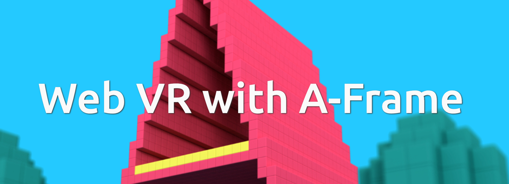

As I sit in my hotel room watching some mindless TV, my mind is filled with ideas gathered from attending the 2019 University API winter Workshop in Provo, UT. A big shoutout to Kelly Flanagan and his staff for putting on such a great conference. I don’t think I’m the only one who left a bit jealous of the way BYU’s OIT staff collaborates and get so much work done in such an efficient manner.

### Conference Schm-onference

This “conference” is actually an “unconference”, a format which was completely new to me. Instead of announcing speakers and sessions ahead of time like a usual conference, unconference goers decide on session topics when they get there. Think bottom-up instead of top-down. As a participant, you feel more significant since you can spark a conversation on a topic you’re new at in the same space as the seasoned presenters and experts. We’re all there to learn, and even the best of us are novices within topics outside of their domain.

This inversion of control can be particularly liberating because it forgoes time-based session lock. Let’s say your conference has a call for proposals that typically ends months in advance of the conference start date. If something relating to a presentation changes before the conference starts, then you might have to ask a presenter to change the topic. Not so in an unconference. The most exciting conversation of the conference might come from something a participant read on the plane ride over.

Another benefit I noticed on the second day came from conversations sparked on the first day of the conference. At least two sessions wouldn’t have been on the schedule if the conference was planned months in advance. People were so excited about these topics they demanded the space and time to discuss them further even though they had no idea they were that excited about them just yesterday. Now that’s powerful! And more importantly, it brings a lot more value to what each attendee gets out of the conference.

### APIs A Plenty++

Even though the unconference format provides for an “anything goes” type of session topics, the sessions mainly revolved around BYU’s Open API spec and work related to that effort. The majority of conference attendees worked at BYU so a majority of the sessions were led by BYU employees.

I’m going to give you an accounting of sessions devoid of BYU employee context, and so you’ll probably get a peculiar take on what happened overall, but that’s okay. I’ve always been a bit peculiar. I ended up going to sessions that were mainly API-related but also included modern JavaScript and HTML discussions.

This post would be too long if I covered both days in one post, so I’ll split them into two.

### Keynote: James Higginbotham

](./asset-2.png)

The first day began with a keynote from [a well-known consultant](https://launchany.com/about/) who “specializes in digital transformation through APIs, microservices, cloud-native architecture, containerization, and serverless, IoT, and edge computing.”

James went through a variety of API-related technologies and how they fit into today’s landscape. REST still seems to be the king of the API including in BYU’s Open API spec, but with GraphQL and gPRC making progress recently, we’re at a time of new options. GitHub has even popularized webhooks as another alternative to throw into the mix.

Understanding the intricacies of each approach isn’t needed to get going as James implored us to have an “AND” mindset instead of an “OR” mindset. To be successful in 2019, your organization can probably utilize REST, GraphQL, and webhooks across all of your API needs. With IOT and voice platforms, you also will encounter streams of data interacting with your API.

If any of this piques your interest, James hosts a newsletter that has a lot more background information on all of these concepts: [https://apideveloperweekly.com/](https://apideveloperweekly.com/). You can even read archives of past issues to fill your head with more API knowledge than you’d ever want to know.

After the keynote, conference participants got to choose their own adventure in terms of session topics based on what other participants, deemed “callers”, suggested. I’m only going to list the ones I went to.

### **UAPI Modeling, Preparing for the future (**Brent More @ BYU)

The BYU University API ecosystem is what a majority of the conference sessions revolved around. In this session, Brent gave an overview of some of the history of how the University API (UAPI) was developed and where UAPI’s future might lie.

Before the UAPI came into fruition, BYU developers used to access data stores directly which was messy. Now, the UAPI provides a facade that devs query hiding implementation details related to data store fetching making change management more robust. Consumers can rely on the UAPI contract while devs working behind the UAPI facade have the freedom to refactor code without disturbing consumer apps.

Brent showed a medallion that had four different ways of accessing data stored behind the facade inside of BYU’s business domain.

-   **UAPI:** The UAPI is supposed to cover 80% of use cases other BYU devs might need. It is REST-based and follows a standard for requests and responses. A common example could be querying for all the staff who work in the Anthropology department.
-   **Events:** Notify users when something interesting happens via subscriptions. A webhook is fired containing the data. Let’s say a course is added by a professor. You might find out about that via an event and trigger an update of something in your system.
-   **Claims:** True/false responses implemented in REST calls. I had never heard of claims before, but they are certainly useful in many cases. If I want to know if a student can take a course based on certain requirements, do I need to be able to ask for student data, write business logic, and come up with the answer myself? Other entities would probably find that claim useful so it’s better to handle the business logic within the facade and only provide the final yes/no answer. Claims can use “rule engines” to decide on answers.
-   **Central Data Store**: For consumers who can’t interact with the other APIs, they provide direct access to query the data store sometimes. These are the few cases where other methods don’t make sense to use and access via this method shouldn’t be promoted vs. the other methods.

](./asset-3.png)

With all four of those methods of access, they need to be governed by “policies”. Who can ask for what and when can they successfully get an answer? To aid in access control BYU uses Attribute-based Access Control, ABAC, which was a new term for me.

I’m used to role-based access control (RBAC) where you make up roles like “admin” and “editor” and the application only needs to look at the role to grant access. When your permissions aren’t that granular, then RBAC makes sense, but once you start getting more complex permissions, ABAC can really shine.

For example, instead of granting access to edit a course description only for “admin” users, you could take into account the time of year and the user’s job title. It is probably the case that course descriptions can only be changed during a certain timeframe and a user’s role won’t necessarily give you that context. The date of the request + other attributes will though, and you can chain attribute checking together with IF/THEN logic to create pretty powerful policies without having to deal with complicated user roles and a growing list of permissions where roles only vary by one or two permissions.

### HAX The Web (Brian **Ollendyke @ Penn State)**

I’ve had the pleasure of seeing Brian present before so I knew a bit more than the other attendees, but in this session Brian went over the Headless Authoring Experience (HAX) platform he’s developed at Penn State. He detailed how HAX can prevent users from being locked in to backend CMSes where the WYSIWYG experience differs between CMSes…and is often times a terrible experience.

> HAX is a decoupled authoring experience built in web components.

In Brian’s paradise-on-earth vision of the web, users of WordPress, Drupal, Backdrop, Grav, and other non-PHP-based CMS tools will have the same authoring experience via the power of Web Components. HAX allows this vision to happen and leverages the [163 “elmsln” components you can find on webcomponents.org](https://www.webcomponents.org/author/elmsln) to fill the gaps that native CMS tools provide like media handling.

You should check out HAX if you haven’t already, and you can do so on the main [https://haxtheweb.org/](https://haxtheweb.org/) site. There you’ll be able to actually use HAX in the browser instead of just seeing a traditional marketing site listing all the tool’s features.

](./asset-4.png)

### **Domain Modeling (Tom Jordan @ UW-Madison)**

“Who owns the data? Who owns the process?” So began Tom’s session on data modeling. Tom described himself as a beginner in domain modeling but led a great discussion on domain modeling and what he could learn from developers who had more experience in the “domain” of domain modeling…oh, don’t you love bad puns 😉

As is often the case, newcomers asking broad questions can lead to more experienced “experts” debating the merits of best practices. However, since most of the session attendees were from BYU and they have spent a lot of time thinking about domain modeling while building out the UAPI spec, the answers were more coherent which helped me out since I am a new comer to domain modeling.

If you don’t know who owns the data and who owns the process, then you won’t get very far with domain modeling or you may wish you hadn’t gotten as far as you did before getting solid answers to those questions. By talking about who owns what, you can hopefully get people to understand that they don’t need to own the data but rather see the value intrinsic in the data and how that relates to the whole organization’s processes and goals. You then might be able to get groups talking who don’t normally interact since they now see the value of solving shared needs instead of defensively dictating process and data access since that is all they think they can control.

Another area you should think about is: “what is the process you’re modeling instead of how it is happening”. Talking about the implementation can box you into people wanting to just replace a bad process with another bad process instead of figuring out they were trying to solve the wrong problems. Things like reaction time can come out of these questioning exercises, e.g. finding out that a process needs to be reviewed and have lead time vs. a process that needs to be real-time and highly available.

The medallion/API facade model I linked to above was mentioned again. You can think of your data and interactions from the standpoint of a traditional API, central data store, events, policies, actions, and claims.

At the end, someone in the group said, “to get better at domain modeling you just have to do it a lot.” And that is an answer you will find with a lot of other areas of software development like coming up with good estimates for hours to complete a task. You can read [Domain-Driven Design by Eric Evans](https://www.amazon.com/Domain-Driven-Design-Tackling-Complexity-Software/dp/0321125215) and also try using some modeling tools like [Gliffy](https://www.gliffy.com/), [WSO2](https://wso2.com/api-management/), and [Swagger](https://swagger.io/) to find out more.

### **Bringing VR to the Web (Mike Potter @ Penn State)**



WebVR might sound like it doesn’t have anything to do with APIs, but I’m sure glad Mike led a session on it nevertheless. You can load source files for objects in your VR scene from an API…so that was good enough justification for me 😀

WebVR is a very interesting, new, and cool collection of APIs that can communicate with VR devices to give users the same experience that they would get on a native VR platform like Occulus. One area where WebVR shines is that the web platform exists everywhere. Any place a user has an internet connection they can have your VR app whereas device-specific platforms are coupled to the device.

Since WebVR acts in a progressive fashion, the user doesn’t even need to have all the device features you’ve programmed into your app. For example, you could make good use of a gyroscope or hands/paddles in your app but have a fallback for when users are accessing the app with a device that doesn’t have a gyroscope or paddles. On the flipside, the fractured nature of trying to provide the best experience to the user no matter what device they are using can be time consuming and still not be ideal for every device…but at least you have the option of progressive enhancement, right?

Mike specifically focused his talk on [the A-frame framework](https://aframe.io/): “A web framework for building virtual reality experiences.” A-frame is built on top of three.js and uses Web Components to make building out your “scene” as easy as dropping a few custom element HTML tags in a web page and publishing that to the interwebs.

```
<body>
  <a-scene environment>
    <a-entity gltf-model="https://cdn.blah.blah..."
              scale="0.005 0.005 0.005"
              position="0 2 -3">
    </a-entity>
  </a-scene>
</body>
```

We ended up going through examples of projects Mike worked on at Penn State while experimenting around with how WebVR could be utilized for university projects. As you can see from the snippet above, the A-frame tags all begin with `<a-` and have attributes that can changes things like the scale of an object or where it appears in the scene.

The `gltf-model` attribute is an interesting one. It allows you to pull in models created elsewhere to use in your VR scene instead of assembling them all via a set of attributes in a tag like `<a-box>` for a box-type thing. In Mike’s case, he had a designer creating 3D models via Blender that he pulled in via this attribute. I’m sure there are a lot of places on the web where you can find these models freely available which should end up making your VR scenes more palatable to the naked eye.

```
<a-camera>
   <a-cursor></a-cursor>
</a-camera>
```

You can also place cameras and pointers in the scene so users can click on stuff and interact with your app. The really cool part about interactions is that they use the native web event system so you hook into those like you normally would writing a standard JS app. And who doesn’t love being able to use existing knowledge while learning a new paradigm of development!

You can [look at Mike’s presentation](https://uapi-2019-vr.surge.sh/#/) to get some more ideas. A lot of good stuff in there!

In part two of my series, I’ll go through day two of the conference and the sessions I attended, but until then, I hope you have enough resources and links from this post to keep you busy until [the 2020 University API Winter Workshop](https://www.eventbrite.com/e/2020-university-api-winter-workshop-tickets-55666562186?aff=erelexpmlt). Tickets are only $99 so get yours today!
