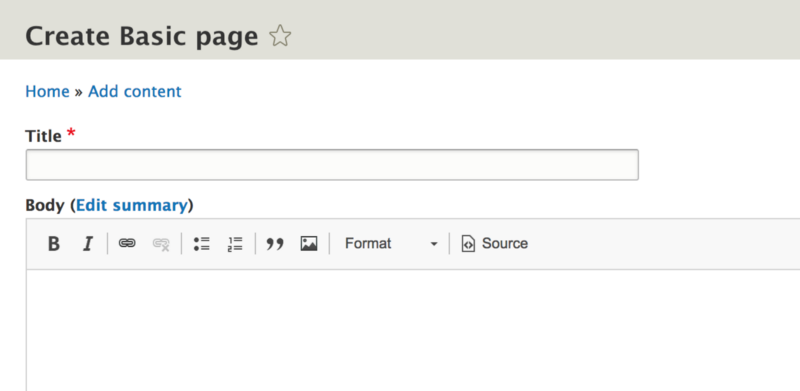
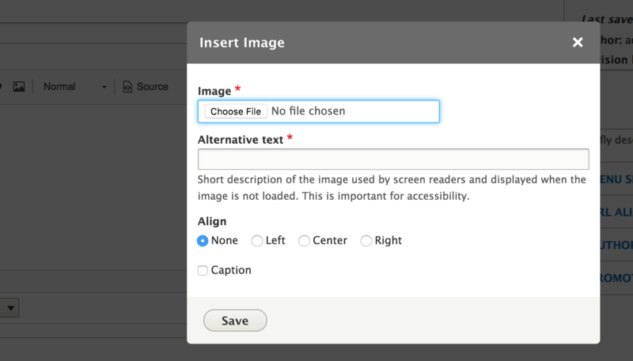
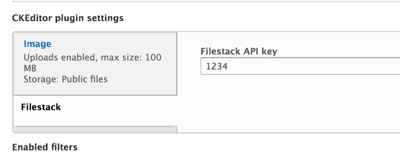

Dealing with media used across a website can be pretty tough. If you’ve ever seen `this_image_102.jpeg` in a files directory, then you know what I mean. It’s not the user’s fault that adding media to a website can cause issues like a huge files directory, but because everyone is busy and no spreadsheet of already uploaded images is available, you can easily see the same image uploaded hundreds of times if it is popular enough…or the image shares a common name like `profile_pic.jpeg`.

What to do about this? Well, if you are using a popular framework with open sourced solutions, you can try one of those out. The trouble is…the staff who uses one website on a particular CMS might also administer another website using another CMS. Sure, you won’t have the trouble of images on one site impacting the storage on another site, but your users probably would like to reuse the same image in multiple admin UIs rather than remembering where they kept the image they uploaded last week to “site X”.

One solution you can try is a hosted service that allows users to upload and share assets across as many web properties as you want. One such service is Filestack: a “Content Workflow API built to manage digital assets at scale.” In this article, we will create a CKEditor plugin for Drupal 8 that allows a user to insert images via a WYSIWYG that are hosted via Filestack.

### CKEditor Plugins In Drupal 8

Up until Drupal 8 (D8), the Drupal CMS didn’t have a WYSIWYG editor built into the core. You always had to add a contributed module in order to get WYSIWYG functionality. I wrote a couple of blog posts about how you add a CKEditor plugin to Drupal 7 and Backdrop CMS you can peruse to see how that worked.

-   [An Introduction To The CKEditor And Text Formats In Backdrop CMS](https://medium.com/@alexfinnarn/an-introduction-to-the-ckeditor-and-text-formats-in-backdrop-cms-21f9460651ac)
-   [Adding A Code Syntax Highlighting CKEditor Plugin To Backdrop CMS](https://medium.com/@alexfinnarn/adding-a-code-syntax-highlighting-ckeditor-plugin-to-backdrop-cms-8ca718568374)

In D8, CKEditor is in the core so you don’t have to do as much work and pick between the different ways you can add your functionality.



The editor probably looks like a lot of WYSIWYG editors you’ve used before. The buttons listed above are the defaults chosen when D8 is installed. We want to add a “Filestack button” that opens up a modal where we can insert our image just like the “Image” upload button does when you click it.



### Defining a CKEditor Plugin

Our first step is to look under the hood and see how the “Image” button appears on the WYSIWYG editor. It’s probably not a bad idea to copy some code over and then modify it for our use case. I started with the `DrupalImage.php` plugin you can [look at in the D8 source code](https://github.com/drupal/drupal/blob/8.6.x/core/modules/ckeditor/src/Plugin/CKEditorPlugin/DrupalImage.php). Let’s go through that file to better understand what we have currently and what we need to modify for the plugin to work.

```
/**
 * Defines the "filestack" plugin.
 *
 * @CKEditorPlugin(
 *   id = "filestack",
 *   label = @Translation("Filestack"),
 *   module = "filestack"
 * )
 */
```

CKEditor plugins are declared via “Plugin annotation” objects. If you know Drupal 7 (D7), you can think of these annotations as “info hooks”. By adding the plugin info in the same file as the class that describes the plugin behavior, you don’t have to include an info hook in the `.module` file. Also, the Symfony project, which D8 uses several components, commonly includes annotation support for things like routing and the Doctrine ORM.

You can see that `@CKEditorPlugin` is the annotation type that takes an id, label, and module property. We need to fill out those fields with ones that relate to our Filestack plugin. 

The class we are about to write is an extension of `CKEditorPluginBase`, which implements `CKEditorPluginInterface, CKEditorPluginButtonsInterface`, and it also implements `CKEditorPluginConfigurableInterface`. You can look at those interface definitions in your IDE if you want, but I’ll just go method by method to explain what each part does.

### Declare CKEditor JS File

```
public function getFile() {
    return drupal_get_path('module', 'filestack'). 
      '/js/plugins/ckeditor/plugin.es6.js';
}
```

First of all, the CKEditor module needs to know what file contains the code needed by the `CKEDITOR` global JS object. Everything in this file will be part of the CKEditor’s API. We’ll be using some of those methods, which [you can read about in the CKEditor official documentation](https://ckeditor.com/docs/ckeditor4/latest/api/CKEDITOR.html#methods). We don’t need to go into the contents of that file yet, but I chose to follow the same directory structure as the `DrupalImage` plugin. 

Add es6 note…

### Add An External Library

```
public function getLibraries(Editor $editor) {
    return [
      'filestack/filestack',
    ];
}
```

We now need to load the Filestack library that loads the “file picker” that will pop up in a modal in a similar fashion as the image upload button. There is a section of the D8 documentation on libraries that [shows how you can add an external library](https://www.drupal.org/docs/8/theming/adding-stylesheets-css-and-javascript-js-to-a-drupal-8-theme#external). 

```
// ...in filestack.libraries.yml
filestack:
  version: 1.x.x
  js:
    //static.filestackapi.com/filestack-js/1.x.x/filestack.min.js: { type: external, minified: true }
```

In the root of the module directory, I created a `filestack.libraries.yml` file that points to the `filestack/filestack` array key returned in the `getLibraries()` function. It is important to make sure you use `type: external` in the file options array, which is why I made that part bold. I left out the protocol which allows the request to use whatever protocol the page uses when loaded. I’m not sure what the minified option does, but I would think D8 has some minification process for assets that aren’t already minified. Set that to false if you’re looking for some Friday night fun!

### Add Configuration For JS Functionality

```
public function getConfig(Editor $editor) {
    $settings = $editor->getSettings();
    return ['aaa_filestack_api_key' => $settings['plugins']['filestack']['api_key']];
}
```

Now that the JS files are in order, we need to consider what information those scripts might need in order to manage the communication back and forth to the Filestack service. For instance, we need to use an API key to connect to Filestack in order to upload files. 

For now, I’ve placed that setting in the CKEditor plugin settings on the Basic HTML text format. I’ll probably move that setting into a stand-alone configuration form, but I will most likely still inject the settings in the `getConfig()` function. 


As you can see from the image above, there is a `drupalSettings` object where oodles of Drupal’s settings are squirrled away. It took me a little while to find where the editor settings were stored since I only knew about the `Drupal` object that I used in D7. I will remove the `aaa_` prefix from my variable name, but you can see how the code translates to some output you can use in your JS files.

### Add A Button

Now we’re talking. Who doesn’t love to click a button? To be honest, I started this side project just to be able to click my very own button, teehee!

```
public function getButtons() {
    return [
      'Filestack' => [
        'label' => $this->t('Filestack'),
        'image' => drupal_get_path('module', 'filestack'). 
          '/js/plugins/ckeditor/icons/fs-logo.svg',
      ],
    ];
}
```

To declare a button, you simply return an array with a label and an image keyed by the name of the button. There are some other options you can include, like attributes and an alternative image, [specified in the interface documentation](https://github.com/drupal/drupal/blob/8.6.x/core/modules/ckeditor/src/CKEditorPluginButtonsInterface.php#L30). I need to work on the image for the button, but the default Filestack logo will work for now.

### Store Some Config

```
public function settingsForm(array $form, FormStateInterface $form_state, Editor $editor) {
  $form['api_key'] = [
    '#type' => 'textfield',
    '#title' => $this->t('Filestack API key'),
    '#maxlength' => 255,
    '#default_value' => $editor->getSettings()['plugins']['filestack']['api_key'],
  ];
  return $form;
}
```

Like I mentioned before, I will most likely move the API key storage to its own form, but for now, I’m keeping it in the text format settings. The `settingsForm()` function allows you to add form elements just like you would any other place. 



I originally thought I would need to make a fieldset to store the form elements in, but the CKEditor module takes your plugin name and prefixes the form element for you. Back in the `getConfig()` function, we saw that the value is saved under `$editor->getSettings()[‘plugins’][‘filestack’][‘api_key’]` even though I only declared the `['api_key']` part as my form element.

### Add Your Plugin To CKEditor

So far, all we’ve done is tell Drupal that we want an extra button added to the CKEditor used for the basic HTML text format. Great!…but that doesn’t really get us anywhere. We need to tell CKEditor what’s up, and that will require learning a bit about the CKEditor library. 

Coming from my copy/paste of the `DrupalImage` CKEditor plugin, I will break tradition and [start out only looking at the CKEditor docs for plugins](https://ckeditor.com/docs/ckeditor4/latest/api/CKEDITOR_plugins.html#method-add), specifically for `CKEDITOR.plugins.add()` that I saw in several D8`plugin.js` definition files. 

Your first question might be: “What the heck version of CKEditor are we using?” A fair and important question to ask. I had some trouble finding this out until I `cmd+click`’d on `CKEDITOR.plugins.add()` in PhpStorm and [saw it located in](https://github.com/drupal/drupal/blob/8.6.x/core/assets/vendor/ckeditor/ckeditor.js) `[core/assets/vendor/ckeditor.](https://github.com/drupal/drupal/blob/8.6.x/core/assets/vendor/ckeditor/ckeditor.js)` I thought bundling third-party assets was a bad thing, but I guess in this case it isn’t…If you search for “version” you’ll be able to match the CKEditor docs to the version you’re loading in D8. For me, this is `4.10.0`.
