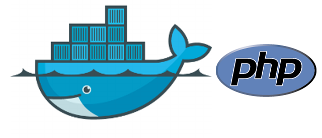
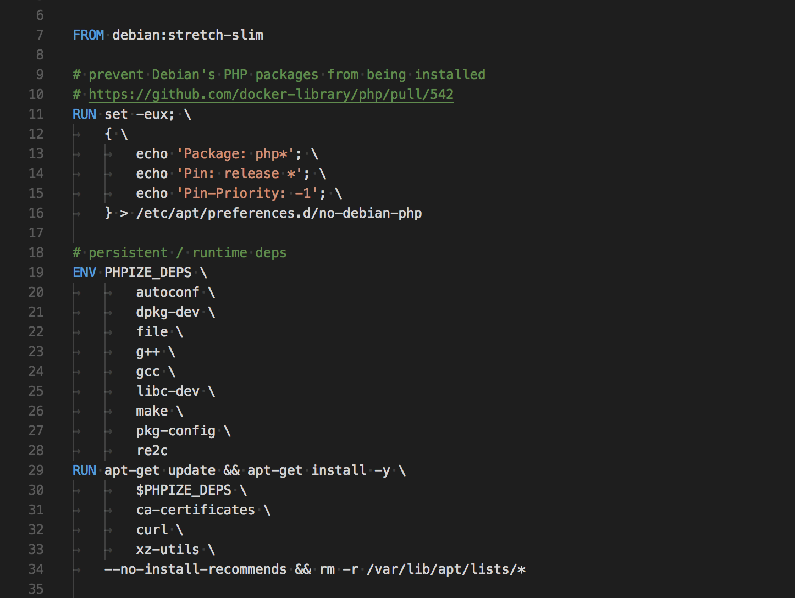
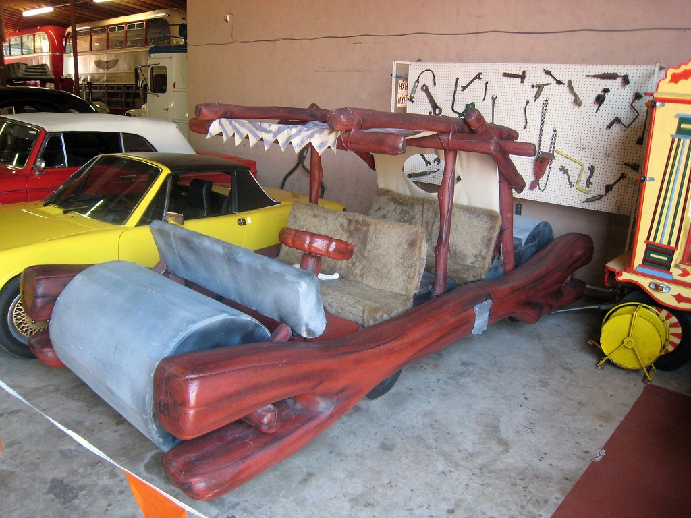

I am embarking on a very important quest. For years I’ve struggled with setting up PHP environments on various machines, upgrading my AMP stack, and then sorting through the pain of what broke during my fiddling about. There is also the awesome moment when you reluctantly update MacOS and have Apache suddenly break for some reason…because it’s obvious to everyone that an OS update would need to randomly upgrade Apache.

At first, I was told to use Vagrant to setup a LAMP stack that would be fire-walled off from Apple breaking my shit unexpectedly or having Homebrew mess things up. Vagrant seemed like a vast improvement from my previous development environment, but it was a pain to setup and really slow to rebuild. Debugging a whole OS also made it hard to sort out bugs in the application I was building. Was it PHP missing an extension, MySQL configuration set up inefficiently, permissions not set right when installing an OS package?


Using off-the-shelf community-built and maintained Vagrant images worked for me for awhile, but I always ended up going back to my local machine when the Vagrant box inevitably broke, especially when I needed to get something done by the end of the day.

### Enter Docker



Not being a DevOps person myself, I end up hearing buzzwords every now and again that pop up and seem to stick. I know not to try and chase the “framework of the week” articles that compare and contrast projects you probably won’t hear about in a few months, but I do pay attention when a thing has been the “new hotness” for several months, and that’s when I try and jump in to test it out.

I already knew that Docker pretty much replaced Vagrant as the “new hotness” for local development, and I wouldn’t be surprised if Docker isn’t even the “new hotness” for local development anymore. It’s stable enough by now to not be exciting, I guess.

Initially, I used community-built solutions developed for the PHP-based Drupal CMS project, but they always ended up having extra stuff that I didn’t need. In several cases, I couldn’t figure out why the collection of containers was running slow compare to my AMP stack and how to route requests between containers was still mystifying to me.

#### Enter Docker Compose

\[add overriding config and environmental variables in compose file\]

When some of the community solutions I used starting basing their tool off of Docker Compose, the 30,000 ft. picture of container interactions became a lot clearer. I could more easily override settings, inject my `php.ini` file, and pass in environmental variables. Most importantly, I could place options I had to pass in via the command line into the `docker-compose.yml`file, like the ports I needed to expose from the container to host. Otherwise, my `docker run` command can get pretty long and unwieldy.

I was pretty happy using my tools via this new paradigm until once again I was so frustrated by my environment being slow and not being able to figure out an issue when I most needed to I…went back to my local environment 😒. But wait a second, I had finally learned enough “DevOps” and had a good enough grasp of Docker that I decided I wanted to control all the things via a single PHP container used for my local development.



Just like Fred Flintstone, I only wanted the bare essentials to get me where I needed to go. To avoid Apache, I will attempt to use PHP’s built-in webserver, and to avoid MySQL, I will attempt to use SQLite. Drupal has database drivers for both MySQL and SQLite, but I am not familiar with SQLite much at this point.

### PHP Docker Images

Unlike local development environments for the frameworks I work with, there is no confusion on “which one is best to use?” for a PHP image since Docker has an [official library of PHP images](https://hub.docker.com/_/php/). By my count, there are 10 different options for getting PHP 7.2 set up. But wait, which one do I use?

If I wanted to use Apache, something like `php:7.2-apache` was the obvious choice to pick. Without Apache, the different Docker images start to look a little scary containing words like “alpine”, “cli-jessie”, “zts”, “zts-alpine”, etc. Rather than try them all, I decided to google for awhile and see what I could come up with.

#### Rule Out The CLI Image

I always forget to scroll down on the Docker library pages to see all the information below the Dockerfile links, but you should do this anytime you are a bit confused on how to use the library.

Right away I saw:

> “For PHP projects run through the command line interface (CLI), you can do the following.”

```
FROM php:7.0-cli
COPY . /usr/src/myapp
WORKDIR /usr/src/myapp
CMD [ "php", "./your-script.php" ]
```

And in the sample Dockerfile, you can see that they suggest pulling in one of the `7.x-cli` images. We want to run a web application, so that’s not us…at least I think. For now, we will skip it. Down to 9 options.

Below that section, you’ll see information on the `7.x-apache` images, but I’ve already mentioned to not use Apache. Down to 8 options.

#### PHP Image Variants

After the notes on Apache and a lengthy section on installing extensions, you’ll see an “Image Variants” heading. Now we’re talking. This section should have all the information you’ll need to make your decision, hopefully.

> “This is the defacto image. If you are unsure about what your needs are, you probably want to use this one.”

Bingo! We will start out using something like `FROM php:7.2` in our Dockerfile. But it is also useful to read the notes about “Alpine” images since you will probably encounter them elsewhere.

The Alpine images claim to be much smaller than the defacto image, but with small size comes potential compatibility issues. They say it is a safe bet most of the time to use an Alpine image, but then they also link to a [flame war thread of the topic.](https://news.ycombinator.com/item?id=10782897) Once you start reading that thread, your eyes will probably start to glaze over pretty quickly. My takeaway was that not using the defacto image could introduce too many potential side effects for my purposes.

That is all for now. In the next post, we will take the defacto PHP image and create the Dockerfile needed to spin it up.
