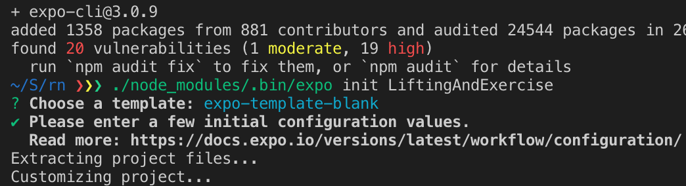

I'm in the process of looking for a job again, and I usually start off my process by looking at gaps in what I see on my resume vs. what I see on job postings. In the past, I've sighed at the many jobs prospects that seem good on paper but include skills I can't speak to. Because of this fact, I've tended to look within my network and at jobs that closely resemble what I do now. However, that isn't a great idea to continue on with lest you pidgeonhole yourself in some tech stack that has dwindling membership.

Since I have some time to fill my most important gaps now, I'm starting to build sample apps with some stacks that I know next to nothing about in hopes I will feel comfortable talking about them in job interviews. After all, if the potential employer builds applications that include user interfaces, I probably have all the conceptual knowledge I need already. I just need to pair that down to the particular syntax I need for a new and different stack.

### React Native

One of the first job posts I looked at mentioned React Native. I had certainly heard a lot about React Native, but up until this point my knowledge of React came down to building a few components and working with my new blog built in React. I'm not going to bore you with any more context other than the fact that my goal here is to build a sample, non-trivial app as fast as possible.

I decided the application would relate to tracking weight lifting exercises. I already have some apps on my Android phone that give me a list of exercises to do in a specific order, but I think I can do better than the free apps I use by combining them into one and personalizing it for my needs.

For instance, the apps I use try to get you to exercise at a set time, but I wish they went a step further. How about asking for some feedback maybe? "How sore are you today, Alex?" Maybe if I'm more sore, then the app should change my workout routines...or maybe I can make an integration to calendaring services, like Google Calendar, to change recommended workout times when I schedule events during my normal workout time for the day. The possibilities are endless.

I started working on a React Native project by going to their documentation: [Page Link](...)

### Expo or react-native CLI

The first choice you'll need to make is between the React Native CLI and a tool called "Expo". I'm not too sure what all the differences are, but people tell me that React Native CLI is the most "official and flexible" tool to use when working with a React Native application. Expo sacrifices flexibility for ease of use. Since you can always switch to the regular React Native CLI, starting with Expo makes more sense for noobs.

```bash
# Get around having to install expo-cli globally
mkdir example && cd example
npm install expo-cli
./node_modules/.bin/expo init MyProject
mv MyProject ../
cd ../ && rm -rf example && cd MyProject
```

I sometimes have issues with node packages and permissions when installing globally, and I also don't like installing global packages. So, instead I install the CLI tool locally in a directory, create some project using the binary, move that new project somewhere else, and then remove the initial directory. It is a bit convoluted, but at least I have one less global utility and maybe I'll see another `expo` tool I want to use.



The getting started guide doesn't go over the different template options you can choose from, but I played it safe and left the cursor on the first choice. You can choose from a couple of TypeScript-based templates, but I didn't want to conflate learning React Native with learning TypeScript. I've used TypeScript a little bit, but I don't know or use it enough to make sense for me to start out using it over vanilla JS.
