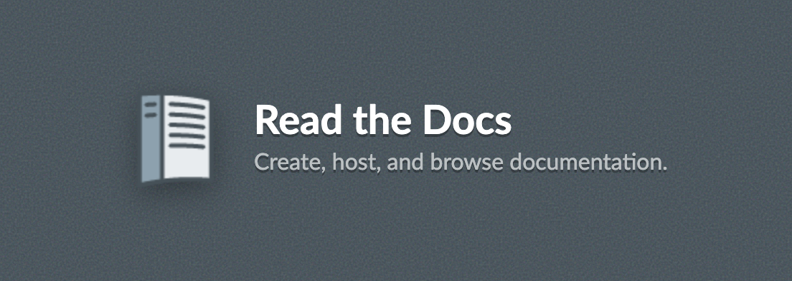
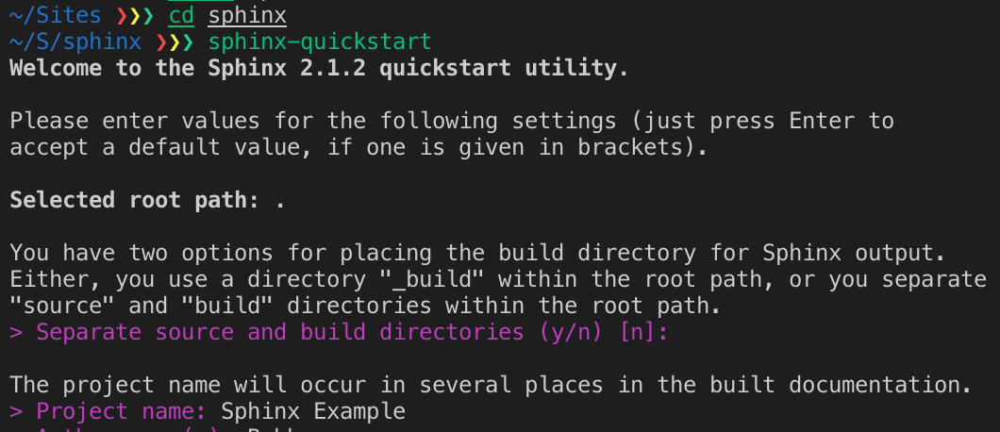
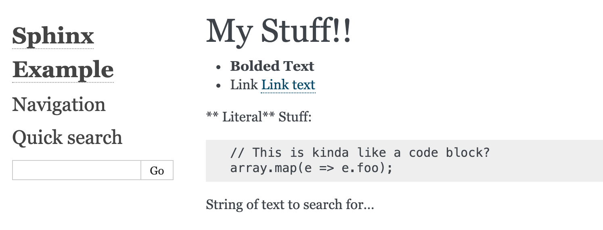
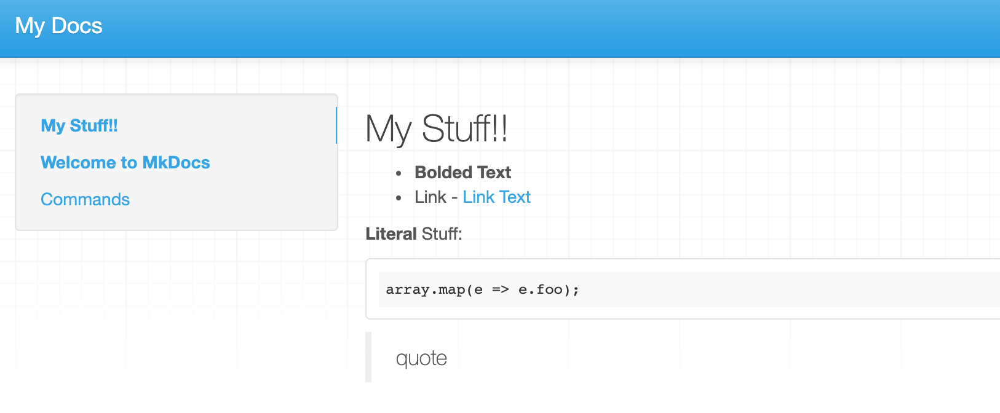

I realize that I've seen many websites hosted by readthedocs.org before I knew what it was. After I noticed several documentation sites had the same look and feel, I guessed that there was probably a common framework used to build the sites.

Since I mostly work in the Drupal world, the closet example that comes to mind off the top of my head is the Drush project's documentation at http://docs.drush.org/en/master/. At that URL, it is kind of hard to tell what the site is made up of since there aren't any overt links to Read the Docs. A sentence in the footer makes it even more confusing...

> Built with MkDocs using a theme provided by Read the Docs.

The theme is made by Read the Docs? Isn't the project a documentation generator? What the heck is MkDocs? A little more digging will lead you to [the project page for Drush](https://readthedocs.org/projects/drush/) on Read the Docs as well as its officially hosted URL: https://drush.readthedocs.io/en/master/.

So there you have it: my closest connection to Read the Docs. I'm sure you can think of an open source project that shares the same look and feel when you're browsing their documentation. That project might use Read the Docs or maybe just the theme.

In this post, we'll go over what Read the Docs is in terms of a project, how Sphinx and MkDocs are used to generate documentation, and a little bit of commentary on the configuration choices you have while setting up Read the Docs within your project. That last part will mostly relate to the options you have for file types and the pros and cons of using them.

<!-- Should this be an h2 or h3? -->

### Read the Docs

At its core, Read the Docs is an open source software project. It is written under the MIT license and was founded "to improve documentation in the Open Source Community". By providing the tools to help add documentation to your project and a place to host the output, Read the Docs aims to make hosting documentation easy.

> readthedocs.org is the largest open source documentation hosting service. It’s provided as a free service to the open source community, and is worked on by a community of volunteers that we’re hoping to expand! We currently serve over 20,000,000 pageviews a month, and we hope to maintain a reliable and stable hosting platform for years to come.

You can read more about the history of the Read the Docs project here: https://docs.readthedocs.io/en/stable/story.html. In the next sections, I'll go over Sphinx, the default documentation generator for Read the Docs, as well as another documentation generator: MkDocs. Sphinx uses the reStructuredText format, and I'm not too familiar with that format so I'll spend some extra time going through the basics of reST. MkDocs uses Markdown, which I've used a bunch so I won't go over much relating to Markdown syntax.

### Sphinx

Read the Docs quickstart guide begins by installing Sphinx, an open source documentation generator written in Python. Read the Docs was primarily created by Python developers so it makes sense that you end up using Pytong and the `pip` package manager to install Sphinx. Coming from the land of PHP, I might be hoping for a PHP-based system or at least a JavaScript-based one, and we'll talk about MDX a little bit in this post :P. However, you don't need to know anything about Python to use Sphinx of MkDocs.



With a couple of commands, I had an example Sphinx project set up. Along with options for name, authors, and root path, you can also specify a language code for the default language. "Any text automatically generated by Sphinx will be in that language." There are plenty of languages to choose from, but I thought that was a neat feature: https://www.sphinx-doc.org/en/master/usage/configuration.html#options-for-internationalization

Now I have a project with some files scaffolded in it. The quickstart guide recommends making a few changes to the included `index.rst` file and then building your new docs site via running `make html`. To test the build process, I added another header section, a list, a link, bolded words, a literal block, and then some text to search for.

### reST

In order to add all of those building blocks to our docs, we'll get into one of the most opinionated parts of this post: the format debate. Markdown and restructured text formats are available to use within Sphinx but the docs push you to use reST so that's what we'll start with.

On a sidenote, I included some text to search for, because I saw what looked like a search feature included in the build by default. However, I couldn't get the search to return the index page. Maybe you need to include sub-pages for the search to work, but I'm not getting involved enough to find out more.

```rst
My Stuff!!
==========

* **Bolded Text**
* Link - `Link text <https://www.google.com>`_

** Literal** Stuff::

  // This is kinda like a code block?
  array.map(e => e.foo);

String of text to search for...
```

You might grok a lot of that markup if you've been using Markdown as a lot of the syntax is similar. As you can see in the example output, if you leave spaces around bolded text, you won't get the desired effect that you want. This is the same behavior you can see in some flavors of Markdown.



I'm not too keen about a couple of differences I picked up on between reST and Markdown. I think the format for adding links in reST is a bit weird and more cumbersome than Markdown. The underscore at the end of the link seems to be just hanging out there. Every time I look at it, I think the underscore is part of something else. Just the same, the literal block will only work if you place double colons at the end of the previous line and then indent the following lines.

### reST Directives

So, on first look, I think reST syntax is a bit more confusing mentally than Markdown. I see many cases of caveats in [the reST primer included in the Sphinx docs](https://www.sphinx-doc.org/en/master/usage/restructuredtext/basics.htm) that make me wonder if I want to learn more about reST. As an extension point, reST has the concept of Directives.

> A directive (ref) is a generic block of explicit markup. Along with roles, it is one of the extension mechanisms of reST, and Sphinx makes heavy use of it.

Since I blog a decent amount using Markdown, I'm most interested in the image directive. There are many directives you can use ranging from notices (they call them admonitions) like errors and tips, table of contents for the current page, tables, and even includes for bits of text in other reST files amongst other things.

```rst
.. image:: image.jpg
    :width: 200px
    :align: center
    :height: 100px
    :alt: alternate text
```

I'm not a big fan of including each bit of metadata about the image on its own line, but I guess that's Python devs' love of whitespace for you? You can actually leave out all the options except for the `.. image:: image.jpg` one-liner and the image will still load, but I'm leaving those options in to compare with Markdown.

There are a lot of other directives included with Sphinx, and I suggest a [VS Code plugin for reST](https://marketplace.visualstudio.com/items?itemName=lextudio.restructuredtext) to help you out with tab autocompletion when first experimenting with the syntax.

### MkDocs

The second way you can use Read the Docs is by spinning up MkDocs, which is another documentation generator written in Python.

> MkDocs is a documentation generator that focuses on speed and simplicity. It has many great features including: preview your documentation as you write it, easy customization with themes and extensions, and writing documentation with Markdown.

As you might have guessed, the keywords here are "simple" and "Markdown". I couldn't find too much on the history of the MkDocs project, but I do know the first release happened in 2014 whereas the first release of Sphinx occurred in 2010. I'm a big fan of simplicity and Markdown, so far, so hopefully I'll like this project better than Sphinx.

One noticeable initial difference in using MkDocs is the `mkdocs serve` command alongside the `mkdocs build` command. In the Sphinx quickstart guide, I only saw the build command. I've made a few file watchers in my day to make re-compiling code an easier process if the build tool didn't have a watch option. Of course, you can [accomplish file watch rebuilds with Sphinx in a few different ways](https://stackoverflow.com/questions/5522326/automatically-build-sphinx-documentation-when-a-source-file-changes), but it's nice to see an official tool built into the MkDocs project. Anyone who's done modern JavaScript work will recognize the serve/build distinction and rejoice that it automatically refreshes your browser.

````markdown
## My Stuff!!

- **Bolded Text**
- Link - [Link Text](https://www.google.com)

** Literal** Stuff: \```js array.map(e => e.foo); \```

> quote
````

The main difference for me here is the limitations on the image properties. With Sphinx's Directives, you can set any image property you want or extend the image directive to make it fit your needs. Also, oddly the `** Literal**` bolded text worked for me when using the MkDocs development server. I didn't think that part would work, but it points to the fact that Markdown is less predictable than reST because there are variations across the specific "flavorful" implementations.



### Markdown vs. reST Comparison

Now we get to the fun part. Which tool should you use? Technically, Sphinx supports Markdown and reST so you don't have to choose, but if you're more into Markdown you might want to choose a tool specifically focused on the Markdown format.

The main difference between the two is that Markdown focuses on simplicity while reST focuses on extensibility. Just like the image example, you are only limited by your imagination when using reST and Sphinx to build out your docs. I would look at [the documentation on extensions](https://www.sphinx-doc.org/en/master/extdev/index.html) to get a better idea of options.

> This is what you can do in an extension: First, you can add new builders to support new output formats or actions on the parsed documents. Then, it is possible to register custom reStructuredText roles and directives, extending the markup. And finally, there are so-called “hook points” at strategic places throughout the build process, where an extension can register a hook and run specialized code.

### When To Use Sphinx and reST Over MkDocs

At the conclusion of my investigation into Read the Docs, I'm still sold on using MkDocs for its familiar simplicity and me not wanting to learn the great power inherent in reST. If I ever contribute to Drush's documentation, which is the most likely Read the Docs project for me to contribute to, then I'll feel more at home using MkDocs.

However, there are plenty of cases where learning how to use reST and Sphinx might benefit you.

- **Non-HTML Output** - Sphinx has helpful output extensions for things like PDFs and epub and can even output Markdown as a PDF. If you don't like those options, then build your own.
- **Internationalization** - Sphinx has built-in support for translating the output of text that it generates.
- **Autodoc** - Autodoc allows you to grab code from your docstrings...only in Python https://www.sphinx-doc.org/en/master/usage/quickstart.html#autodoc

I'd also advise you to look at other articles written by people who have actually maintained an open source project's documentation using Read the Docs. I found a great article written from the standpoint of creating documentation for a PHP project via Sphinx and Read the Docs: https://www.sitepoint.com/using-sphinx-for-php-project-documentation/

### Other Alternatives

When I look at a project like Read the Docs, I'm reminded of a time when creating, hosting, and deploying projects on the internet was different. I'm most reminded of that time when I look at the Drupal project and how it grew up. Back in the day, https://www.drupal.org was cutting-edge. The way they chose to host, package, and test contributed code was one of the reasons the project could grow. There was no Composer, not even a GitHub even. Hell, a lot of people didn't even use source control back then.

Just like Drupal, Read the Docs was created at a specific point in time to fill a certain void. Nowadays, static site generators abound, and one of the most popular ones, Gatsby, has new and exciting ways you can create technical documentation using MDX and React components. Sphinx's "directives" map almost exactly to the concept of components that a lot of developers use in there work daily.

I imagine static site generators written in JavaScript will usurp the process of using Python-based generators that end up creating projects that are hosted on https://readthedocs.org. It is really easy to find a host that will deploy static files for free and the pull of JS and React is enormous. For any PHP developer, you have to touch JS at some point anyway, so what's the point of using a Python-based tool?

In that light, I've been [looking into the Docz project](https://www.docz.site/docs/introduction) a little bit. It is built with Gatsby and uses MDX allowing for really simple-looking documentation that also includes the power of React, when needed. I will likely write some posts about React and MDX in the near future to explore projects like Docz further; however, there are many documentation generation tools out there I haven't mentioned. [Pandoc's homepage](https://pandoc.org/) can give you a good idea of how many markup languages there are out there, and I bet each one has some tool you can use to generate and host docs written in that format.
