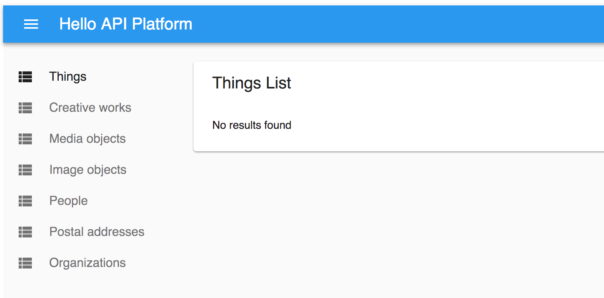

If you’ve read any of my recent blog posts, you probably know that I work with the Drupal platform and also a fork of Drupal called Backdrop. Those two platforms are great for certain use cases, but you will find projects that don’t fit their strong points. In the Drupal community, using the “Drupal hammer” was an acceptable way of shoving Drupal into any project just because you knew how to develop with it and other solutions seem scary to learn. At certain points in Drupal’s history, there weren’t many, if any, good alternatives to choose from, but in 2018, there are several other PHP frameworks you can use when your app doesn’t fit in with the Drupal hammer.

I am looking into the API Platform for a project that is API-centric and doesn’t need all the bells and whistles that come with a standard Drupal installation. The app will replace a listing of university organizations with relationships in a parent-child hierarchy and externally linked data connected to the organizations. The API Platform combines a series of technologies that I think are a great fit for the project’s description. In this post, I will go over my experience setting up my initial data models and how that looks in the packaged admin UI component.

### Installation and Changing Ports

Everything went pretty smoothly with setting up the API Platform. I cloned down the repo, checked out the latest release, and ran `docker-compose up -d` just like is mentioned in the [Getting Started with API Platform](https://api-platform.com/docs/distribution) guide. They tell you to download and extract the release; however, if you are developing on the platform instead of just trying it out, I would urge you to clone down the repo so you can fork it, make PRs, try out new features, etc and not have to download zipped versions of specific commits or something like that.

The only issue I had was the client app port being taken up by another process. You might encounter the same issue if you get an error bringing up the containers that looks like this:

> `ERROR: for client Cannot start service client: driver failed programming external connectivity on endpoint api-platform_client_1 (bf1ceda4053d8ffe85cd41e7deb23cbd382abc723c9fa135f4ce31bec536b963): Error starting userland proxy: Bind for 0.0.0.0:80: unexpected error (Failure EADDRINUSE)`

All you have to do is navigate to the client configuration in the `docker-compose.yml` file and change the ports section from `80:3000` to something like `8092:3000`. Once I picked an open port on my host machine, `8092` for me, everything installed awesomely.

### Squashing The Spider

I’ve never liked the spider that slinks down to the bottom of the page when you load the API Component UI. Luckily, you only need to comment out a CSS rule to make the spider stick where it’s stuck on page load.

The code is generated when you install API Platform but you can look in `api/public/bundles/apiplatform/style.css` once that file is generated and comment out the `.spider` CSS rule.

```
/*.spider {*/
  /*opacity:0;*/
  /*top:170px;*/
  /*animation-name: spiderAnim;*/
  /*animation-duration: 2s;*/
  /*animation-delay: 2s;*/
  /*transform:translateY(-100%);*/
  /*animation-fill-mode: forwards;*/
  /*animation-timing-function: ease-in-out;*/
/*}*/
```

After you make that change, the spider won’t bother you anymore and remain up in his corner…where he belongs!

### Creating Your First Model

The API Platform introduction guide gives you [an example model file to copy](https://api-platform.com/docs/distribution#bringing-your-own-model) into your project, but then it later describes a way to make model templates via the command line. Rather than copy over that file, I decided to try the code generating command out.

Since there isn’t a lot of information in the API Platform introduction about the Doctrine console commands (nor should there be), I switch over to the Symfony docs that cover Doctrine commands amongst all other things Doctrine. You will see `generate:doctrine:entity` used for creating a stub, however, all I have access to after installing the platform is `doctrine:generate:entities` and I got errors trying to use that command.

So…I will go back and copy the example file for a starter template. For my `Organization` entity, I wanted fields that held strings in an array, which was not really part of the [introductory API Platform documentation](https://api-platform.com/docs/distribution#bringing-your-own-model) on Doctrine models. I’m going to have to dive into the Doctrine documentation anyway, so I started to look at those docs to find out more about property annotations.

When you are creating models to use with Doctrine, you create POPOs: Plain Old PHP Objects…if you’re like me, you probably giggled when you saw POPO and said it in your head. I certainly thought of the boys in blue, and that’s why I take great care to not break the law when creating my POPOs ;)

I have fields like phone numbers, emails, and links that don’t seem to need their own entity or any relationships at this point, so I wanted to just stick them in a field…and then I read about the `ArrayCollection` for storing multivalue fields. Since an organization could have multiple phone numbers and links associated with it ArrayCollection sounded great…and I then I started reading about relationship mapping because those phone numbers and links will also be associated with people and the fields will have behaviors associated with them and so forth…and then…

### The Schema Generator Component

And then after clicking around the web and diving into and climbing out of holes, I found the Schema Generator Component. That component pulls in data from schema.org and creates stub models for you to use in your application. What a godsend for someone like me who is new to thinking about models and their relationships coming from Drupal where most of the data modeling is taken care of for you out-of-the-box.

You can create a simple `schema.yml` file containing fields that you want to include from [a schema.org definition like “Organization”](https://schema.org/Organization). The Organization is a child of “Thing”, the most basic entity on schema.org. If you don’t have a good idea of the content you are modeling, picking fields from schema definitions is a great way to start discussing what fields are needed and how they will relate to each other. It’s also a great resource for non-technical users to contribute to without having to look at PHP code.

<Embed src="https://gist.github.com/alexfinnarn/938747d510d157fbbeb15d3384b83c2b.js" aspectRatio={0.357} caption="" />

I hope you can see how using a `schema.yml` file can be very useful early on in app development. If you want to add more fields, change relationships, or do anything in the full configuration reference, you can just delete the generated model files and regenerate them.

<Embed src="https://gist.github.com/alexfinnarn/83797749e1bf99cb32ea6b557ec84c34.js" aspectRatio={0.357} caption="" />

In the generated code, you’ll see that the schema generator guesses on the field types based on what schema.org suggests and what is included in your `schema.yml` file. For the address field, it correctly assumed that I wanted to use the `PostalAddress` field type which is actually its own model with a schema.org definition. You can explicitly specify which field types you want to use in the `range` attribute of your properties so the generator doesn’t have to guess. I wanted to use `Distance` as a field type for the `height` parameter of the `MediaObject` model, but the code doesn’t import that definition to use in the property annotations. I’ll figure that out eventually, but for now, the height will be of type `Text`.

You’ll also notice that the generator adds a lot of PHP 7 features you might not be familiar with, if you’re like me and work in a legacy codebase where using PHP 7 things wouldn’t match code style or break lower PHP version requirements. Declaring strict types is something I forget to add but want to keep as a standard for inclusion in my future PHP applications.

I also noticed the question mark in function type declarations and had to [look that up for an explanation](http://php.net/manual/en/migration71.new-features.php).

> Type declarations for parameters and return values can now be marked as nullable by prefixing the type name with a question mark. This signifies that as well as the specified type, `**NULL**` can be passed as an argument, or returned as a value, respectively.

Seems cool and useful to me. Kind of like the “Elvis operator” where you can use `$foo ?: 'other_value'` to avoid using `isset($foo) ? $foo : 'other_value'` to check truthiness before using the value. Syntactic sugar, oh so sweet…but I do like when code generators introduce you to programming styles you will most likely adopt in the future.

### React Admin



After creating the data models, I went over to the React Admin part of API Platform. I don’t know much about React so I was excited to dive into the admin UI and figure out how to extend and modify the base install.

My first task was trying to hide the entities that I didn’t want users to create content with. “Thing”, “MediaObject”, and “CreativeWork” are all entities that have children of “People”, “Organization”, and “ImageObject”. The top level models use a `@ORM\MappedSuperclass` annotation while the actual entities are declared as `@ORM\Entity`. One reason you might want to use the super classes is for Inheritance Mapping.

Inheritance Mapping allows you to specify “Mapped Superclasses” that hold shared fields their extended classes use. Since the app I’m building will grow and need more entities over time, it is likely that “CreativeWork” and “Thing” will define base fields that are shared in several places. Rather than repeat the fields for all of the sub-classes, you can state which models are actual entities and which only hold shared fields.

> A mapped superclass is an abstract or concrete class that provides persistent entity state and mapping information for its subclasses, but which is not itself an entity. Typically, the purpose of such a mapped superclass is to define state and mapping information that is common to multiple entity classes.

See, [the Doctrine documentation on Inheritance Mapping](https://www.doctrine-project.org/projects/doctrine-orm/en/2.6/reference/inheritance-mapping.html) is much better worded than what I have to say. In the docs, it mentions “[Single Table Inheritance](http://martinfowler.com/eaaCatalog/singleTableInheritance.html)” as a way to store all of the sub-classes data in one table. The non-shared fields have to be nullable for this to work, but it should increase performance for your queries since fewer joins are needed to gather all of the field data together.

How do we accomplish hiding those models in the UI via React Admin, though? Well, that is a topic for another blog post…cause now I have to actually learn React.
