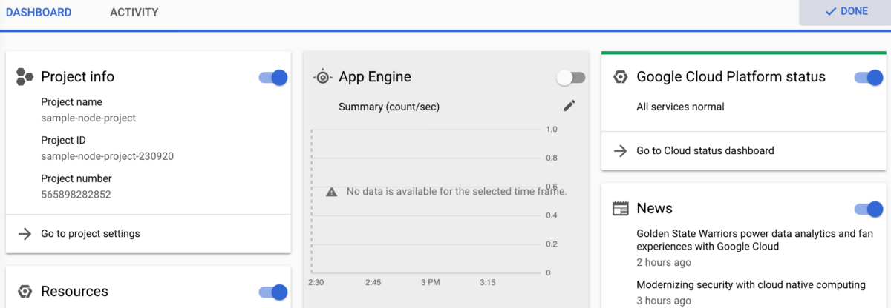
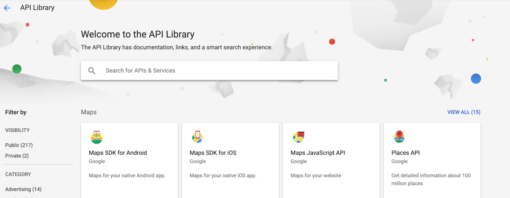

The Google Cloud Platform (GCP) is quite a beast. If you go to [https://cloud.google.com/](https://cloud.google.com/) and then follow that to the console link, you’ll probably feel just as overwhelmed as I first did. With so many menu items and tabs, I couldn’t resist the urge to click on them all to see all the features I could utilize…and that process of clicking took quite some time to complete.

In this post, I’ll go over some of the more interesting clicks I made while investigating the GCP for creating a node-based backend for a frontend deployment UI.

### Creating A Project

You’ll start out creating a new project, which is a pretty straight-forward process. I somehow had three or four old projects under my account so don’t be surprised if you see some stuff that looks like it came from Google’s webmaster suite of tools. I think that is where those past projects of mine originated. 

I had 20 project slots available so I’m guessing you’ll have one slot open for a sample app. One awesome thing to note is that you can sign up for a trial of GCP that gives you a year to use $300 worth of credit. I haven’t used a single cent up to the start of me writing this post so I can’t tell you how quickly you’ll run out of that credit, but it’s a good chunk of change to start out working with.

Once you create a project, you’ll be sent to a dashboard page with a slew of “cards” on it. Most of the default cards included make sense to be visible and you can customize the dashboard to add others. The “News” card was the weirdest default for me since it featured a story about the Golden State Warriors…I’m not sure I’d include random news headlines as a default myself, but luckily I could quickly find the toggle to hide that card.

I was tempted to go over to the left-hand sidebar menu and start clicking around, but since there are “Getting Started” and “Documentation” cards, I thought it would be prudent to follow those links. 

### Getting Started — Enable APIs

First on their recommended ways of exploring the GCP is an “Explore and enable APIs” link. You’ll end up getting taken to a page monitoring traffic, errors, and latency to…the APIs you haven’t enabled yet. You’ll need to go to the “library” page to enable some APIs in order to make the reporting pages useful, and if I were Google, I would switch the library link instead of sending a user to a page full of no stats.

The library page will undoubtedly overwhelm you again with over 200 APIs you can sift through and enable. For me, the “databases” category caught my eye since most every app you build will probably need to store some sort of data. In my case, there could be a need to store document-like data, and thankfully there were only two options to look at: [Cloud Datastore API](https://cloud.google.com/datastore) and [Google Cloud Firestore API](https://cloud.google.com/firestore). I knew about Google’s Firebase product so I started looking at the Firestore API first; however, for many minutes I had no idea what the differences between the two very similar APIs were.

> Cloud Firestore is the next major version of Cloud Datastore and a re- branding of the product. Taking the best of Cloud Datastore and the [Firebase Realtime Database](https://firebase.google.com/docs/database/rtdb-vs-firestore), Cloud Firestore is a NoSQL document database built for automatic scaling, high performance, and ease of application development.

Oh thank God! Why didn’t they put two sentences up front when I was trying to figure out how to enable an API? It looks like Cloud Firestore is the one you’ll want to go with unless you have some specific need to run the legacy version. You will need to choose between “Native” and “Datastore” modes for that API, and I chose native since “real-time and offline features” sounded much cooler than using “Cloud Datastore server architectures while removing fundamental Cloud Datastore limitations.”
