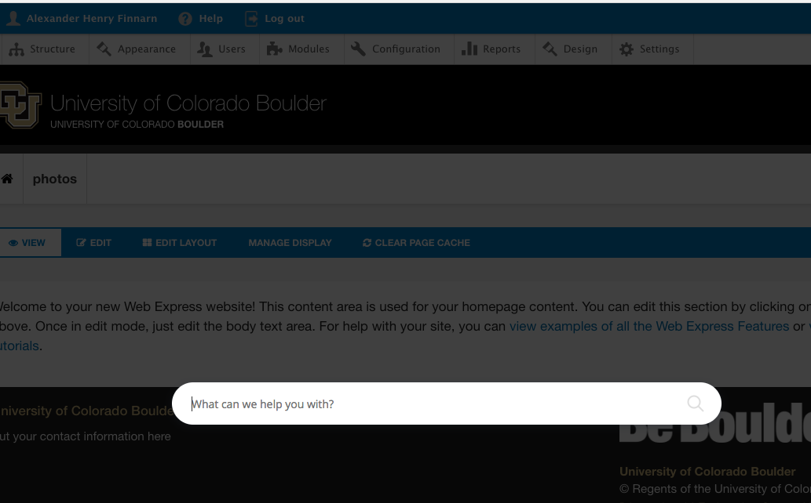
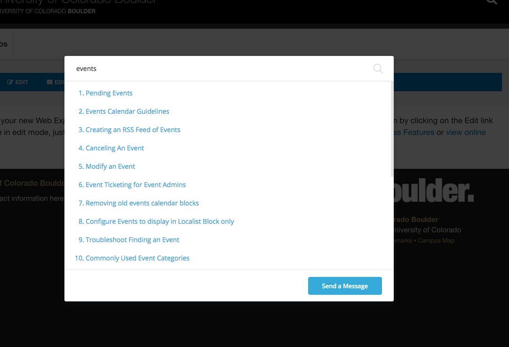
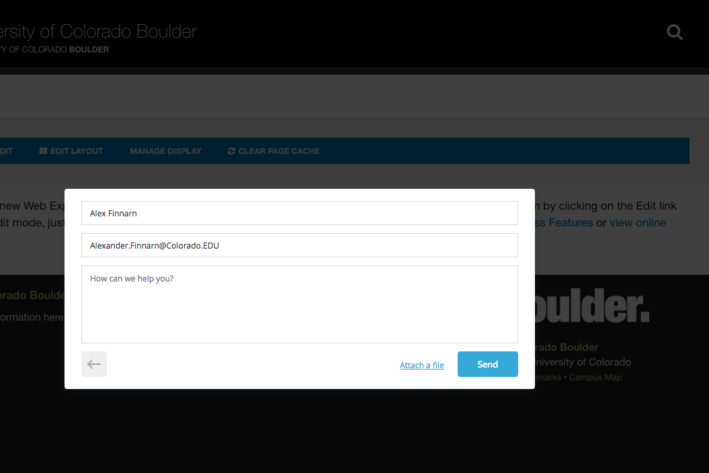
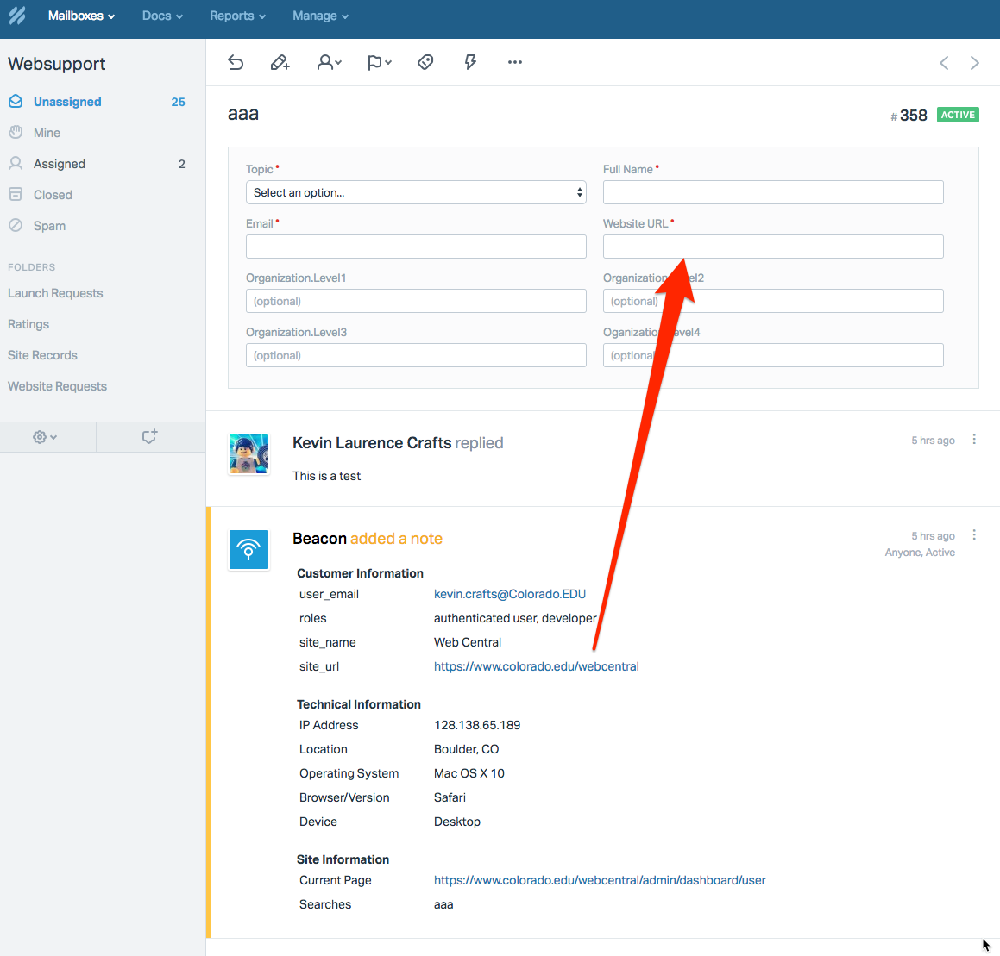

Where I work, we are switching from JIRA to HelpScout for user-facing support. JIRA is great for a lot of project management, but my team felt that using a product specifically focused on providing user support made more sense. I’m not expert on HelpScout so this post (and any other HelpScout ones) will only be about the development side of things.

### Beacon Me Up Devvy

Probably the coolest feature of HelpScout, IMHO, is the Beacon that users can click to provide them support links or articles as quickly and easily as possible. You can set it up a number of ways, but we have a link on a navbar help icon for authenticated users. You can also have an overlay icon at the bottom-right of the screen that opens into a modal.



You can kind of see the “Help” link behind the modal, and once you click it, you get the search box displayed above. I think you can start suggesting help topics once a user starts typing, but we currently just let them search with some random string.



At the time of writing this post, when I searched for “events” I received several potentially helpful articles I can look at. In the future, the list of articles will be more fleshed out and the results more targeted. If I don’t like what I see I can click to send a message, and this is where my job comes in.



On the next screen, you can enter your contact information as well as send a message to the support team about your specific problem. The Beacon can pre-populate some limited fields with user information when the contact form is initialized, but we expected the ability to fill out hidden “conversation fields.”

### Conversations

In HelpScout, they call interactions with customers (what I call support tickets) “conversations.” Sounds nicer than the standard developer terminology, I guess.

You can create custom fields to add to conversations, but unfortunately, there isn’t a clear way to populate custom fields from the Beacon. We tried guessing random form keys and stuffing data into random hidden fields, but no solution was ideal. We could add any user data to the Beacon sent, but it appeared as HTML in an unstructured conversation “thread” instead of a defined field.

Now onto the hacks to move the data from the Beacon “note” to the conversation custom fields. Huzzah!



### Adding User Data To A Beacon

[The Beacon API documentation](https://developer.helpscout.com/beacons/javascript-api/#identify) does tell you how to add any random data you might want to add to a support request via the embed form. HelpScout adds an object to the global window you can call to add user info that eventually ends up as a note in HelpScout. We are mainly concerned with getting the `org_name` and `site_url` fields populated when a user sends in a Beacon request, but your fields will be different.

<Embed src="https://gist.github.com/alexfinnarn/39f08b003f4879eda1f20090c8b1a484.js" aspectRatio={0.357} caption="" />

You’ll have to use whatever is generating your JS snippet to add your variables to the `identify()`method, but once added, they will appear under “Beacon added a note” like in the screenshot above.

### Webhooks?

At this point, I should mention a path I didn’t consider even going down. HelpScout has developed ways for you to update conversations (among many other features) when they are created, updated, deleted, user replied, etc. In order to interact with those events, you supply a callback URL and use an authentication header to verify the request is coming from HelpScout.

Their documentation was okay for this feature, but I got scared when I read:

> “Any status code other than 200 is a failure of some kind. A failed event is retried up to 10 times (with an increasing timeout period in between each retry). If the event fails all 10 retries, it is discarded. Webhooks are automatically deactivated if three or more events get discarded.”

Sounds scary once you are running in production, but based on [all of the available apps](https://secure.helpscout.net/apps/) already created, it is probably a safe bet to use and not be afraid of. I will start out working on this feature with two things I know decently well: REST APIs and cron jobs.

To accomplish this feature request, I first need to grab a list of conversations from HelpScout, filter out any ones that don’t need updating, add “customer information” data in an HTML table to actual fields, and then send a PUT request back to HelpScout to update the conversations with new data.

### Searching For Conversations

HelpScout has [easily accessible documentation](https://developer.helpscout.com/help-desk-api/search/conversations/) for searching Conversations. Unfortunately, the API doesn’t allow you to query custom fields. If it did, I could look for conversations with blank custom fields and only filter through that result set. Without that additional querying capability, we have to figure out a hack.

I suppose using a “createdAt” field shouldn’t be considered a hack for sorting most things, but out of the fields you can search, it seemed like the best one to use. We are only concerned with populating the custom fields when a user submits a request and the “createdAt” field gives us a timestamp to compare with during the cron job.

The final API query looks something like:

```
https://api.helpscout.net/v1/search/conversations.json?query=(createdAt%3A%5B2018-02-18T00%3A00%3A00Z%20TO%20*%5D) 
```

You’ll notice that the “createdAt” query ends up having a weird timestamp. IT is a little hard to read in the example URL above since the quotes and brackets are encoded, but I originally thought the format was the “ISO 8601” standard that PHP’s `date('c')` function can easily output for you. Instead, the date format is ever so slightly different leaving me to write insightful comments in my code like:

<Embed src="https://gist.github.com/alexfinnarn/2709b39aa612fa71ae64d84886597654.js" aspectRatio={0.357} caption="" />

### Conversation Fields

Earlier in this post, we discussed how to add user information from your site to the Beacon request sent to HelpScout. I had hoped you could guess the fields on the HelpScout conversation editing screen and they would automagically populate, but that was not the case 😒

You will have to use field IDs, e.g. `5645`, to match Beacon fields to Conversation fields. I know, very intuitive. The easiest way I could find to gather the custom field IDs was in a conversation GET via the API.

```
curl -u access-token:X https://api.helpscout.net/v1/conversations/conversation-id.json  
```

You’ll get back a response with the custom fields listed at the bottom. You’ll need to fill out all of the custom fields in the HelpScout UI in order to get them back in the response.

```
{
  "customFields": [
    {
      "fieldId": 4965,
      "name": "Website URL",
      "value": "http://127.0.0.1:8068",
      "type": "SINGLE_LINE",
      "label": "http://127.0.0.1:8068"
    },
  ],
}
```

All you need to do is replace the `value` property with what was sent in the Beacon when the conversation was created. Easy right? Not!!! In the next post, we will go through all the steps, caveats, and gotchas needed to perform what seems like a simple field mapping operation.
