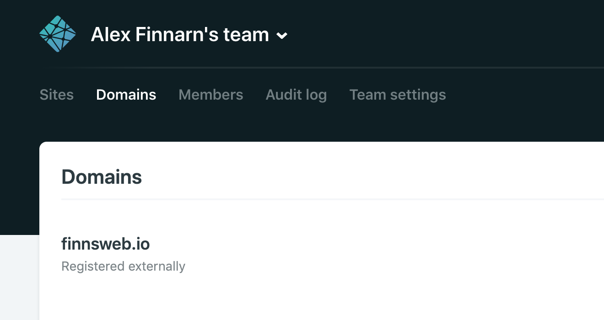
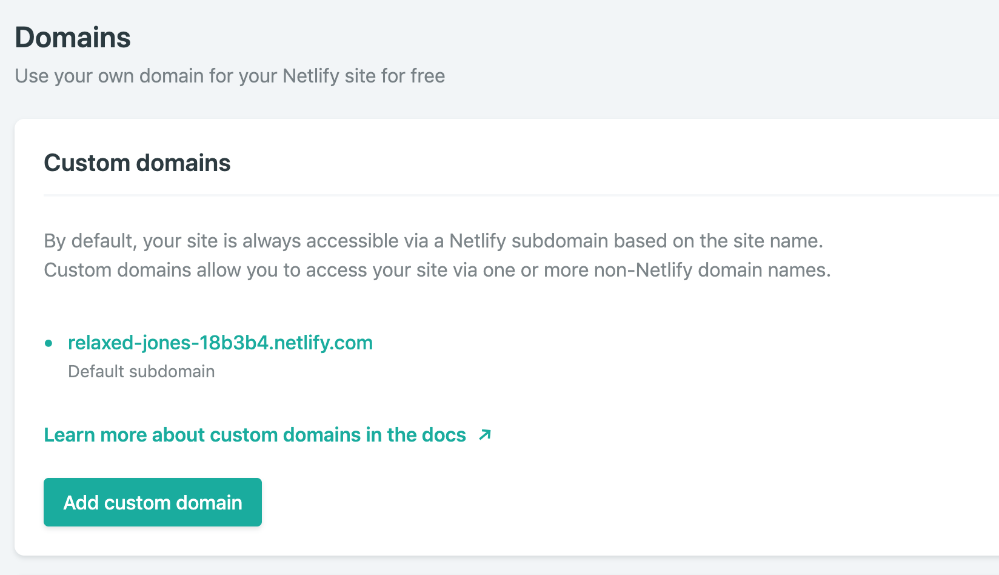
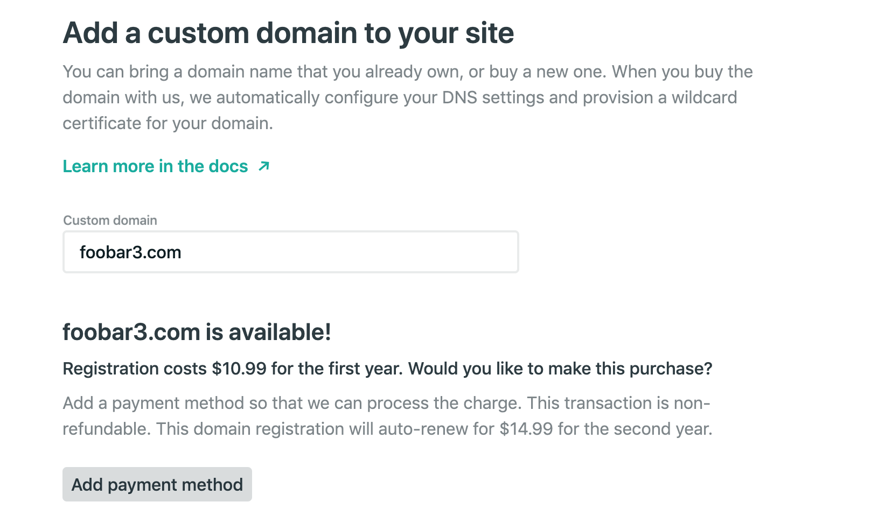
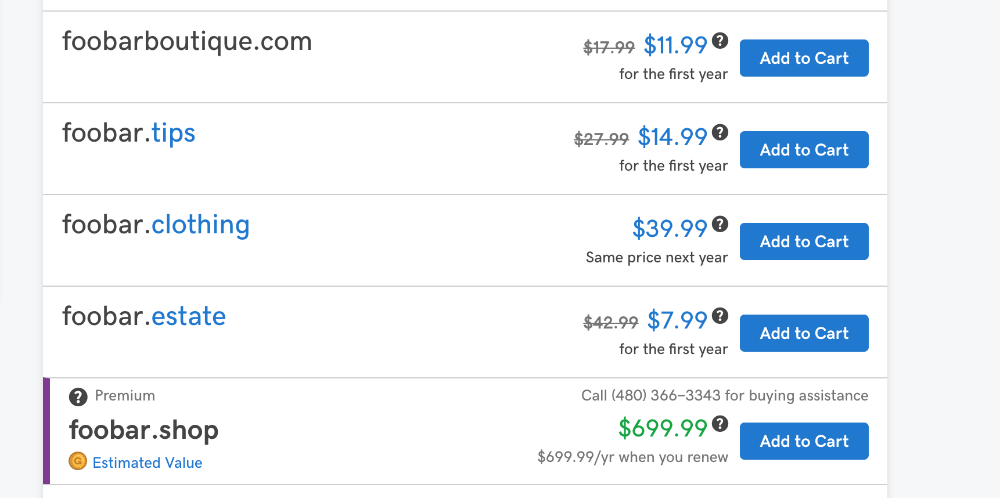
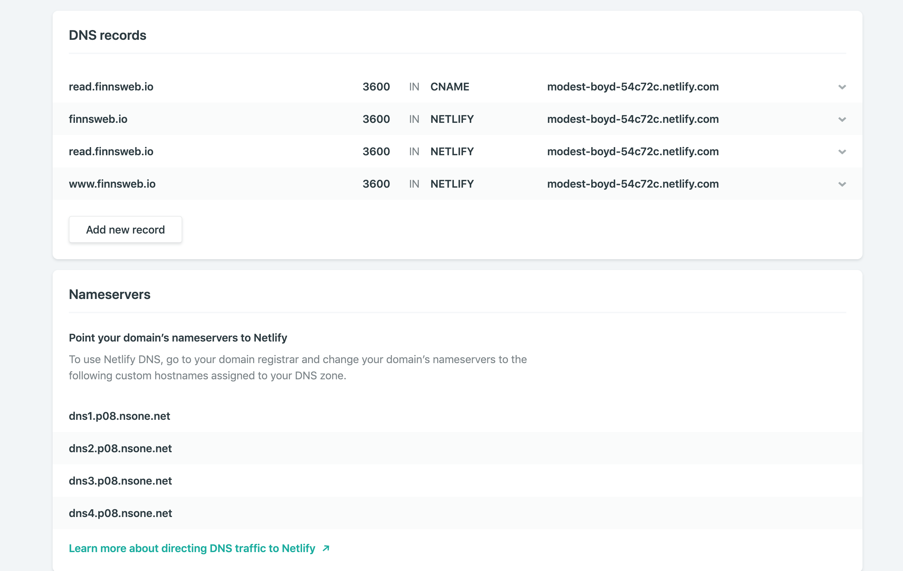
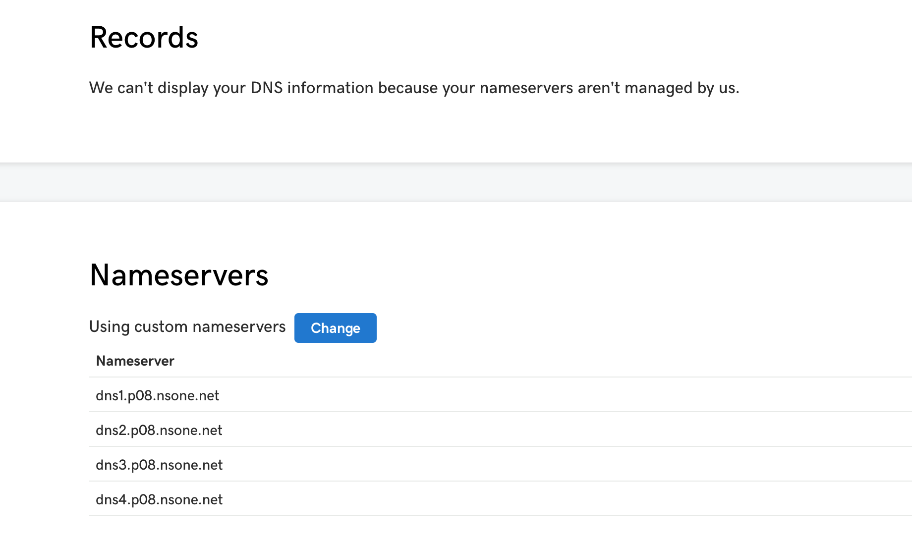
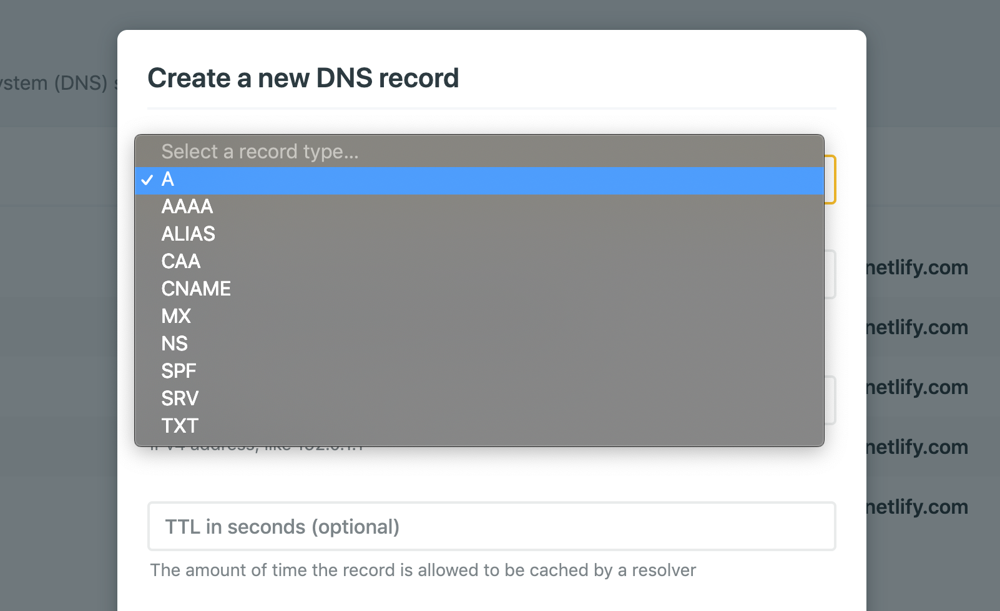
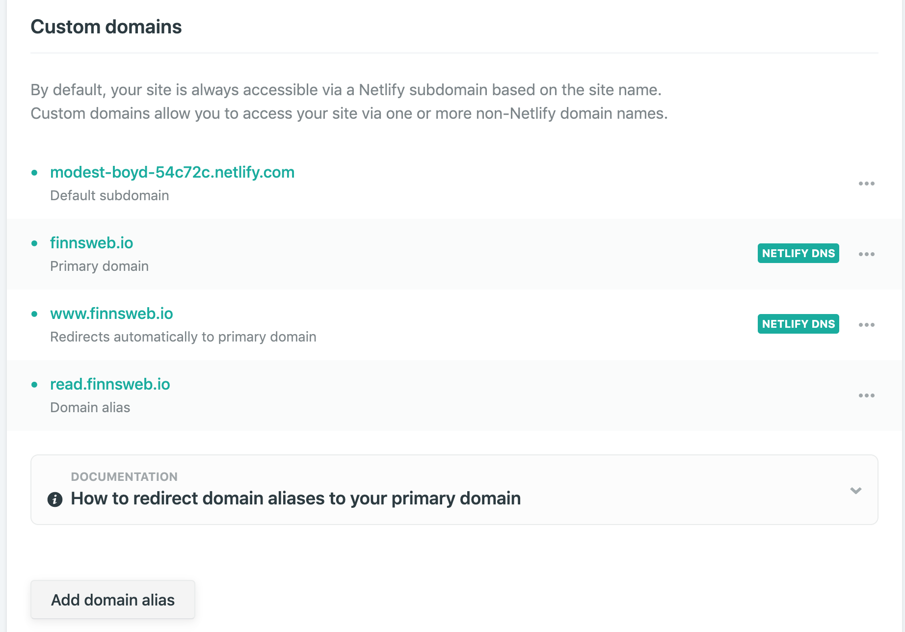
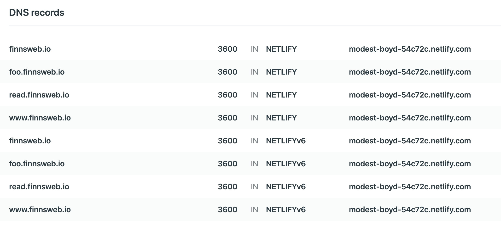

In [my last post in the #OwnYourContent series](https://read.finnsweb.io/own-your-content:-my-version/), I detailed my digital publishing history as well as showing you how to quickly move your blog off of Medium and onto GitHub + Netlify. That was a good start, but in setting up my blog, I also had to take DNS considerations into account. I really wanted to publish my first #OwnYourContent post on my own site rather than Medium.com; however, `relaxed-jones-345-dufus.netlify.com` is what Netlify gave me to hand out to the public. Okay, okay, they didn't put "dufus" into my URL, but that's how I felt when I went to post a link to my site on Twitter.

What are all the steps and thoughts you'll want to go through as you point people to your new and shiny blog? And how do you accomplish this within Netlify? We'll cover these topics during the remainder of this post.

### Back To Messing With DNS

When I finally switched off my personal site after about five years of iteratively building it out, I rejoiced in not having to renew domain names or remember what the difference between an `A record` and a `CNAME` was. I still have to look that stuff up every time. I also rejoiced that I didn't have to pay for an SSL certificate after the web decided encrypted traffic should be the rule instead of the exception. Someone told me I could generate SSL certs for free, but at that point, I'd already paid my dues for a two-year "bargain" SSL multidomain offer.

I didn't care enough about the domains I owned at the time, `alexfinnarn.com`, `finnsweb.com`, and `psychedout.club`, to keep them parked, and I was amused to see that all but `psychedout.club` are now taken. `finnsweb.com` can be bought for the princely sum of $2,595. Not sure why anyone would pay so much for that domain or how the SEO gets you anywhere just based on the name, but who knows, in a couple of years someone else might usurp my crown as the internet's de facto "Finn's Web" entity.

### Netlify Managed DNS

As people get off of Medium because it is the cool thing to do, they end up needing to use some host, like Netlify, that is way cooler than Medium. Netlify allows you to run build steps and covers 90% of what you need to deploy a simple JS application. As more people have moved to use Netlify for freely hosting their projects, the platform keeps adding integrations that come in handy for tasks that might normally involve a lot of steps and be a huge PITA to implement. Managed DNS is now one of those integrations.

I started my DNS journey by clicking on the "Domain settings" button on the project overview page and arriving on a page like the screenshot above. When you attempt to add the custom domain, Netlify will check to see if it is available for you to purchase. At first, I didn't realize that there was a checking process so I went elsewhere to look for domains. I went back to the daddy of all domain registers, Godaddy, for their familiar UI...and to compare prices.

### Buying a Domain

Back in Netlify, if the domain you request is already registered, you'll see a prompt to confirm the domain belongs to you or a button you can click to perform another search. If the domain is available for purchase, then you can enter your payment information and buy the domain straight from Netlify. At this point, I thought I had given Netlify my credit card details since I've used it on several projects, but so far everything on Netlify has been free for me. Noice!

One reason I like using Godaddy to search for potential domain names is the helpful alternative names Godaddy provides if your domain of choice is already taken. For example, when I typed in `foobar.com` as an example, Godaddy shows me that `foobar.tips` is available and not too expensive of a name. `foobar.shop` looks to be a hot item that is also available for quite a lot of money compared to the other choices. I've actually used some of the suggestions before when shopping for domains. 

I'm a big believer in great content making a great site and the domain name having little to do with overall success; so, I'd pick the cheapest domain available that looks alright to you. For me, that came out to be `finnsweb.io`, and we all know that the `.io` TLD is the coolest one to have as a developer person.

### Nameservers

The internet's big 'ole IP tables now know to contact Godaddy when they come across the `finnsweb.io` domain, but what happens after that? Well, your DNS provider turns right around and connects that domain to an IP address. The IP address might be hosted by the same DNS provider, a web hosting company, or something you set up by IP, like a Linode or Digital Ocean server. Once your browser talks to your ISP playing a game of telephone along the way to get the specific IP address, your browser remembers the pathway to get content for the next request.

Via the Godaddy UI, I can take the Netlify nameservers (listed on https://app.netlify.com/teams/alexfinnarn/dns/finnsweb.io) and replace Godaddy's default ones listed for `finnsweb.io`. Once that's done, I can add some DNS records to my domain on Netlify. I wanted to have `read.finnsweb.io` host my blog site so that other subdomains could host other projects. To make this happen, I needed to create a DNS record within Netlify.

It is important to note that DNS record changes need time to propagate so you might see parts of what I'm mentioning disabled and greyed out on Netlify's UI for a little while. It didn't take more than a few minutes for my nameservers change to propagate and allow me to make changes in the UI.

### A, CNAME, NS Records and the Like

When you go to add a DNS record in the Netlify UI, the first option you'll have to decide on is the record type. I never remember anything about DNS records until I need to change my domain names...which happens once every few years or so. I imagine you're going to end up the same way, but since I wanted to write a thorough article, I looked up enough stuff for the knowledge to hopefully stick this time...Okay, I didn't actually do that much research and got most of my knowledge through [a domain management company's support documentation](https://support.dnsimple.com/categories/dns/).

We already encountered a certain type of DNS record earlier in this post: the NS record. NS records point subdomains to an authoritative name server. The entries I took from Netlify and placed in Godaddy are NS records that allow traffic to be spread across servers but still be accessed from the same domain. So, the game of telephone goes like `read.finnsweb.io -> dns1.r4.some-domain.net -> 192.65.765`. This allows hosting providers to split up a lot of domains across many name servers and not make you remember actual IP addresses.

For our purposes, we're only concerned about A and CNAME records in this blog post. The main difference between these types is where the name you provide will point: another domain name record or an actual IP address. The last time I set up my own blog site, I created an A record since I had a Linode box and all they gave me was an IP address. I felt cool at the time just typing in an IP address to get to my site and other apps hosted on my server.

### Fluid IPs and Containers Make The World Go Round

However, we can't point to an IP address in this case. Why is that, you ask? Well, we can't point to one since the IP addresses for our Netlify projects are changing whenever it suits Netlify to change them. This allows Netlify's DevOps teams to orchestrate scaling and managing resources over time. In today's highly-scalable, containerized world, servers are being provisioned and blown away all the time.

Let's say your site initially goes into a bucket of mostly pet project sites that don't get a lot of traffic, but then you write an article that gets shared by Elon Musk for some reason...he is kind of crazy...and now your site gets 100x the traffic of the other sites. Netlify might want to move your project to a different server in that case. 

Or let's say they want to run a test of upgrading some utilities but have canaries they want to test it on. That bucket of dead, er...pet, projects can be a useful place to run those tests. However, if you now have thousands of fans heading to your Netlify blog, you might want to find a different host if Netlify experiments on the servers that host your site and that goes poorly. Who knows what's going on behind the scenes when you make a request to `relaxed-jones-345-dufus.netlify.com`?

And this is precisely why we want to make a CNAME record where we can point `read.finnsweb.io` to `relaxed-jones-345-dufus.netlify.com`. Before we make this change, `read.finnsweb.io` will still go through Netlify's name servers, but you will see a 404 since the name servers have no record of what `read.finnsweb.io` means. After we save the record, Netlify knows where to go when it sees that domain in a request.

### Domain Alias Record

At this point in the post, I have to inform you that some of what I just told you is full of lies. You actually can't just add a CNAME record and have Netlify's DNS point to your subdomain through their subdomain. To make things simpler for you, Netlify creates what are called ALIAS records via another UI section than the main domain management area for your account.

Adding a domain alias is a really simple process and only requires you to enter a domain name in a text box. Behind the scenes, Netlify creates a "NETLIFY" record that looks identical to the CNAME record you just added...and should now delete. I was confused as to why I had a CNAME record and also a mysterious NETLIFY record until I tested out deleting the domain alias or the CNAME record. Turns out the alias is needed and the NETLIFY record can't be deleted since you have no control over it.

### SSL Certificates

My favorite feature of Netlify Managed DNS is the built-in auto-generated SSL certificate via Let's Encrypt. You don't have to pay anything or perform any manual steps to provision and apply the certificate. When I switched to GitHub Pages hosting my personal site for free, I rejoiced that they already managed SSL for me. 

The last time I set up my personal site on a Linode box, it took me hours to read all about SSL, get a cert from Comodo, upload the certs in the formats and locations they are expected to be in, and then test to make sure everything was working. I even went so far as to buy a medium-fancy certificate that could be shared across a few domains. That choice cost me more than what it took to host my site for many months...then someone told me about Let's Encrypt, and I flipped a table.

I only had to visit my domain to see that the SSL cert was working properly. You automagically get coverage for your primary domain, e.g. `finnsweb.io`, as well as a wildcard for subdomains, e.g. `*.finnsweb.io`. This fits my use case perfectly of using subdomains to host different parts of my online presence. 

[The documentation on Netlify Certificates](https://www.netlify.com/docs/ssl/#netlify-certificates) mentions that you have to enter all your domain aliases in advance of issuing the cert so that they will all appear on the cert when issued. I'm only using one domain here so I don't have to worry about what that means exactly; however, if you see anything fishy with your SSL certs, I would read their troubleshooting guide.

The docs also mention a hard limit of five subdomains on the same domain, and I will need to keep that in mind as I move forward. I can only think of three or so parts I want to split `finnsweb.io` into so far so I should be good for a while.

### Branch Deploys Via Subdomains

Back when I first started using Netlify, I was blown away by the deploy preview feature on pull requests. It is exactly the kind of feature that can replace some poor DevOps person's whole job. 

I worked at a place where a large portion of one DevOps resource was to provide ways to test code before it was merged into the dev branch...and the "feature" was less featured than what you get from Netlify by default for free. At another job, I talked to an Ops person frequently about our dream of an environment per branch for testing features before merging them into dev. Management didn't see the value and we never wrote one line of code around the whiteboard drawings, but we didn't need to write a line of code since the feature already exists in the wild today.

With deploy previews, I always accessed them at my `relaxed-jones-345-dufus.netlify.com` address, but with branch deploys, a `read` branch would get deployed to `read.finnsweb.io` every time I pushed code out to it. The most obvious use of this feature is for a `dev` branch you can preview before merging dev into your `master` branch.

I briefly thought about messing around with branches and trying to have whole different applications on different branches, but that...

Rather than do that, you can use your main DNS dashboard to point subdomains to different Netlify site projects. Much simpler. Using `dev` or `staging` branches to check your site/app as development moves along makes sense, but I'm not going to try that because of the SSL subdomain limit I mentioned earlier. Sure, it might be easy to get around, but I'm lazy.

### Dedicated Secondary DNS

One of the premo features for Netlify Managed DNS is the ability to have a secondary DNS provider for failover in cases such as DDoS attacks. You have to "contact the sales team" to learn more about this feature so I don't know that much more about it at this time...although I did contact the sales team to try and find out for you all. Could it have helped with the recent Cloudflare SNAFU? No idea, but that would be cool if it could have.

### IPv6

The last feature I'll talk about is IPv6 support. I know nothing about IPv6 other than it allows for more IP addresses than IPv4 and that the addresses take different formats. IPv4 is a 32-bit protocol that you're most familiar with. You've probably seen `192.168.0.1` pointing to your local gateway, and if that were an 128-bit IPv6 address, it would look more like `3ffe:1900:4545:3:200:f8ff:fe21:67cf` with colons acting as the separator instead of periods.

There are many more features for you to compare IPv4 to IPv6, but I'll let the internet and Google sort that out for you. All you have to do to enable IPv6 support is to push a button. 

Now you support both protocol versions. Hoorays!

### Next Up

Now that you have your domain all set up and no longer embarrassingly pointing people to `relaxed-jones-345-dufus.netlify.com`, you'll want to cover redirects and reposts to and from Medium which we will cover in the next post. We'll probably also talk about SEO n' stuff.

