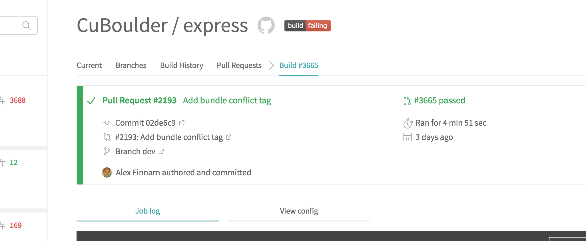

Like most people, I hate testing. I also hate (most) vegetables and hate exercising (especially while watching CrossFit people). But we all know that all three of these things are important..well three for devs, two for most people.

Since my early days of web development, I kept running into codebases with little to no tests. That made me 😢. It still makes me sad since I still don’t see a lot of test suites out there. I’ve heard many reasons as to why this is, and while working on my team’s test suite (cause no one else wanted to eat their vegetables) I’ve felt a lot of the pain resulting from those complaints. Of course I feel a lot more pain that the people not writing the tests, but if they see me 😢 they probably won’t want to join me.

One reason people can hate testing suites is that you have to wait for them to finish before you merge in code…wait, not true exactly. You “should” wait till the test run completes and make sure it doesn’t have red “X”s all over the place. As we all know, that doesn’t happen all of the time, and if the testing suite is broken and a hot-fix needs merged in, then that’s what needs to happen.

### Just Do Unit Tests, Man

Granted, you can tell me to just do that and silo my code work off from the other developers. Not my unit of code, not my bug, not my fault. But how many devs out there work in huge engineering teams where you really can’t tell what everyone is doing or what the “whole application” even is? You might be working on a library or package, instead of an application, and so it might be impossible to know how someone will wire your project up in an actual application. Fair enough, solely unit tests for you.

But for web developers who are working on sites/applications that users interact with, I’m going to say tell you that functional tests are way more important than your beloved unit tests. Why? Because what the user sees or doesn’t see is why you exist and get paid every week. You can write a butt load of unit tests for a feature only to have other features of the site conflict when it’s all put together.

Plus, since a web app has user interaction built into its core, you can test everything you would test with unit tests in functional tests. There is no reason to test the internal black box of code if it functions the same for users after a refactoring of the codebase.

The best part: no need to mess with mocks, stubs, spys, etc. You just test the actual application people will use. Simple. I’m not saying you shouldn’t unit test code, but if you have no tests, don’t start with unit tests. I can’t stress that enough. You are most likely wasting your time. Once you have a sensible functional test suite up and running, then you can go back to unit tests.

### So What Do I Actually Do?

There are plenty of great resources online to tell you about what Behat is, what the Mink Extension does, and how to write in Gherkin syntax so I am not going to go over any of that. I can show you what my team uses and how that is done via some links.

I wrote some [detailed documentation on how how to start writing tests](https://github.com/CuBoulder/express_documentation/blob/master/docs/behat.md) within our testing structure and [also how to run those tests locally](https://github.com/CuBoulder/express/tree/dev/tests/behat)…much pain in that area some of which is covered in my other local development environment posts.

Once you have your test suite set up and some tests running, you’ll probably continue onto the next phase of “how do I automate this and put into my development workflow?” Like a lot of FOSS developers, we turned to GitHub.

### GitHub + Travis CI + CodeClimate

I tried a few combinations of online tools, but since we already host our code on GitHub, their webhook integrations feature made it really nice and easy to stay on GitHub and look for some green checkboxes before merging in any code.

Many projects have much more complicated deployment/CI workflows and more integrations, but we kept it simple with Travis CI to run tests, and CodeClimate to lint code being modified.

Any of the Travis integrations, I’ve set up has been pretty easy, so I’ll skip talking about any of that. While CodeClimate has been very helpful in keeping our code cleaner than it would be otherwise, it will finish far more quickly than your Behat test suite will. That is why I’ll focus on running Behat tests via Travis CI for the rest of the post.

### How I Started Working On Tests a.k.a Janky Fixes

I started working on our main codebase’s test suite as a junior dev who was just looking for something to do. Initially I just added some tests and someone fixed things when they broke. Eventually, when I learned enough about how the tests were run locally and on Travis, I started fixing broken things more often.

JavaScript tests were always the most PITA to write and to debug. We originally didn’t have a spinner function, waiting for an element to appear before continuing, and so we “waited for 5 seconds” after all of the JS tests. While that fact might sound ridiculously stupid, it took me until just now to fix that issue after adding a spinner function in the meantime.

But that’s okay and mistakes are how you learn. This is why I’m telling you of my failings, but one of the biggest was not [implementing a spinner function](https://github.com/CuBoulder/express/blob/dev/tests/behat/features/bootstrap/FeatureContext.php#L218) sooner. Steal that code and do it now, please. You’ll thank me for not seeing “And I wait for AJAX” all over your feature scenarios.

Another thing you’ll encounter is the magical “@broken” tag. I’m sure you’ll use it some time when half a test works but part of it you just can’t get right. I’m perfectly fine running half of a test and going back later to complete it. A half-test is better than a no-test in my book. But sometimes no part of the test works and you just want to set a placeholder to come back to.

I ended up using something like the broken tag, a “@run\_last” tag, in order to separate out tests that passed fine locally but periodically failed on Travis. Yes, that is a thing. Depending on the environment you run your test suite in, inevitably you are going to run into an issue where tests pass on one environment but fail on another.

### What’s The Common Factor Of Suckiness Here?

It’s time. Yes, time does suck doesn’t it. It’s always a changin’ and currently stealing my scalp hairs away from me. But we, of course, all have to deal with time. Trying to debug testing failures on Travis has always been a PITA for me, and waiting for the whole test suite to finish just to run your one additional test is one of the biggest PITA-es.

> “Why wait, Alex? Just run your test and merge.”

Remember what I said: functional tests are important because they touch the vectors of interaction users can take. If I only run my one test, I’m just as bad as a siloed unit tester.

So, as my team started to add more tests and planned to replicate the test suite template to many of our other projects, we needed to look at the time factor.

In the next post, we will go through some baselines for before and after test runs as well as the code needed to manage the new testing workflow.
