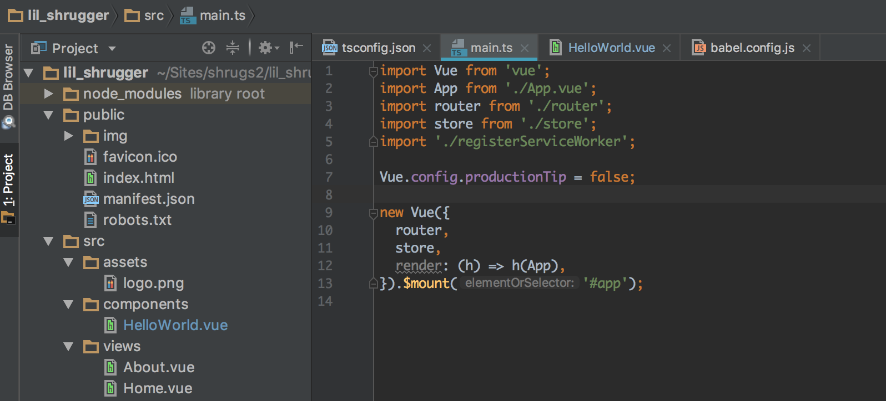

I created a Vue application back in June of 2017 after going through the excellent [Vue documentation and examples](https://vuejs.org/v2/guide/index.html). My first pass at the app only included straight-up HTML files. Vue and its dependencies were loaded via script tags and other “partials”, as I called them, were imported in the same fashion that Web Components uses HTML imports.

You can view [the structure of the index.html file](https://github.com/CuBoulder/lil_shrugger/blob/8e8e61808fbd20dd4dc3396117938144d2d6f07a/index.html) in the dev branch of my initial version. It only lists one component, the `<listing>` component, which is loaded via a [separate JS file](https://github.com/CuBoulder/lil_shrugger/blob/8e8e61808fbd20dd4dc3396117938144d2d6f07a/src/js/site-listing.js). The JS naively creates a Vue instance to load some data (stats relating sites that run on a service) when the page finishes loading. You’ll see some jQuery used as well as some ES6 features like `let` (incorrectly used) but also `var` variable declarations…not great, but hey, I don’t mind showing my crappy code to you because we all take journeys from crappy to less crappy to eventually decent code.

I loved how Vue allowed me to start exploring the framework in the simplest way possible while following in line with some of the same features that Web Component evangelists were pushing. Alongside HTML Imports, you can use the `<script type=”text/x-template”>` syntax to load a template used by a Vue instance and placed inside other HTML as a component tag. [Here is the template used](https://github.com/CuBoulder/lil_shrugger/blob/8e8e61808fbd20dd4dc3396117938144d2d6f07a/src/partials/listing.html) to replace the `<listing>` tag in the `index.html` file.

### What’s Missing?

Well…a lot of good pieces are missing from my initial exploratory Vue application. The configuration that could be placed in a Vuex store is set via a global `siteConfig` object. `vue-router` could replace the Vue object I created only to store routes. Single-file Vue components (SFC) could combine the templates, JS, and CSS into a more concise and easier to navigate codebase. ESLint could help reduce bugs and help developers adhere to best practices just the same as adding unit and E2E tests would do. Oh yeah, and since Safari doesn’t (or didn’t) like to import HTML files, one developer who preferred Safari couldn’t use the app in his browser of choice. Enter build tools…

As the application grew, I knew that I wasn’t “doing it right” mainly due to the absence of SFCs and a dev serve/run command that would add hot reloading, linting, etc. for an improved developer experience. I also knew that I didn’t understand most of the pieces needed to make that work. So, I was at a crossroads, and I thought I should check and see if there were any starter kits I could install to help me improve my understanding of the necessary parts to make it all function. I knew starter kits for React and Angular existed so I didn’t think I’d have much trouble in finding one for Vue.

### Vue Webpack Boilerplate

[The “vue-webpack-boilerplate” project](https://github.com/vuejs-templates/webpack) provided all the bells and whistles I needed to convert my app built with static files into one that used node to serve the app in development mode and build the app for deploying to a production server. Honestly, I blindly accepted the defaults since I didn’t know what the heck I was doing and the boilerplate project was highly recommended in the [Vue Awesome list on GitHub](https://github.com/vuejs/awesome-vue). I didn’t see the project listed on that page currently, but that’s probably because it was deprecated after vue-cli 3 came into maturity.

After refactoring my app on a `1.x` branch, [the structure changed](https://github.com/CuBoulder/lil_shrugger/tree/1.x) to follow Webpack Boilerplate including a bunch of dot files, testing, build, and config folders as well as a healthy number of node module dependencies 😬. I could now serve a version of the app that worked in Safari, linted code and reloaded components on file changes, and allowed me to combine all the Vue code into SFCs. Pretty sweet, eh?!

Navigating the app codebase was a little more confusing, but once I added the components via `Vue.use()` and placed routes into `vue-router` I mainly stuck to the `src/components` folder for developing features. I also added `src/pages` to mirror the routes and only placed components used by the “pages” in the `src/components` directory.

### Fast-forward to October 2018

I mainly developed the “Lil’ Shrugger” application by myself, for better or worse, and one of my continual goals was to document and write tests for the app so that it could be handed over to other devs if I wasn’t around or busy working on something else…and collaboration, hooray! Failing to write tests and documentation is quite common during development cycles, and I fall victim to that disease all the time.

I developed some tests that passed locally consistently but didn’t work on Travis CI, our CI test runner of choice. The cause was…Selenium, you guessed it. UI interactions loaded slowly and for some reason, the components didn’t seem to mount and unmount correctly. After some prodding, I decided it was time to switch testing frameworks to use something that wasn’t Selenium-based for E2E tests.

During the process of switching the testing framework, I realized that I hadn’t updated the dependencies…ever…ooh, that’s not good. Since this app was only used internally, I guess I didn’t take it as seriously as I would have a production app with user management, a database, and more exposure than 10 or so co-workers using it. I also locked down the hosted version of the app via HTTP Basic Authentication for awhile.

I’m not all that well versed in updating node modules and thought that running`npm update` would do the trick; however, I still ended up with outdated packages since some versions of the dependencies were pinned to specific versions. Rather than try to figure out what it would take to update all of the 43 outdated dependencies, I thought it would be a much better use of time to recreate the project using an updated version of the boilerplate template.

### Enter vue-cli 3

Much to my chagrin, the boilerplate project I started my refactor with was already deprecated when I looked again. They told me to use vue-cli instead. [Looking at the project page](https://cli.vuejs.org/), I saw a lot of the parts that were included in the boilerplate, `1.x`, version of my app were also included in vue-cli 3. ESLint, E2E and unit testing, Webpack, and Babel. The GUI part looked interesting, but I didn’t try that out.

After installing the CLI globally, it was as simple as typing`vue-cli create lil_shrugger` and picking the plugins I wanted to include in my project. The CLI uses a plugin system to add features to your project scaffolding. You can do a lot with the plugin system, but that’s all over my head at this point.

I chose the manual route of generating my app instead of using the defaults. Just in case, I chose all of the listed plugins in order to learn as much as I could about what the CLI tool can add to a new project. I knew a little about all of the plugins you can add via the manual route, but I was most interested in adding TypeScript support.

[TypeScript allows you to add type annotations](https://www.typescriptlang.org/docs/handbook/typescript-in-5-minutes.html) to your JS code (amongst other things I don’t know about yet) in order to help you catch some bugs when the app is compiled during development and not after a deployment when a user finds the bug before you do. One common complaint about dynamically-typed scripting languages is that variable types can change during the execution of the program potentially creating a lot of bugs where developers don’t know what the type of a variable should be in the codebase. Codebases and languages that are statically typed usually have fewer bugs introduced during development and also provide a more self-documenting codebase.

If you’re not using the tools/methods to add as much type checking to your projects as possible, it’s one of the lowest hanging fruits you can pick in order to reduce potential future bugs and uncover current ones lurking in your codebase.

### App.vue and main.ts Comparison

After creating my project via the CLI, my first step was to compare the `App.vue` and `main.js` files. The `App.vue` file contains the template and some CSS used for the main app. My app also had a `<script>` tag that added a bunch of commonly used components, but I don’t think I should have set things up that way. The `App.vue` file generated by vue-cli now only includes a template and some CSS.

The `main.js` file is where the Vue instance is created and rendered. In the current version of my app, instantiating Vue has a different syntax than what is generated in vue-cli 3.

```
// Old code...
new Vue({
  el: '#app',
  router,
  template: '<App/>',
  components: { App },
});

// New code...
new Vue({
  router,
  store,
  render: (h) => h(App),
}).$mount('#app');
```

One thing to notice is that the `vuex` store is also added to the main Vue instance so you can use the store anywhere in your app. I imported the store where needed in components, but I think adding it at the top layer of the app is probably the right approach. Once you start using it for state management, you’ll probably include the store in more components than not.

The main difference here is the inclusion of a render function mounting to `#app` instead of attaching the `App` component and template to the element. One area I was confused about when comparing Vue to React is thinking that you can only use templates in Vue and render functions belong in React. However, you have the choice of using render functions as well as templates within a Vue application. I’m going to have to read more of [the documentation on render functions and JSX](https://vuejs.org/v2/guide/render-function.html) in Vue but at least know you have the option of using both, although most of the time you’ll want to stick to templates.

```
import './registerServiceWorker';
```

The other part of `main.js` I noticed was the service worker import statement. Since I chose the PWA plugin when I generated the code, it added a Service Worker in order to deal with connectivity issues and using the app while the user is offline. My app could potentially use this feature in the future, and I’m glad you can add it easily with as a reminder to investigate later.

### TypeScript and Decorators

You’ll notice that I used the JavaScript extension for the main.js file because I wanted to mirror the older version of my app. Since I chose the TypeScript plugin when creating a newer version of the app, all “JS files” use the TypeScript `.ts` extension instead. TypeScript isn’t used in the `main.js` file as far as I can see, but I do notice it used throughout the other TypeScript (TS) files. All my previous JS files will need to be converted to TS files, and you can look at the `HelloWorld.vue` to see an example of some TS type annotation syntax as well as how to use decorators.

```
<script lang="ts">
import { Component, Prop, Vue } from 'vue-property-decorator';

@Component
export default class HelloWorld extends Vue {
  @Prop() private msg!: string;
}
</script>
```

In the`**private** msg!: string;` variable declaration, you can see that the `msg` variable needs to be of type `string` and that it can’t hold a null or undefined value. The exclamation point, called the [“Non-null assertion operator](https://github.com/Microsoft/TypeScript/wiki/What%27s-new-in-TypeScript#non-null-assertion-operator)”, tells the compiler that the variable can’t be null or undefined so you don’t [have to check if the value is truthy](https://stackoverflow.com/questions/50983838/what-does-mean-in-typescript) before trying to access it. Syntactic sugar essentially, but it makes your code more readable IMHO.

The Decorator design pattern is used to dynamically add behavior to an object without affecting any other behavior in the class. You can think of this design pattern as a function wrapping another function within it but adding additional behavior to the original function when it is called. In this code, using `@Prop()` allows you to shorten the syntax needed to [declare a property](https://github.com/kaorun343/vue-property-decorator#propoptions-propoptions--constructor--constructor---decorator) as well as add TS support for type checking. I guess the normal object literal I used to declare props and their types doesn’t allow TS to infer the same information.

I’m not familiar with decorators in JS/TS or the design pattern so you should read [this blog post on decorators in JS](https://www.sitepoint.com/javascript-decorators-what-they-are/), [this blog post announcing better TypeScript support](https://medium.com/the-vue-point/upcoming-typescript-changes-in-vue-2-5-e9bd7e2ecf08) within Vue, and [a definition of the Decorator pattern](https://en.wikipedia.org/wiki/Decorator_pattern) to learn more. Decorators aren’t in the JS spec right now, but Babel takes care of transforming your code during compilation so you can use them today.

Those changes were the biggest things I noticed on a first glance at what vue-cli 3 generated for the new version of my application. I also noticed that there were fewer files included and the codebase seemed easier to navigate because of that change. I’m not sure how they accomplished this, but good job!

I’ll write more on actually converting/updating the codebase as I go about that process. I hope you have a good idea of how I came to learn Vue and that you don’t have to start out with a fancy CLI generator to understand the basic parts of the framework. My code wasn’t that great when I first started working on the app, but screwing it up helped me to compare my mistakes to the “right way of doing things” I later saw when using the Webpack boilerplate project and now while using vue-cli 3.
