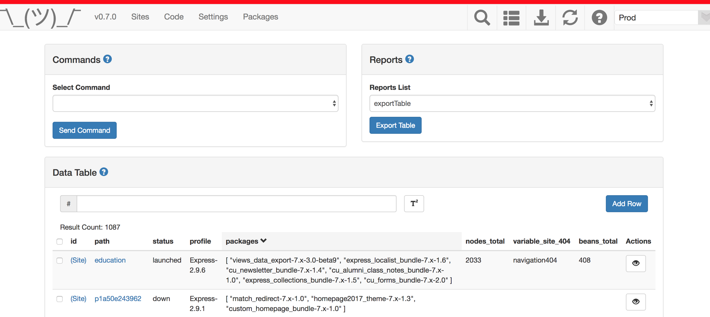

[In part 1 of this blog series](https://medium.com/@alexfinnarn/upgrading-from-vue-webpack-template-to-vue-cli-3-d888cd8e34d2), I went through my history of learning Vue.js while building out an application called, “Lil’ Shrugger”. I told the tale of starting from static HTML files, moving to a Webpack boilerplate template, and now onto using vue-cli 3 as a template.

I stopped short of discussing the process of converting my components to use TypeScript and fit into the new app structure, and in this post, we will go over that process. By the end of the post, I’ll have a working application that functions and looks just the same as the older version.

### Adding The Components

My first step is to add all the components I created previously and replace the “Hello World” components that the CLI generated for me. Since all the components were written in `.vue` files, I don’t need to convert any of that code at this point. I’ll go back into those files to clean them up and add some TypeScript features, but for now, I will just copy them over. I’m still putting them into the`src/components` directory so I don’t even have to change the paths of the import statements.

```
import AutocompleteInput from './components/AutocompleteInput';
Vue.component('autocomplete-input', AutocompleteInput);

// ...more components added

new Vue({
  router,
  store,
  render: (h) => h(App),
}).$mount('#app');
```

I am simply adding all the re-used components in the`main.ts` file where before I was doing this in the`App.vue` file. I’ll probably review how I’m adding the components for use in templates later, but this is good enough for me now.

Similarly, I am copying over what I called “pages” into the `src/views` directory. I could re-name that directory to `src/pages` like I had in my older version of the app, but I like to keep with conventions of frameworks so it is easier for other developers to navigate and contribute to my codebase in the future.

### Linking Views To Routes

Once again, I need to place the routing file in a different place. In the older version of my app, it was stored in `src/router/index.js`. That directory only included one file. One can debate the merits of using a directory in this case to organize a codebase, but in the newer CLI-generated version, the routing file is located at the top-level of the `src` directory.

```
import Vue from 'vue';
import Router from 'vue-router';

// Import views.
import Sites from '@/pages/Sites';
// ...

export default new Router({
  mode: 'history',
  base: process.env.SUBDIRECTORY ? `/${process.env.SUBDIRECTORY}` : '',
  routes: [
    { path: '*', component: NotFoundComponent },
    {
      path: '/sites',
      name: 'sites',
      component: Sites,
    }, // ...more routes
  ],
});
```

Not much changed in moving the routing data into `router.ts`. I imported Vue and the Router, added my “views”, and then exported the Router including the components connected to each path.

I added a check to the `base` property so that the app could be deployed in a subdirectory of the root of a domain, if needed. Sometimes your app isn’t going to live at `mydomain.com` but rather maybe as an app you’re integrating into a part of another app, like `mydomain.com/products` for example.

You’ll also notice the `mode` property. `vue-router` defaults to the “hash” mode, but you can use HTML5’s History feature to allow a more “normal” way to navigate your app. You can [catch any path a user might mistake as a view](https://router.vuejs.org/guide/essentials/history-mode.html#caveat) with a catch-all `NotFoundComponent` which is something I wish I would have included in my older version.

```
// ...part of routes: []
{
  path: '/about',
  name: 'about',
  // route level code-splitting
  // this generates a separate chunk (about.[hash].js) for this   
  // route
  // which is lazy-loaded when the route is visited.
  component: () => import(/* webpackChunkName: "about" */ './views/About.vue'),
},
```

I noticed a different way of adding a route at the bottom of the generated `router.ts` file. I’ll have to look into this later, but it sounds better to lazy-load the other views when they are visited instead of when the user loads the default route. Nifty!

### Adding Services

To not pollute my components with behavior they don’t need to know about and to reuse some code, I’ve grouped certain logic into some services in a `src/js` directory. In the new version of my app, I’ve switched the extensions to TypeScript and renamed the directory to `src/services` since every other directory is descriptive of which part of the app the files relate to except the `js` directory. I’m not a big fan of adding `js` or `css` directories, because all you’re really doing here is telling people what file extensions they will find in that directory and not what functionality the files add to your application. Ain’t nobody got time for that!

After moving over the JS files, I now had to go around and rename the import statements in all of my component files. This can be a tedious process depending on how many components you have scattered around your app, but of course, using an IDE with a proper find and replace tool helps quite a bit.

### Adding the Vuex Store

Just like `vue-router`, if you are building an application that will grow over time and include many components, you’ll probably have a use for`vuex` state management pretty quickly. The old version of my app included all the initial state and mutations in one “store” object, and I will go back and split those up to make navigating the data store more semantic.

For now, I simply copied over the whole file replacing everything generated from the CLI tool. I could do this because the `store.ts` file had an identical structure to what I already developed. Hooray for me!

### Reap The Benefits

Much to my surprise, my app functioned just as it had in the older version when I loaded the default route…well, I did have one more change I needed to make. My styling was all off because I used Bootstrap CSS classes for styling in the older version without a whole lot of custom CSS thrown in. I needed to add the CSS inclusion to my `index.html` file to fix this issue, but I had to find where it moved to first.

In the older version of the app, the `index.html` file lived outside of the `src` directory at the root level. In the vue-cli 3 version of the app, the `index.html` file lives in the `public` directory. Once again, I agree with this change since the root of my app only contains configuration files where before I had a hodgepodge of configuration files and what typically goes into a `public` directory.

After adding the Bootstrap CDN links, everything looked the same as before. I did see quite a few TypeScript-related errors mentioned during the compilation stage that I will fix later; however, they mainly related to missing type declarations so I saw a lot of `Element implicitly has an ‘any’ type because type X has no index signature`. These are good errors to have, and I’m actually quite pleased to see them pop up. Hopefully, I’ll catch some lurking bugs in the codebase as I go about investigating the error notices.

If you have a Vue application you started on the Webpack boilerplate template and you end up having a lot of outdated dependencies you’d need to manually update, it’s probably worth recreating your app after having vue-cli 3 generate some scaffolding for you. I’m certainly glad I went through the mostly painless process, and I am looking forward to using TypeScript as I continue to develop the application.

Now onto testing changes!
