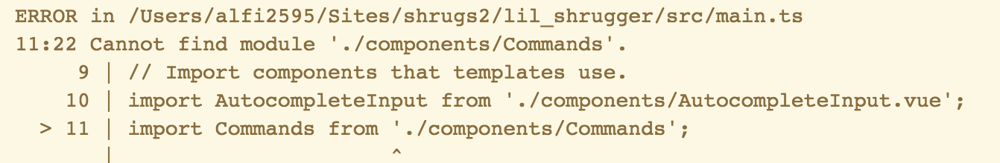
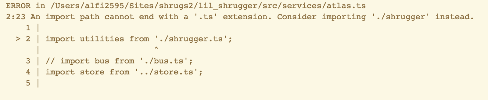
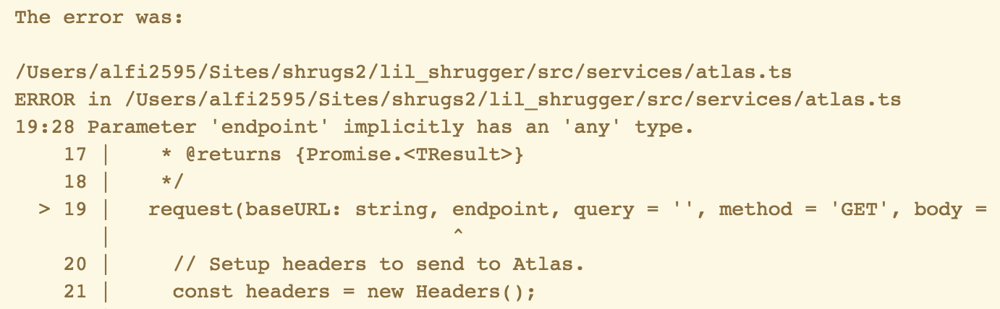
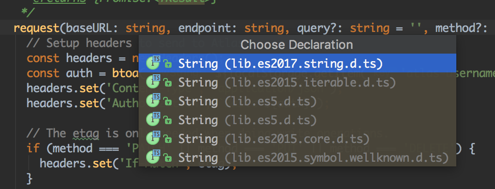

I’m upgrading an app I built using the Vue Webapck template to use the scaffolding that vue-cli 3 generates. I mainly chose to start over since I had 43 outdated dependencies that couldn’t be automatically updated, but I’m glad I did since the new code structure seems much simpler to navigate and replaces a few areas I was having trouble in with new tools, like using Cypress instead of Nightwatch for E2E testing. You can read the first two posts by following the links below.

-   [Upgrading From Vue Webpack Template To Vue-cli 3](https://medium.com/@alexfinnarn/upgrading-from-vue-webpack-template-to-vue-cli-3-d888cd8e34d2)
-   [Upgrading From Vue Webpack Template To Vue-cli 3: Migrating Components](https://medium.com/@alexfinnarn/upgrading-from-vue-webpack-template-to-vue-cli-3-migrating-components-7f42f87866c2)

Another reason I like using the new cli generator is that one of the options is to include TypeScript support or not. Since I’m trying to learn as much as possible about what “modern JS” looks like these days, I decided to add TS support to this project.

You might think, “what’s the point of not using standard JS?” and if using TypeScript in your application would be worth learning it. Anytime I have questions about what tools to use for a particular project, one thing I do is check into their communities and see what people think about using the tool and how many of those people exist. Also, it’s very important to notice trends over time. As everyone knows, the JS development world is rocked quite consistently with major changes year-to-year. Package managers, asset bundlers, build tools, reactive declarative view layers, JS on servers, “serverless” architectures, and on top of all that, major changes to the underlying language.

One trend that I see in JS as well as in PHP is a move towards adding static typing support. The syntax of declaring types for function signatures, variables, and properties looks pretty similar to me between PHP and TS. Plenty of smart people think that the more static analysis you can fit into your codebase the fewer bugs your app will create over time. The State of JS 2018 survey results point to a great desire for better typing support.

](./asset-1.png)

Just as you should learn ES6 (and more recent ES versions) since most every JS library and framework uses its features, you should invest time into exploring a widely adopted language that compiles down to JS. The clear choice for me after looking at those results is TypeScript. Even if you don’t use it in most of your apps, you’ll be forced to think more clearly about how information is passed around in your application, and you’ll be the better off for it. That’s been the case so far for me.

The best part of using TS is that you can progressively add typing support to your codebase. You can violate TS rules found during compilation but tackle the errors as time allows. It’s not like you need to convert all your code from JS to TS or else your app won’t run but rather start out simply by changing `.js` extensions to use `.ts`.

### ts.config.json

Before you start changing any of your code, you ought to look at the configuration file for TypeScript. TS has a dedicated configuration file that the CLI tool generates for you with quite a few presets for different options. You don’t have to have a config file if you just want to use the defaults, but it is useful to go over some of the options you can configure.

```
"compilerOptions": {
    "target": "esnext",
    "module": "esnext",
    "strict": true,
    "jsx": "preserve",
    "experimentalDecorators": true,
    "types": [
      "webpack-env",
      "jest"
    ],
    "lib": [
      "esnext",
      "dom",
      "dom.iterable",
      "scripthost"
    ]
  },
```

One of the benefits of having a compilation stage that runs on every code change is that you can add ES features into your code that might still be in the proposal stages. Since I was following Vue documentation and examples from generated code, I really had no idea what parts of ES6, ES2016, and ES2017 I was using. Webpack, Babel, and Vue’s integration with those tools took care of the compilation into whatever the code needed to be for it to work across browsers. It’s worth a bit of your time to [look over esnext](https://github.com/esnext/esnext) and some [good explanations to what the TC-39 body is working on](http://exploringjs.com/).

I didn’t change any configuration to start out and I’m going to try and keep to the strictest settings possible.

```
"rules": {
  "quotemark": [true, "single"],
  "indent": [true, "spaces", 2],
  "interface-name": false,
  "ordered-imports": false,
  "object-literal-sort-keys": false,
  "no-consecutive-blank-lines": false
}
```

If I get fed up enough, I’ll probably start adding exclusions to the `.tslint.json` file. I know I added several exclusions to the `.eslint.json` file in previous versions of the application. Now onto the actual errors!

### Missing Type Definitions

Most of my errors related to missing type definitions for variables. You’ll probably start by fixing some of these, and since none of your variables will have types initially, you’ll have a lot of errors to sort through. So many errors showed up in my terminal as warnings, that I could only really see the last few.

Since I chose to use [Cypress and its dashboard service](https://www.cypress.io/dashboard/), I was able to get a much better sense of what was going on. I like that I can see the beginning of the error list on the dashboard, because my terminal doesn’t keep enough lines for me to scroll all the way to the beginning, lol. Score one for Cypress. I’ll go through some common errors I saw in my logs and how to fix them in case you encounter them as well.

My first error actually wasn’t related to missing variable types but rather the module import system.



I’m still pretty inexperienced with using the module system in JS, and I go back and forth over whether to include file extensions or not. I’ve used relative `./` path before, but I thought the file extension was optional and wouldn’t matter if it was absent or included.

In this case, TypeScript was confused about what the `./components/AutocompleteInput` module was and where it was located. My app worked fine locally when compiled, but I still saw this error in the logs.

```
declare module '*.vue' {
  import Vue from 'vue';
  export default Vue;
}
```

On further inspection, I found a `src/shims-vue.d.ts` file that tells TypeScript what to do with any file containing the `.vue` extension. TypeScript has [a whole section of documentation on module resolution](https://www.typescriptlang.org/docs/handbook/module-resolution.html) that I might return to, but luckily, all I had to do was add the `.vue` extension to my import statements and move on.



Blargh! I thought I might need to add extensions to all import statements but after I did that…I had to go back and remove some of them. TSLint apparently doesn’t like it when you add the `.ts` extension to an import statement, and I’m sure there’s probably a good reason as to why. For now, dropping the extension from the import statement let me move onto what I’ll call a “better” error.



Here we go. Now we begin to add type support to the application. Previously, I used doc block comments to annotate parameters and return types for functions. Coming from PHP, I was used to writing doc blocks in this style, but now that PHP 7.x is including more typing support, I’ll probably end up writing the types very similarly to how it’s done in TypeScript.

```
/**
 * Makes a request to Atlas.
 *
 * @param {string} baseURL
 */
request(baseURL: string, endpoint, query = '')
```

In that doc block, you can see how the type of `baseURL` was defined as a string. IDEs have gotten pretty good at showing you missing types in your codebase and inferring the type if you have an annotation in comments, but including it in the parameter list is less verbose and leads to more self-documenting code. It is still useful to define what variables mean and you can leave the type information in the doc block.

Another common error you will see after fixing all of your missing type errors relates to function calls that reference optional parameters. [The TypeScript documentation on functions](https://www.typescriptlang.org/docs/handbook/functions.html) has more information on this topic.

> “In JavaScript, every parameter is optional, and users may leave them off as they see fit.”

In my case, this error was related to an optional parameter in a function that I set to null.

```
request(baseURL: string, endpoint: string, query?: string): Promise
```

Going back to the `request` function I mentioned before, I don’t always need a query string to make a request to the API, so I can make that parameter optional by adding a question mark before the declared type. I fear I’ll see a lot of these notices…

Now on to my first “good” error from adding TypeScript support: `Argument of type ‘null’ is not assignable to parameter of type ‘string’.` In the request function, I have a part where I add an etag, if necessary, to the HTTP verbs that need it.

```
const headers = new Headers();

// The etag is only needed when doing write operations.
if (method === 'PATCH' || method === 'PUT' || method === 'DELETE') {
  headers.set('If-Match', etag);
}
```

Trouble is…the `set()` method can’t take anything other than a string as a value. But where the heck is that defined? If you look [at the MDN documentation](https://developer.mozilla.org/en-US/docs/Web/API/Headers/set) on the `Headers.set(name,value)`, there are no types declared anywhere. This is where a proper IDE comes in handy.

I’m using WebStorm at the moment, and when I became flummoxed at finding out where the parameter type declaration lived, all I needed to do was hover over the method call and CMD + click it. I went straight to the interface TypeScript developed around the Headers object in `lib.dom.d.ts`.

```
interface Headers {
    append(name: string, value: string): void;
    delete(name: string): void;
    forEach(callback: ForEachCallback): void;
    get(name: string): string | null;
    has(name: string): boolean;
    set(name: string, value: string): void;
}
```

There we go. `Headers.set()` takes a string for both parameters and we don’t care about what the function returns. Now I had to ask myself: where the heck does `lib.dom.d.ts` come from?

`/Applications/PhpStorm.app/Contents/plugins/JavaScriptLanguage/jsLanguageServicesImpl/external/lib.dom.d.ts`

That is where the file was located on my MacBook Pro. WebStorm (via PHPStorm in my case) includes a lot of plugins some of which relate to language-level features and might not be one of the plugins you’ve manually added. WebStorm has a “JavaScript Support” plugin that “supports JavaScript, ActionScript and TypeScript languages.” I don’t think I installed that plugin, but I can see a lot of TypeScript definition files in the directory I listed above.

### Declaration Files and Interfaces

As TypeScript is compiling your code and checking for types, where does it go to look for them? How does it know that I’ve tried to use a wrong parameter in a function call? In TypeScript, you can declare your definitions using interfaces in [“declaration files”](https://www.typescriptlang.org/docs/handbook/declaration-files/introduction.html).

My IDE already has some declaration files that include the `Headers()` object among many other objects, properties, and even scalars.



When I decided to look for what a “string” was via CMD + click, I can see many definitions listed in separate files. Each file has an interface related to the string prototype in JS. I looked at an interface declaration for `string` that only had one piece defining the `localeCompare()` function shape. Then in another file, there were many more functions defined for the `string` type. How does TypeScript know which declaration to use? I suspected there was some sort of merging going on.

Yep, [TypeScript has a concept of declaration merging](https://www.typescriptlang.org/docs/handbook/declaration-merging.html). As the interface declarations are loaded, they get merged in a last-in, first-out manner. So that answers my question of how all of those declaration files work together, but where do they live exactly and how do they get loaded when the compiler starts checking my code?

Some of the type declarations are loaded via npm packages, and there is a [whole repo on GitHub](https://github.com/DefinitelyTyped/DefinitelyTyped) with “ _high quality_ TypeScript type definitions.” There is even [a website called TypeSearch](https://microsoft.github.io/TypeSearch/) that lets you quickly query for type packages. Finally, you can look at your `node_modules/@types` directory where TypeScript looks for packages relating to `import` statements [regardless of inclusion rules in](https://www.typescriptlang.org/docs/handbook/tsconfig-json.html) `[ts.config.json](https://www.typescriptlang.org/docs/handbook/tsconfig-json.html)`[.](https://www.typescriptlang.org/docs/handbook/tsconfig-json.html)

> Keep in mind that automatic inclusion is only important if you’re using files with global declarations (as opposed to files declared as modules). If you use an `import "foo"` statement, for instance, TypeScript may still look through `node_modules` & `node_modules/@types` folders to find the `foo` package.

I finally found the answer to where my string interfaces came from by looking at the WebStorm help article on TypeScript support. It will tell you where to change some TypeScript settings in your IDE, if you want, but more importantly, it pointed me to `node_modules/typescript/lib` which is where all the `.d.ts` files live…and knowing that is half the battle.

I could go on about the optional parameters or get into “Generics”, which were the next two types of TS errors I needed to fix, but this post is getting long enough as it is. If you look at the links I provided for type definitions, you’ll get a better sense of how interfaces work, which becomes pretty important for state management.

I’ve wanted to break up my Vuex module into more coherent sub-modules for some time, and adding TS support will help me to better reason about the objects contained in my app. Prior to now, I just added a property when needed and the default value was the only signaling of what that property was supposed to take. I had some guards to prevent things like a string being used as an array and prop types in Vue components, but my lack of explicitness for types in general has most likely led to several bugs.

I might write another blog post about some of the TS errors I see and fix, but I really hope I can get to writing some tests with Cypress next.
